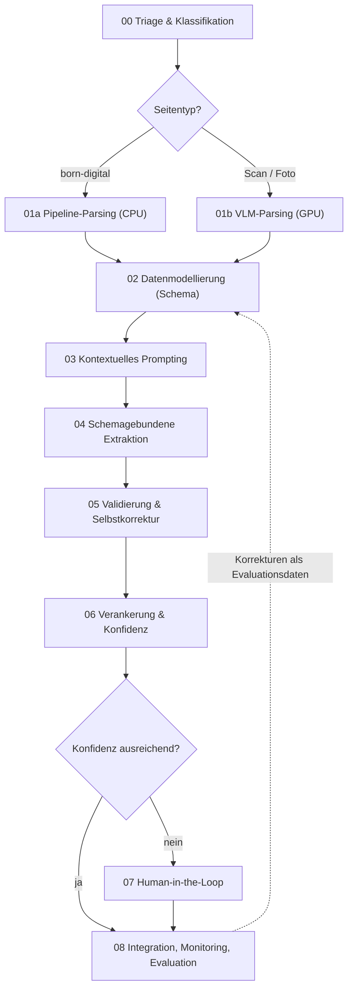

# KI-gestützte Dokumentenaufbereitung und Datenextraktion

**Ein Leitfaden für Cloud- und On-Premise-Szenarien**
Niveau: DQR 5/6 · Stand: August 2026

---

## Inhalt

1. [Wann sich der KI-Pfad lohnt – und wann nicht](#1-wann-sich-der-ki-pfad-lohnt--und-wann-nicht)
2. [Das Prozessmodell in neun Phasen](#2-das-prozessmodell-in-neun-phasen)
3. [Layout-Analyse: der entscheidende erste Schritt](#3-layout-analyse-der-entscheidende-erste-schritt)
4. [Werkzeuglandschaft: lokal und Cloud](#4-werkzeuglandschaft-lokal-und-cloud)
5. [Sonderfall mathematische Formeln](#5-sonderfall-mathematische-formeln)
6. [Datenmodellierung und Structured Outputs](#6-datenmodellierung-und-structured-outputs)
7. [Validierung, Verankerung, Konfidenz](#7-validierung-verankerung-konfidenz)
8. [Human-in-the-Loop](#8-human-in-the-loop)
9. [Qualität messen](#9-qualität-messen)
10. [Dokumentklassen im Vergleich](#10-dokumentklassen-im-vergleich)
11. [Kostenbetrachtung](#11-kostenbetrachtung)
12. [Datenschutz und Haltbarkeit](#12-datenschutz-und-haltbarkeit)

---

## 1. Wann sich der KI-Pfad lohnt – und wann nicht

Unstrukturierte Dokumente in maschinenlesbare Daten zu überführen, ist keine neue Aufgabe. Neu ist, dass Sprachmodelle mit Bildverständnis das auch bei Dokumenten schaffen, deren Aufbau vorher nicht bekannt ist. Genau darin liegt der Nutzen – und die Abgrenzung:

| Situation | Empfohlener Weg |
|---|---|
| Zehntausend strukturgleiche Formulare, feste Feldpositionen | Positionsbasiertes Template-Matching mit klassischem OCR. Schneller, billiger, deterministisch, auditierbar. |
| Hundert Lieferantenrechnungen in achtzig verschiedenen Layouts | KI-gestützte Extraktion. Templates zu pflegen wäre teurer als der Modellbetrieb. |
| Dokumente, deren Struktur sich laufend ändert (Verträge, Berichte, Datenblätter) | KI-gestützte Extraktion mit Review-Schleife. |
| Freitext ohne Zielschema, Recherche statt Extraktion | Kein Extraktionsproblem, sondern ein Retrieval-Problem (RAG). |

**Merksatz:** Der KI-Pfad rechnet sich bei **Heterogenität**, nicht bei Masse allein. Wer nur ein Layout verarbeitet, baut sich mit einem LLM ein teureres und schlechter prüfbares System als mit zwanzig Zeilen Koordinatenlogik.

---

## 2. Das Prozessmodell in neun Phasen



### Die Phasen im Detail

| # | Phase | Ziel | Umsetzung: Bibliotheken und Werkzeuge | Modelle (Stand 08/2026) | Typische Fehler |
|---|---|---|---|---|---|
| **00** | **Triage & Klassifikation** | Feststellen, womit man es zu tun hat, und pro Seite den günstigsten Pfad wählen | `pypdf` / `PyMuPDF` (`page.get_text()` leer ⇒ Scan), `pdfplumber` für Textdichte, Auflösungs- und Schiefeprüfung, `imagehash` gegen Dubletten, Sprach- und Dokumenttyp-Erkennung; Ergebnis ist eine Routing-Entscheidung | kleiner Klassifikator oder ein 2–4B-VLM für die Dokumenttyp-Erkennung | Alles durch dieselbe teure Pipeline schicken; rotierte oder doppelt eingescannte Seiten nicht erkennen |
| **01a** | **Pipeline-Parsing** | Born-digital-PDFs schnell und deterministisch in Markdown/JSON überführen | `pymupdf4llm`, `docling` (CPU-Pfad), `pdfplumber` für Tabellenkoordinaten | – (klassische Algorithmen) | Kopf- und Fußzeilen mitschleppen; mehrspaltige Seiten zeilenweise verschmelzen |
| **01b** | **VLM-Parsing / Layout-Analyse** | Seite in typisierte Blöcke zerlegen: Absatz, Tabelle, Formel, Bild, Fußnote – mit Leserichtung und Koordinaten | **lokal:** VLM in LM Studio (Gemma 4, Qwen3-VL) oder spezialisierte Parser (`docling`, `mineru`, `marker-pdf`, `surya-ocr`); **Cloud:** LlamaParse, Reducto, Mistral Document AI, Azure Document Intelligence, Google Document AI, Amazon Textract | Gemma 4 12B, Qwen3-VL; produktiv zusätzlich PaddleOCR-VL, GLM-OCR, dots.ocr, DeepSeek-OCR, olmOCR, granite-docling | Reine Textextraktion ohne Layout; Tabellen über Seitenumbrüche zerreißen; Bildauflösung zu niedrig |
| **02** | **Datenmodellierung** | Zielschema definieren, **bevor** ein Modell läuft | `pydantic` v2 (`BaseModel`, `Field(description=…)`, `Annotated`), JSON Schema, in TypeScript `zod`; Geld als `Decimal`, Datum als `date`, jedes Feld mit Beschreibung | – | Verschachtelung tiefer als drei bis vier Ebenen; mehr als ~40 Felder in einem Schema; Pflichtfelder ohne Null-Option |
| **03** | **Kontextuelles Prompting** | Mehrdeutigkeit, Einheiten, Formate und Fehlwerte regeln | Few-Shot mit Gegenbeispielen; explizite Regeln (`de-DE`-Zahlformat, Brutto/Netto, „nicht auffindbar ⇒ `null`, nicht raten"); Reasoning-Feld **vor** den Wertfeldern; Seitenbild **und** Parser-Text gemeinsam übergeben | jedes Vision-LLM; Thinking-Modus bei reiner Extraktion abschalten (Kostenfaktor) | Reasoning-Feld hinter das Ergebnis stellen; Bild unter ~150–200 dpi übergeben |
| **04** | **Schemagebundene Extraktion** | Schemakonforme Ausgabe erzeugen | **Cloud:** OpenAI Structured Outputs (`strict: true`), Anthropic Tool-/Output-Schema, Gemini `responseSchema`; **lokal:** LM Studio (`response_format` mit JSON-Schema), vLLM/SGLang `guided_json`, llama.cpp GBNF; **providerübergreifend:** `instructor`, `BAML`, `langextract` | Cloud: Gemini-3.x-, GPT-5.x-, Claude-4.x-Klasse. Lokal: Gemma 4, Qwen3-VL | Ein Riesenprompt für sechzig Felder statt Aufteilung nach Dokumentabschnitten |
| **05** | **Validierung & Selbstkorrektur** | Formale **und** fachliche Korrektheit prüfen | `pydantic`-Validatoren, Fachregeln (Summenproben, Wertebereiche, Datumslogik), Prüfziffern (IBAN via `schwifty`, USt-IdNr., ISBN, EAN), Regex-Gegenprobe im Rohtext, gezielter Re-Prompt **nur** für gescheiterte Felder | für den zweiten Pass genügt oft ein kleineres Modell | Valides JSON mit richtigen Werten verwechseln; den ganzen Datensatz neu generieren |
| **06** | **Verankerung & Konfidenz** | Jedes Feld auf Seite und Position im Original zurückführen | Bounding Boxes aus dem Parser durchreichen; Feld → Quell-Span verknüpfen; Konfidenz über Logprobs, Selbstkonsistenz (n-fache Extraktion, Mehrheitsentscheid) oder Cross-Model-Agreement | zwei Modelle als Gegenprobe (ein günstiges, ein starkes) | Das Modell nach seiner Konfidenz fragen – selbstberichtete Werte sind kaum kalibriert |
| **07** | **Human-in-the-Loop** | Unsichere Fälle gezielt an Menschen geben statt alles oder nichts zu prüfen | Schwellenwert-Routing in eine Review-Queue; Oberfläche mit Bildausschnitt neben dem Feld (Gradio oder Streamlit genügt für Prototypen); Korrekturen zurückschreiben | – | Alles maschinell durchwinken; Korrekturen nicht persistieren |
| **08** | **Integration, Monitoring, Evaluation** | Daten übergeben und dauerhaft messen | Übergabe an DB/ERP/API mit Idempotenz und Dublettenerkennung; Logging von Modell-, Prompt- und Schemaversion sowie Kosten und Latenz pro Dokument; Goldset und Regressionstest bei jedem Wechsel | – | Modellwechsel ohne Re-Evaluierung („Silent Drift") |

### Abzweigung für RAG statt Extraktion

Ist das Ziel kein Feldsatz, sondern Retrieval, tritt zwischen 01 und 02 das **layoutbewusste Chunking**: Splits entlang der Überschriftenhierarchie, Tabellen immer als Ganzes, Seiten- und Abschnittsmetadaten am Chunk (`HybridChunker` in Docling). Danach Embedding und Vektorindex, etwa BGE-M3 oder Qwen3-Embedding mit Qdrant oder pgvector. Die Phasen 05 bis 08 gelten sinngemäß weiter – Verankerung heißt hier Quellenangabe in der Antwort.

---

## 3. Layout-Analyse: der entscheidende erste Schritt

Die größte Fehlerquelle klassischer Textextraktion ist das Ignorieren räumlicher Zusammenhänge. Ein naiver Parser liest eine Seite stur von oben nach unten und von links nach rechts. Bei mehrspaltigen Papieren, Rechnungstabellen oder Formularen verschmelzen dadurch Zeilen, die inhaltlich nichts miteinander zu tun haben – und kein noch so gutes Sprachmodell kann das anschließend zuverlässig reparieren, weil die Information beim Parsen bereits verloren ging.

Fachlich zu unterscheiden sind zwei Ebenen:

- **Physische Segmentierung:** Wo auf der Seite steht etwas? (Koordinaten, Blöcke, Spalten)
- **Logische Segmentierung:** Was ist es? (Überschrift, Fließtext, Tabellenzelle, Fußnote, Bildunterschrift)

Erst die logische Ebene macht aus Pixeln Struktur. Beide zusammen ergeben die **Leserichtung** – die Reihenfolge, in der die Blöcke inhaltlich zusammengehören.

### Der Architekturwandel

Bis vor kurzem war die dreistufige Pipeline Standard: Layout-Detektor → OCR-Engine → Spezialmodelle für Formeln und Tabellen. In den führenden Werkzeugen sind diese Stufen inzwischen in **ein einziges Vision-Language-Modell** zusammengefallen, das eine Seite direkt in strukturiertes Markdown oder JSON in korrekter Leserichtung überführt. Marker 2 führt Layout, OCR und Formeln über ein einzelnes Surya-2-Modell; MinerU bietet VLM- und Hybrid-Backends neben der klassischen Pipeline; Docling hat einen VLM-Pfad auf Basis von `granite-docling-258M` ergänzt. Die modulare Pipeline ist damit nicht verschwunden, aber vom Standardweg zum CPU-Fallback geworden.

Die praktische Frage lautet deshalb nicht mehr „Pipeline oder LLM", sondern:

1. **Pipeline-Pfad** – CPU, schnell, günstig, deterministisch: für saubere born-digital-PDFs.
2. **VLM-Pfad** – GPU, teurer, robuster: für Scans, Fotos, mehrspaltige und tabellenlastige Seiten.
3. **Routing** zwischen beiden – genau die Aufgabe von Phase 00.

### Layout Chain-of-Thought

Wenn ein **generelles** Vision-LLM statt eines spezialisierten OCR-Modells eingesetzt wird, lohnt es sich, die Layoutbetrachtung explizit zu erzwingen, bevor Werte ausgelesen werden:

1. **Layout-Analyse:** „Die Seite enthält Kopfdaten oben rechts, eine Positionstabelle in der unteren Hälfte, darunter einen Summenblock."
2. **Räumliche Lokalisierung:** „Der Gesamtbetrag steht in der rechten Spalte der letzten Tabellenzeile."
3. **Extraktion:** Erst jetzt wird der Wert aus dem lokalisierten Bereich abgelesen.

Technisch setzt man das um, indem das Zielschema ein Textfeld für die Layoutbeschreibung enthält, das **vor** den Wertfeldern steht (siehe Kapitel 6). Bei spezialisierten OCR-VLMs entfällt das: Dort ist der Schritt antrainiert und wird nicht mehr ausgegeben.

---

## 4. Werkzeuglandschaft: lokal und Cloud

Beide Betriebsarten haben ihren festen Platz. Zum Lernen und Erproben ist der Cloud-Weg schneller am Ergebnis; im betrieblichen Einsatz sprechen Datenschutz, Kostenkontrolle und Verfügbarkeit häufig für On-Premise. Entscheidend ist, dass beide Wege **dieselbe Schnittstelle** verwenden – dazu Abschnitt 4.3.

### 4.1 Lokal in LM Studio

LM Studio ist der praktikabelste gemeinsame Nenner: Es führt GGUF-Modelle über llama.cpp und – auf Apple Silicon – MLX-Modelle aus, zeigt vor dem Download an, ob eine Quantisierung in den vorhandenen Speicher passt, und stellt über den Developer-Tab einen **OpenAI-kompatiblen Server** auf `http://localhost:1234/v1` bereit. Alles, was in diesem Leitfaden an Code steht, läuft damit unverändert lokal.

Für Layout und OCR sind **12–16 GB VRAM** die sinnvolle Untergrenze. Darunter muss man auf 4B-Modelle ausweichen, was bei kleiner Schrift und dichten Tabellen sichtbar zulasten der Genauigkeit geht.

| Modell | Größe / Bedarf | Eignung für Dokumente | Lizenz |
|---|---|---|---|
| **Gemma 4 12B** | ~8–10 GB bei Q4/Q5, komfortabel ab 12–16 GB VRAM | Aktuell der beste Allrounder für den Kursbetrieb: starke OCR, Dokument- und Diagrammverständnis, Handschrift, 140+ Sprachen, 256K Kontext | Apache 2.0 |
| **Gemma 4 26B A4B** (MoE) | ~18 GB bei Q4, nur 3,8 B aktive Parameter | Deutlich schneller als ein dichtes Modell gleicher Qualität; sinnvoll ab 24 GB VRAM | Apache 2.0 |
| **Gemma 4 E4B** | ~6 GB | Notlösung für schwache Hardware und für die Triage-Phase | Apache 2.0 |
| **Qwen3-VL 8B / Qwen3.5-VL** | ~6–10 GB bei Q4 | Sehr stark bei Dokument-Fragen (DocVQA) und GUI-Grounding; gute Alternative und gute Gegenprobe zu Gemma | Tongyi-Qianwen – EU-Einsatz prüfen |
| **MiniCPM-V** | ~6 GB | Einstieg auf sehr kleiner Hardware | prüfen |

**Praxishinweis:** Vision-Modelle brauchen in LM Studio eine aktuelle Version – die Bild-Parallelverarbeitung für Gemma 4 und die neueren Qwen-VL-Generationen kam erst in der 0.4.x-Reihe hinzu. Wenn ein Modell keinen Bild-Upload anbietet, liegt es fast immer an einer veralteten App oder an einem GGUF ohne den zugehörigen Vision-Teil (`mmproj`).

#### Zu Gemma 4 und der Layout-Frage

Gemma 4 ist mehr als ein guter OCR-Zufallstreffer. Google listet für die Bildseite ausdrücklich Objekterkennung, Dokument- und PDF-Parsing, Diagrammverständnis, mehrsprachige OCR, Handschrifterkennung und „Pointing" auf. Zwei Eigenschaften sind für unseren Zweck besonders relevant:

**Erstens: konfigurierbares Visual-Token-Budget.** Gemma 4 verarbeitet Bilder in variablem Seitenverhältnis und Auflösung; wie viele Token ein Bild belegt, ist einstellbar – die unterstützten Stufen sind 70, 140, 280, 560 und 1120 Token. Niedrige Budgets sind für Klassifikation gedacht, das **höchste Budget (1120) ausdrücklich für OCR, Dokument-Parsing und kleine Schrift**. Wer Gemma 4 für Dokumente einsetzt und beim Standardbudget bleibt, verschenkt genau die Detailschärfe, auf die es ankommt. Umgekehrt ist das ein sauberer Kostenhebel: Für die Triage in Phase 00 reichen 140 Token pro Seite.

**Zweitens: native Bounding-Box-Ausgabe.** Alle Gemma-4-Größen geben Koordinaten direkt als strukturiertes JSON aus, ohne Grammatikzwang oder Prompt-Tricks, im Format `{"box_2d": [y0, x0, y1, x1], "label": "…"}`. Die Koordinaten sind auf ein 1000×1000-Raster normiert – unabhängig von der tatsächlichen Bildgröße, was die Rückrechnung auf Pixel trivial macht.

Damit lässt sich die Verankerung aus Phase 06 auch ohne spezialisierten Parser umsetzen: Man fragt das Modell nach dem Wert **und** nach der Box, rechnet die Box auf Pixelkoordinaten zurück und zeigt in der Review-Oberfläche den passenden Ausschnitt.

Eine Einschränkung bleibt: Für Gemma 4 sind keine Ergebnisse auf den einschlägigen Dokumenten-Parsing-Benchmarks veröffentlicht. Es ist ein generelles Vision-Modell, kein auf Dokumente spezialisiertes. Wie gut die Layoutzerlegung auf **euren** Dokumenten ist – insbesondere Leserichtung bei mehrspaltigen Seiten und Tabellenstruktur –, lässt sich nur am eigenen Goldset feststellen. Das ist übrigens eine ausgezeichnete Übungsaufgabe: dieselben zwanzig Seiten durch Gemma 4, Qwen3-VL und einen klassischen Parser schicken und die Ergebnisse gegeneinanderhalten.

### 4.2 Spezialisierte Parser (produktiv, nicht LM Studio)

Diese Werkzeuge sind Python-Bibliotheken oder eigene Serverprozesse. Sie laufen **nicht** in LM Studio und gehören deshalb in die Betriebs-, nicht in die Kursumgebung – dort aber sind sie den generellen VLMs bei reinem Parsing meist überlegen.

| Werkzeug | Stärke | Einschränkung | Lizenz |
|---|---|---|---|
| **Docling** (IBM) | Breitestes Formatspektrum (PDF, DOCX, PPTX, XLSX, HTML, Bilder), CPU-tauglich, typisiertes `DoclingDocument`, integrierter Chunker, LangChain-/LlamaIndex-Anbindung | bei reinen OCR-Benchmarks hinter den VLM-Parsern | MIT – unkritisch |
| **MinerU** (OpenDataLab) | Genauigkeitsführer bei Formeln (sauberes LaTeX) und CJK, verbindet Tabellen über Seitenumbrüche | langsamer, GPU empfohlen | Projekt und Modellgewichte getrennt prüfen |
| **Marker 2** (Datalab) | sehr hoher Durchsatz, drei Betriebsmodi, optionaler LLM-Nachbearbeitungspass | strukturierte Extraktion in v2 entfernt | **GPL-3.0 + RAIL-M-Gewichte** – kommerzielle Nutzung vorab klären |
| **PyMuPDF4LLM** | sehr schnelle Markdown-Extraktion aus born-digital-PDFs | kein Layout-Reasoning, schwach bei Scans | AGPL bzw. kommerziell |
| **PaddleOCR-VL, GLM-OCR, dots.ocr, DeepSeek-OCR, olmOCR** | spezialisierte OCR-VLMs unter 1 B bis 3 B Parametern; schlagen auf Parsing-Benchmarks teils die großen Frontier-Modelle | reines Parsing, keine Fachlogik; Betrieb über vLLM oder SGLang | je Modell unterschiedlich |
| **Tesseract 5** | deterministisch, leichtgewichtig, offline | nur sauberer Druck, kein Layoutverständnis | Apache 2.0 |

### 4.3 Cloud: dieselbe Schnittstelle, anderer Endpunkt

Der praktische Trick für Kurs **und** Betrieb: Die großen Inferenz-Hoster für offene Modelle – **OpenRouter**, **DeepInfra**, Together, Fireworks, Groq, Novita – sprechen dieselbe OpenAI-kompatible API wie LM Studio. Der Wechsel ist ein **Drop-in-Replacement**:

```python
from openai import OpenAI

# lokal, LM Studio
client = OpenAI(base_url="http://localhost:1234/v1", api_key="lokal")

# Cloud, OpenRouter – identischer Client, zwei geänderte Zeilen
client = OpenAI(base_url="https://openrouter.ai/api/v1", api_key=os.environ["OR_KEY"])

# Cloud, DeepInfra
client = OpenAI(base_url="https://api.deepinfra.com/v1/openai", api_key=os.environ["DI_KEY"])
```

Der didaktische Wert ist erheblich: **Dasselbe Modell** – etwa Gemma 4 – lässt sich lokal und gehostet betreiben, sodass sich Qualität, Geschwindigkeit und Kosten isoliert vergleichen lassen, ohne dass die Modellwahl die Messung verfälscht. Und für den Betrieb bedeutet es, dass ein Lastspitzen-Überlauf in die Cloud oder ein späterer Rückzug auf eigene Hardware keine Umbaumaßnahme ist, sondern eine Konfigurationsänderung.

Zwei Dinge sind dabei zu beachten: OpenRouter ist ein Router, der an Drittanbieter (häufig DeepInfra selbst) weiterreicht und dafür eine Marge nimmt – direkt beim Hoster ist es günstiger, über den Router ist die Anbieterauswahl flexibler. Und: Nicht jeder Hoster liefert für jedes Modell die volle Bildunterstützung; das ist vor dem Kursaufbau kurz zu prüfen.

Daneben gibt es die dokumentenspezifischen Dienste, die nicht pro Token, sondern **pro Seite** abrechnen:

| Dienst | Positionierung |
|---|---|
| **Mistral Document AI** | günstigste seitenbasierte OCR mit Markdown-Ausgabe, mehrsprachig |
| **LlamaParse / LlamaCloud** | naheliegend im LlamaIndex-Umfeld; mehrere Qualitätsstufen |
| **Reducto** | agentische Mehrpass-Extraktion, Bounding-Box-Zitate, komplexe Tabellen |
| **Azure Document Intelligence** | als einziger Hyperscaler-Dienst mit **Container-Deployment on-premise** |
| **Google Document AI / AWS Textract** | tief im jeweiligen Cloud-Stack, stark bei Handschrift |

### 4.4 Zwei Referenzarchitekturen

**A – Lernen und Erproben**

```
PDF → Seite als Bild → Vision-LLM (Gemma 4)
                        lokal:  LM Studio  :1234/v1
                        Cloud:  OpenRouter / DeepInfra
    → instructor: Pydantic-Schema, Validierung, Retry
    → JSON
```
Ein Modellaufruf, keine zusätzliche Infrastruktur, in einer Unterrichtseinheit lauffähig – und durch den Endpunktwechsel derselbe Code lokal wie gehostet.

**B – Betrieblicher Einsatz (on-premise)**

```
PDF → Triage (PyMuPDF)
    ├─ born-digital → Docling CPU-Pfad ────┐
    └─ Scan/Foto   → OCR-VLM auf vLLM ─────┤
                                            ▼
                    Markdown + Bounding Boxes
                                            ▼
        lokales Vision-LLM (guided_json) → Pydantic-Validierung
                                            ▼
                    Konfidenz-Routing → Review-Queue oder DB
```
Mehr Aufwand, dafür: keine Daten außer Haus, kalkulierbare Fixkosten, nachprüfbare Ergebnisse durch Verankerung.

### 4.5 Auswahlheuristik

```
Kursumgebung, gemischte Hardware        → Gemma 4 12B in LM Studio
Kursumgebung, keine GPU vorhanden       → dasselbe Modell über OpenRouter/DeepInfra
born-digital, sauber, große Menge       → PyMuPDF4LLM oder Docling (CPU)
gemischt, on-prem-Pflicht, RAG          → Docling + lokales VLM für harte Seiten
Formeln, wissenschaftliche Texte        → MinerU (siehe Kapitel 5)
hoher Durchsatz auf GPU                 → Marker 2 (Lizenz prüfen)
Scans, Fotos, komplexe Tabellen         → spezialisiertes OCR-VLM
kein Betriebsaufwand gewünscht          → Mistral Document AI / Reducto
Datenschutz plus Cloud-Komfort          → Azure Document Intelligence (Container)
```

---

## 5. Sonderfall mathematische Formeln

Gedruckte Formeln in LaTeX zu überführen (fachlich: *Mathematical Expression Recognition*, MER) ist eine eigene Disziplin und die Stelle, an der allgemeine OCR am deutlichsten scheitert. Der Grund ist strukturell: Eine Formel ist kein Text, sondern ein **zweidimensionaler Baum**. Indizes, Exponenten, Brüche, Wurzeln, Matrizen und Klammerungen tragen ihre Bedeutung in der räumlichen Anordnung. Eine zeilenweise Leseheuristik zerstört sie zwangsläufig.

### Was die Modelle leisten

| Ansatz | Modelle | Einordnung |
|---|---|---|
| **Spezialisierte MER-Modelle** (Eingabe: Formelausschnitt) | UniMERNet, PPFormulaNet, Texify, pix2tex | Die genaueste Klasse. UniMERNet erreicht auf UniMER-Test einen CDM-Wert von ~0,97, Texify ~0,76, pix2tex ~0,64. Der Abstand zwischen den offenen Modellen ist also erheblich. |
| **Kommerzieller Dienst** | Mathpix | Langjähriger Referenzpunkt, CDM ~0,95; API-basiert, kostenpflichtig |
| **Dokumentenparser mit integriertem Formelmodell** | MinerU (nutzt UniMERNet), Marker 2, PaddleOCR-VL, GLM-OCR | Der praktische Standardweg: Layoutmodell erkennt Formelregionen, das Formelmodell transkribiert sie, das Ergebnis wird als `$…$` bzw. `$$…$$` in den Markdown-Fluss eingesetzt |
| **Generelle Vision-LLMs** | Gemma 4, Qwen3-VL, Frontier-Modelle | Geben LaTeX aus und treffen einfache Ausdrücke meist; bei mehrzeiligen, tief verschachtelten oder ungewöhnlich gesetzten Ausdrücken unzuverlässig. Ohne Prüfung nicht produktiv einsetzbar. |

**Empfehlung:** Für formellastige Dokumente nicht auf ein generelles VLM setzen, sondern auf einen Parser mit dediziertem Formelmodell – MinerU ist hier die naheliegende Wahl, das zugrundeliegende UniMERNet lässt sich über PDF-Extract-Kit auch einzeln ansprechen, wenn man die Formelregionen selbst detektiert.

### Validierung: rendern statt vergleichen

Der entscheidende Kniff bei Formeln: **LaTeX-Ausgaben lassen sich prüfen, indem man sie rendert.** Dieselbe Formel kann in verschiedener LaTeX-Notation völlig korrekt geschrieben sein (`\frac{a}{b}` vs. `\dfrac{a}{b}`, `\left(…\right)` vs. `(…)`), ein Textvergleich mit einer Referenz wäre also irreführend – genau deshalb wurde die CDM-Metrik entwickelt, die das gerenderte Bild vergleicht statt den Quelltext.

Für die eigene Pipeline ergibt das eine zweistufige Prüfung:

1. **Rendert es überhaupt?** Ein Syntaxfehler in der Ausgabe fällt beim Rendern sofort auf. Schon dieser Test filtert einen großen Teil der Fehlausgaben – die Renderquoten der schwächeren Modelle liegen messbar unter denen der starken.
2. **Stimmt es optisch?** Gerendertes Ergebnis gegen den Originalausschnitt halten – automatisiert per Bildähnlichkeit oder manuell in der Review-Oberfläche.

```python
# Stufe 1: Syntaxprüfung durch Rendern (ohne LaTeX-Installation)
import matplotlib
matplotlib.use("Agg")
import matplotlib.pyplot as plt

def rendert(latex: str) -> bool:
    fig = plt.figure()
    try:
        fig.text(0.1, 0.5, f"${latex}$")
        fig.canvas.draw()
        return True
    except Exception:
        return False
    finally:
        plt.close(fig)
```

Für den Browser leistet KaTeX dasselbe – nützlich, wenn die Prüfung in einer Review-Oberfläche stattfinden soll.

### Grenzen

- **Handschriftliche Formeln** sind deutlich schwerer als gedruckte; die Genauigkeit bricht bei allen Modellen ein. Bei Klausuren oder Mitschriften ist eine Vollprüfung durch Menschen einzuplanen.
- **Inline- versus Display-Formeln:** Inline gesetzte Ausdrücke im Fließtext werden häufiger übersehen als abgesetzte. Wer nur die abgesetzten Formeln zählt, überschätzt die Trefferquote seines Systems.
- **Chemische Strukturformeln** sind ein anderes Problem (*Optical Chemical Structure Recognition*) und brauchen andere Werkzeuge – DECIMER oder MolScribe mit SMILES als Zielformat. Ein Formel-OCR-Modell kann damit nichts anfangen.

---

## 6. Datenmodellierung und Structured Outputs

Das Schema ist der stärkste Qualitätshebel im gesamten Prozess – stärker als die Modellwahl. Ein Modell, das frei formulieren darf, liefert Fließtext, den nachgelagert niemand zuverlässig parsen kann. Ein Modell mit engem Schema liefert Felder.

### 6.1 Vier Wege zum schemakonformen Ergebnis

| Ansatz | Mechanismus | Einsatz |
|---|---|---|
| **Prompt-only JSON** | Bitte um JSON, danach parsen | nur als Notlösung |
| **Native Structured Outputs** (OpenAI `strict`, Anthropic, Gemini `responseSchema`) | Schemazwang serverseitig | Standardweg bei Cloud-Nutzung |
| **Constrained Decoding** (XGrammar, llguidance, Outlines, GBNF) | Ungültige Tokens werden beim Sampling maskiert – ungültige Ausgabe ist physisch unmöglich | Standardweg lokal; XGrammar ist Default-Backend in vLLM, SGLang und TensorRT-LLM, llama.cpp und damit LM Studio nutzen GBNF-Grammatiken |
| **Validate-and-Retry** (`instructor`, `BAML`) | Erzeugen → Pydantic-Validierung → Fehlermeldung zurück ins Modell | providerübergreifend, kombinierbar mit den beiden vorigen |

**Die zentrale Einschränkung:** Schemazwang garantiert die **Form**, nicht den **Inhalt**. Ein Pflichtfeld erzwingt einen Wert auch dann, wenn das Modell ihn nicht kennt – dann wird ein plausibler erfunden. Daraus folgen drei Regeln:

1. Optionale Felder wirklich nullable machen (`str | None = None`), damit „nicht vorhanden" ausdrückbar ist.
2. Jedes Feld mit `description` versehen – das ist Prompt, nicht Dokumentation.
3. Die fachliche Gegenprüfung in Phase 05 ist nicht optional.

### 6.2 Ein generisches Extraktionsmuster

Unabhängig von der Domäne empfiehlt sich derselbe Aufbau: ein generischer Feldtyp, der neben dem Wert immer die Herkunft mitführt, und ein Umschlag, der Layoutbetrachtung und Nutzdaten trennt.

```python
from typing import Generic, TypeVar
from pydantic import BaseModel, Field

T = TypeVar("T")

class Feld(BaseModel, Generic[T]):
    """Ein extrahierter Wert samt Herkunftsnachweis."""
    wert: T | None = Field(default=None, description="None, wenn im Dokument nicht belegt")
    seite: int | None = Field(default=None, description="Seitenzahl des Fundorts")
    beleg: str | None = Field(default=None, description="Woertliches Textfragment aus der Quelle")
    box_2d: list[int] | None = Field(
        default=None,
        description="Fundstelle als [y0, x0, y1, x1], normiert auf 1000x1000"
    )

class Extraktion(BaseModel, Generic[T]):
    """Umschlag: erst Layoutbetrachtung, dann Nutzdaten."""
    layout_analyse: str = Field(
        description="Kurzbeschreibung des Seitenaufbaus: Wo stehen welche Bloecke?"
    )
    dokumentklasse: str = Field(description="Erkannter Dokumenttyp")
    daten: T
    unklarheiten: list[str] = Field(
        default_factory=list,
        description="Felder, deren Zuordnung mehrdeutig war - Begruendung in einem Satz"
    )
```

Die Reihenfolge ist funktional relevant: Da autoregressive Modelle Token für Token erzeugen, wirkt alles, was **vor** den Wertfeldern steht, als Denkschritt. Steht die Layoutanalyse dahinter, ist sie eine nachträgliche Rechtfertigung ohne Effekt.

Das Feld `unklarheiten` ist der billigste Konfidenzindikator überhaupt: ein paar Token Kosten, dafür eine brauchbare Vorsortierung für die Review-Queue. Das Feld `box_2d` nutzt das Koordinatenformat, das Gemma 4 nativ ausgibt – bei anderen Modellen entsprechend anpassen oder aus dem Parser übernehmen.

### 6.3 Instanziierung für eine konkrete Domäne

```python
from datetime import date
from decimal import Decimal
from pydantic import model_validator

class Belegdaten(BaseModel):
    belegnummer: Feld[str]
    belegdatum: Feld[date]
    aussteller: Feld[str]
    waehrung: Feld[str]
    netto: Feld[Decimal]
    steuer: Feld[Decimal]
    gesamt: Feld[Decimal]

    @model_validator(mode="after")
    def summenprobe(self):
        n, s, g = self.netto.wert, self.steuer.wert, self.gesamt.wert
        if None not in (n, s, g) and abs(n + s - g) > Decimal("0.02"):
            raise ValueError(f"Netto {n} + Steuer {s} ergibt nicht Gesamt {g}")
        return self
```

Beträge grundsätzlich als `Decimal`, nie als `float` – Gleitkommaarithmetik erzeugt bei Geldbeträgen systematische Rundungsfehler. Datumsangaben als `date`, damit Pydantic das Format erzwingt, statt es zu tolerieren.

### 6.4 Der Aufruf – lokal wie gehostet identisch

```python
import base64, os
import instructor
from openai import OpenAI

LOKAL = True  # einzige Umschaltstelle

if LOKAL:
    oai = OpenAI(base_url="http://localhost:1234/v1", api_key="lokal")
    MODELL = "google/gemma-4-12b"
else:
    oai = OpenAI(base_url="https://openrouter.ai/api/v1", api_key=os.environ["OR_KEY"])
    MODELL = "google/gemma-4-12b-it"

client = instructor.from_openai(oai)

ergebnis = client.chat.completions.create(
    model=MODELL,
    response_model=Extraktion[Belegdaten],
    max_retries=2,                       # Self-Correction-Loop
    messages=[
        {"role": "system", "content":
         "Extrahiere ausschliesslich Werte, die im Dokument belegt sind. "
         "Deutsche Zahlformate umrechnen: 1.234,56 -> 1234.56. "
         "Nicht auffindbar -> null. Niemals schaetzen."},
        {"role": "user", "content": [
            {"type": "text", "text": "Extrahiere die Belegdaten."},
            {"type": "image_url",
             "image_url": {"url": f"data:image/png;base64,{seite_b64}"}},
        ]},
    ],
)
```

`max_retries` realisiert den Self-Correction-Loop: Schlägt ein Validator an, geht dessen Fehlermeldung als zusätzliche Nachricht zurück an das Modell. Beim lokalen Betrieb greift zusätzlich die Grammatikbeschränkung, sodass Formfehler gar nicht erst entstehen und die Wiederholungen ausschließlich fachliche Fehler abfangen.

---

## 7. Validierung, Verankerung, Konfidenz

Drei Prüfebenen, die aufeinander aufbauen:

| Ebene | Frage | Mittel |
|---|---|---|
| **Syntaktisch** | Ist es gültiges JSON im richtigen Schema? | Constrained Decoding oder Pydantic-Parsing |
| **Semantisch** | Sind Datentypen und Wertebereiche sinnvoll? | Pydantic-Validatoren, Wertebereiche, Enum-Listen, Prüfziffern |
| **Fachlich** | Ist der Datensatz in sich stimmig und plausibel? | Kreuzprüfungen zwischen Feldern, Abgleich mit Stammdaten, Historienvergleich |

Die dritte Ebene ist domänenspezifisch und muss von der Fachseite formuliert werden. Generische Muster:

- **Summenprobe:** Teilwerte müssen die Gesamtsumme ergeben.
- **Zeitlogik:** Ausstellungsdatum ≤ Fälligkeitsdatum; kein Datum in der Zukunft.
- **Referenzprüfung:** Existieren angegebene Kennungen (Kunden-, Artikel-, Matrikelnummer) im Bestand?
- **Verteilungsprüfung:** Weicht ein Wert um Größenordnungen vom Erwartungsbereich ab, ist es meist ein Komma- oder Einheitenfehler.

**Verankerung** heißt: Jedes Feld trägt Seite und – wo verfügbar – Bounding Box seines Fundorts. Das ist der Unterschied zwischen einem Ergebnis, das man glauben muss, und einem, das man prüfen kann. Für Revision, Nachweispflichten und die Review-Oberfläche ist es die Voraussetzung. Bei Gemma 4 liefert das Modell die Boxen selbst (Abschnitt 4.1), bei Parser-Pipelines kommen sie aus dem Layoutmodell.

**Konfidenz** lässt sich nicht durch Nachfragen ermitteln – selbstberichtete Sicherheitswerte von Sprachmodellen sind kaum kalibriert. Brauchbare Verfahren:

- **Selbstkonsistenz:** dieselbe Seite mehrfach extrahieren (Temperatur > 0), Felder vergleichen; Abweichungen markieren die unsicheren Stellen.
- **Cross-Model-Agreement:** zwei unterschiedliche Modelle, Abgleich der Ergebnisse. Lokal bietet sich Gemma 4 gegen Qwen3-VL an.
- **Logprobs:** sofern der Endpunkt sie liefert, Token-Wahrscheinlichkeiten der Wertfelder auswerten.
- **Validierungsstatus:** jeder angeschlagene Validator senkt die Konfidenz des betroffenen Feldes.

---

## 8. Human-in-the-Loop

Vollautomatik ist bei heterogenen Dokumenten kein realistisches Ziel; das realistische Ziel ist **eine kleine, gut sortierte Prüfmenge**.

```
Konfidenz hoch + Validierung sauber        → automatisch übernehmen
Konfidenz mittel oder Warnung              → Review-Queue
Validierungsfehler oder Pflichtfeld null   → Review-Queue, markiert
```

Drei Gestaltungsregeln:

1. **Feldbezogen prüfen, nicht dokumentbezogen.** Ein Dokument mit einem unsicheren Feld erzeugt eine Feldprüfung, keine Vollprüfung.
2. **Bildausschnitt neben das Feld.** Die prüfende Person soll nicht suchen müssen – hier zahlt sich die Verankerung aus Phase 06 unmittelbar aus.
3. **Korrekturen persistieren.** Jede Korrektur ist ein Datenpunkt für das Goldset und damit für die nächste Modellauswahl. Ohne Rückschreibung wiederholt das System dieselben Fehler unbegrenzt.

Die Quote der Review-Queue ist zugleich die aussagekräftigste Betriebskennzahl: Steigt sie, hat sich entweder der Dokumentenbestand oder das Modell verändert.

---

## 9. Qualität messen

| Ebene | Metrik | Bezugsrahmen |
|---|---|---|
| Parsing (Seite → Markdown) | Edit-Distanz, TEDS für Tabellenstruktur, CDM für Formeln | OmniDocBench (aktuell v1.7), olmOCR-Bench |
| Extraktion (Seite → Felder) | Field-level Accuracy, Precision/Recall pro Feld, Anteil vollständig korrekter Dokumente | eigenes Goldset |
| Betrieb | Kosten pro Dokument, Latenz p95, Anteil Review-Queue | Logging |

Veröffentlichte Benchmarkzahlen stammen überwiegend von den Anbietern selbst, entstehen auf unterschiedlichen Benchmark-Revisionen und sind untereinander häufig nicht vergleichbar. Ein Modell mit 94 Punkten im Benchmark kann auf einem bestimmten Layout bei 80 landen. Deshalb gilt: **Das eigene Goldset schlägt jedes Leaderboard.**

Faustregel: 50 bis 200 Dokumente, alle vorkommenden Sorten und Störfälle abgedeckt – schlechter Scan, mehrseitig, fehlende Felder, Fremdwährung, Storno, handschriftliche Ergänzung. Sollwerte von Hand geprüft, versioniert im Repository, bei jedem Modell-, Prompt- oder Schemawechsel erneut durchlaufen.

---

## 10. Dokumentklassen im Vergleich

Das Prozessmodell ist domänenunabhängig, die Gewichtung der Phasen nicht:

| Dokumentklasse | Schwierigkeit liegt bei | Phase mit dem meisten Aufwand | Besonderheit |
|---|---|---|---|
| **Belege, Rechnungen** | vielen Layouts bei wenigen Feldern | 05 (fachliche Prüfung) | Summen- und Steuerlogik erlaubt harte Validierung – höchste Automatisierungsquote erreichbar |
| **Verträge, Ordnungen, Satzungen** | Verweisstrukturen und Geltungsbedingungen | 02 (Schemaentwurf) | Ein flaches Feldschema greift zu kurz; Klauselklassifikation plus Verankerung sinnvoller |
| **Technische Datenblätter** | Einheiten, Toleranzen, Messbedingungen | 03 (Prompting) | Einheitennormalisierung ist die Hauptfehlerquelle; Einheit **als eigenes Feld** modellieren |
| **Wissenschaftliche Texte** | Formeln, mehrspaltigem Satz, Referenzen | 01b (Parsing) | Formelqualität entscheidet – siehe Kapitel 5 |
| **Formulare, Anträge** | Ankreuzfeldern, Handschrift, Leerfeldern | 01b + 07 | Checkbox-Erkennung ist unzuverlässiger als Texterkennung; Leerfeld ≠ Nullwert |
| **Berichte, Protokolle** | Fließtext mit eingestreuten Kennzahlen | 02 + 06 | Häufig eher Retrieval- als Extraktionsfall – RAG-Pfad prüfen |
| **Historische Bestände** | Druckqualität, Frakturschrift, Alterungsschäden | 01b | Spezialmodelle oder Feinabstimmung nötig; Standardparser scheitern reproduzierbar |

---

## 11. Kostenbetrachtung

### 11.1 Das Rechenmodell

Token-basierte Anbieter rechnen nicht in Seiten. Für eine Abschätzung braucht man drei Größen:

| Größe | Anhaltswert |
|---|---|
| **Bild-Token pro Seite** | 800–1.600 bei OCR-tauglicher Auflösung. Gemma 4 macht das explizit: maximal 1.120 Visual Token pro Bild, für Dokumente die richtige Stufe. |
| **Prompt und Schema** | 200–400 Token pro Aufruf |
| **Ausgabe-Token** | Volltext-Markdown einer Seite: 800–1.200. Reine Feldextraktion (15–20 Felder): 150–400. |

Daraus die Formel:

```
Kosten = (Seiten × Input-Token/Seite  ÷ 1.000.000) × Preis_input
       + (Seiten × Output-Token/Seite ÷ 1.000.000) × Preis_output
```

### 11.2 Beispiel: ein 500-seitiges PDF

Angenommen 1.500 Input-Token pro Seite. Zwei Szenarien: **Volltextkonvertierung** nach Markdown (1.000 Output-Token je Seite) und **Feldextraktion** (300 Output-Token je Seite).

| Weg | Preisklasse (pro 1 Mio. Token, in/out) | 500 S. Volltext | 500 S. Feldextraktion |
|---|---|---|---|
| Offenes Modell bei DeepInfra/OpenRouter (Gemma-4-Klasse) | ~0,05–0,10 / ~0,25–0,40 $ | **≈ 0,25 $** | **≈ 0,15 $** |
| Mittelklasse-Cloudmodell (Flash-Lite-Klasse) | ~0,25 / ~1,50 $ | ≈ 0,95 $ | ≈ 0,40 $ |
| Starkes Cloudmodell (Flash-Klasse) | ~0,75 / ~3,75 $ | ≈ 2,45 $ | ≈ 1,10 $ |
| Frontier-Modell (Pro-Klasse) | ~2,00 / ~12,00 $ | ≈ 7,50 $ | ≈ 3,30 $ |
| Seitenbasierter OCR-Dienst (günstig) | ~0,001–0,002 $/Seite | 0,50–1,00 $ | – |
| Seitenbasierte Extraktionsplattform | ~0,015 $/Seite | ≈ 7,50 $ | ≈ 7,50 $ |
| Agentische Premium-Stufe | bis ~0,09 $/Seite | bis ≈ 45 $ | bis ≈ 45 $ |
| **Lokal (LM Studio, eigene GPU)** | Strom | **≈ 0,05–0,10 €** | ≈ 0,05–0,10 € |

Die Lokalrechnung: 500 Seiten bei 3–6 Sekunden pro Seite ergeben 25–50 Minuten Rechenzeit; bei 250–350 W Leistungsaufnahme sind das etwa 0,15–0,25 kWh, also bei ~0,30 €/kWh wenige Cent. Die Hardware selbst ist Fixkosten – deshalb ist der Vergleich nur bei fortlaufendem Betrieb aussagekräftig, nicht bei einem einzelnen PDF.

### 11.3 Was daraus folgt

- **Ein einzelnes 500-Seiten-PDF ist in fast jeder Variante billig.** Der Unterschied zwischen 0,25 $ und 7,50 $ ist im Einzelfall irrelevant. Er wird relevant, sobald daraus 500 Dokumente pro Monat werden: dann stehen 125 $ gegen 3.750 $ im Jahr.
- **Output-Token dominieren die Rechnung.** Sie kosten typischerweise das Vier- bis Achtfache der Input-Token. Deshalb ist Feldextraktion durchweg günstiger als Volltextkonvertierung – und deshalb ist der **Thinking-Modus bei Extraktionsaufgaben abzuschalten**: Er kann die Ausgabemenge vervielfachen, ohne die Feldgenauigkeit im gleichen Maß zu verbessern.
- **Mehrpass-Verfahren multiplizieren.** Layoutpass plus Extraktionspass plus Selbstkonsistenz mit drei Durchläufen ergeben schnell den fünffachen Preis. Das kann richtig sein – aber es sollte eine Entscheidung sein, keine Nebenwirkung.
- **Die Triage aus Phase 00 ist der wirksamste Kostenhebel.** Wenn 80 % der Seiten born-digital sind und über den CPU-Pfad laufen, fallen 80 % der Modellkosten weg, ohne dass die schwierigen Seiten schlechter behandelt werden.
- **Der Break-even zu eigener Hardware** liegt je nach GPU im Bereich weniger zehntausend Seiten pro Monat, gerechnet gegen die mittleren Preisklassen. Bei ausschließlich günstigen offenen Modellen in der Cloud rechnet sich eigene Hardware rein finanziell kaum – dann ist Datenschutz das Argument, nicht der Preis.

Alle Preisangaben sind Größenordnungen mit kurzer Haltbarkeit; die Formel aus 11.1 bleibt gültig, die Zahlen darin sind vor jeder Kalkulation neu einzusetzen.

---

## 12. Datenschutz und Haltbarkeit

**Datenschutz.** Sobald personenbezogene Daten im Spiel sind, ist die Frage nach dem Verarbeitungsort keine technische Vorliebe, sondern eine rechtliche Vorgabe. Praktikable Konstellationen: vollständig lokal betriebene Modelle; EU-Regionen der Anbieter mit Auftragsverarbeitungsvertrag; Container-Deployment eines Cloud-Dienstes in der eigenen Umgebung. Bei Aggregatoren wie OpenRouter ist zu beachten, dass die Anfrage an wechselnde Drittanbieter weitergereicht wird – für personenbezogene Daten ist das ohne Anbieter-Pinning und Prüfung der jeweiligen Bedingungen keine tragfähige Konstruktion. Zu klären ist außerdem, ob Eingaben zur Modellverbesserung verwendet werden dürfen; das ist je Anbieter und teils je Tarif unterschiedlich geregelt.

**Haltbarkeit.** Konkrete Modell- und Werkzeugnennungen in diesem Dokument sind auf August 2026 datiert und veralten erfahrungsgemäß innerhalb weniger Monate. Stabil bleiben:

- das Phasenmodell 00 bis 08,
- der Grundsatz „Schema vor Prompt",
- die Trennung von formaler und fachlicher Validierung,
- die Notwendigkeit von Verankerung, Review-Schleife und eigenem Goldset,
- die OpenAI-kompatible Schnittstelle als Abstraktionspunkt zwischen lokal und Cloud.

Wer ein System entlang dieser Punkte baut, tauscht ein Modell in einer Konfigurationszeile aus. Wer entlang eines konkreten Modells baut, baut in zwölf Monaten neu.

---

### Quellen (Auswahl)

- Gemma-4-Modellkarte und Dokumentation, Google DeepMind (Visual-Token-Budget, Bounding-Box-Format, Fähigkeitsliste)
- OmniDocBench, OpenDataLab / Shanghai AI Laboratory – <https://github.com/opendatalab/OmniDocBench>
- olmOCR-Bench, Allen Institute for AI
- MinerU Technical Report sowie CDM: „Image Over Text – Transforming Formula Recognition Evaluation with Character Detection Matching" (CVPR 2025)
- UniMERNet, PPFormulaNet, Texify, pix2tex – Formelerkennung
- Datalab: Marker-2-Release und Vergleichsmessungen, Juli 2026
- PaddleOCR-VL Technical Report, arXiv
- Dokumentation zu XGrammar, llguidance, Outlines, Instructor, BAML
- Preisangaben: OpenRouter, DeepInfra und Google-Gemini-Preisdokumentation, Stand August 2026
- LM Studio Changelog und Dokumentation (Vision-Unterstützung, OpenAI-kompatibler Server)
