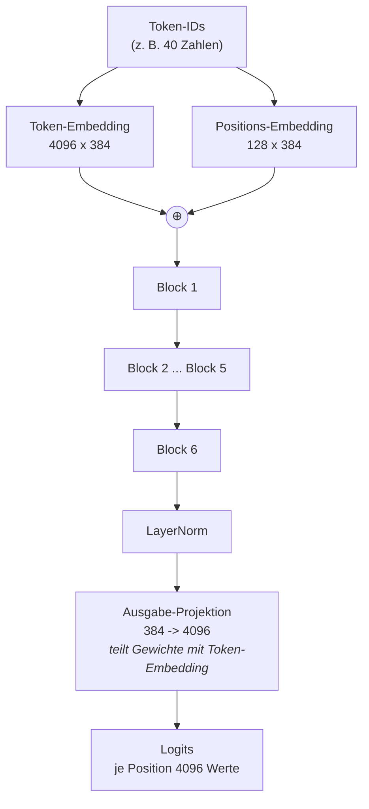
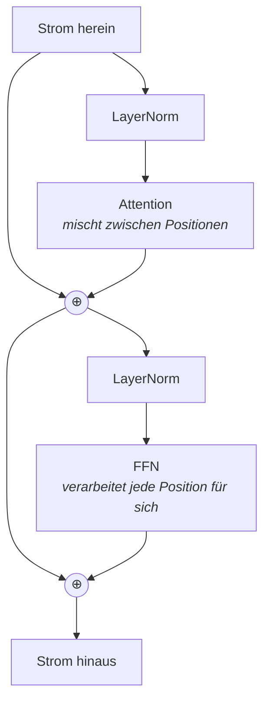

# Wie GuppyLM entsteht

*Begleittext zum Notebook `guppylm_lehrnotebook.ipynb`*

---

## Worum es geht

Am Ende des Notebooks existiert eine Datei von etwa 47 Megabyte. Darin stehen
12,3 Millionen Zahlen. Wenn man dieser Datei den Satz „hallo guppy" gibt,
antwortet sie mit etwas wie „hallo. das wasser ist heute schoen."

Nichts davon ist einprogrammiert. Niemand hat eine Liste von Fragen und
Antworten hinterlegt. Die 12,3 Millionen Zahlen sind aus 57.000 Beispielsätzen
entstanden, und alles, was das Programm dabei geübt hat, ist eine einzige
Aufgabe: **Rate das nächste Wort.**

Dieser Text erklärt, wie aus dieser einen Aufgabe ein sprechender Fisch wird.

---

## Teil 1: Die Daten

### Der Rohstoff

Der Datensatz enthält 60.000 kurze Gespräche. 57.000 zum Üben, 3.000 zum
Prüfen. Jedes Beispiel besteht aus einer Frage und einer Antwort, dazu ein
Themenwort:

```
Frage:  lots of rain today
Antwort: the outside is getting wet. finally something i can relate to.
Thema:  rain
```

Es gibt 60 Themen: Begrüßung, Futter, Wassertemperatur, Licht, Katzen vor dem
Becken, Langeweile, der Sinn des Lebens. Die Antworten sind alle kurz,
kleingeschrieben und drehen sich um das Leben im Aquarium.

Diese Enge ist kein Mangel, sondern die Voraussetzung. Ein Modell dieser Größe
kann keine Weltsprache lernen. Eine Fischsprache mit ein paar hundert Wörtern
kann es lernen.

### Rollen sichtbar machen

Das Modell sieht später nur eine lange Kette von Zeichen. Es muss darin erkennen
können, wo eine Frage aufhört und eine Antwort anfängt. Dafür bekommt jedes
Beispiel Markierungen — dieses Format heißt **ChatML**:

```
<|im_start|>user
lots of rain today<|im_end|>
<|im_start|>assistant
the outside is getting wet. finally something i can relate to.<|im_end|>
```

So sieht dann auch die Trainingsdatei `train.jsonl` aus. Eine Zeile pro
Beispiel, jede Zeile ein JSON-Objekt mit einem einzigen Feld:

```jsonl
{"text": "<|im_start|>user\nlots of rain today<|im_end|>\n<|im_start|>assistant\nthe outside is getting wet. finally something i can relate to.<|im_end|>"}
{"text": "<|im_start|>user\nis that plant real<|im_end|>\n<|im_start|>assistant\nthe plant waves in the current. it's relaxing to watch.<|im_end|>"}
```

Das `\n` ist ein Zeilenumbruch, der hier als zwei Zeichen geschrieben steht,
weil JSON keine echten Umbrüche in Zeichenketten erlaubt.

**Der wichtigste Teil ist `<|im_end|>` am Schluss.** Das Modell lernt nicht nur,
was es antworten soll, sondern auch, **wann es aufhören soll**. Aufhören ist
eine gelernte Fähigkeit wie jede andere. Fehlt diese Markierung, redet das
Modell nach der Antwort einfach weiter.

### Vom Text zu Zahlen: der Tokenizer

Ein Rechenwerk kann nichts mit Buchstaben anfangen. Der Text muss in Zahlen
übersetzt werden. Diese Übersetzung übernimmt der **Tokenizer**.

Er zerlegt den Text nicht in Buchstaben (zu viele Schritte) und nicht in Wörter
(zu viele verschiedene), sondern in häufige Bruchstücke. Das Verfahren heißt
**BPE** (Byte Pair Encoding): Es sucht wiederholt das häufigste Zeichenpaar und
fasst es zu einer neuen Einheit zusammen, bis 4096 Einheiten beisammen sind.

Wichtig: Der Tokenizer wird **auf diesen Daten** trainiert, nicht von einem
fremden Modell übernommen. Dadurch bekommt fast jedes häufige Fischwort ein
eigenes Kürzel. Ein universeller Tokenizer würde die Hälfte seines Vorrats für
Wörter verschwenden, die hier nie vorkommen.

Ein Beispiel:

```
"guppy mag blasen"  ->  5 Tokens

   1420   'gupp'
    318   'y'
   1102   'Ġmag'
     29   'Ġbl'
    847   'asen'
```

Das `Ġ` steht für ein führendes Leerzeichen. `Ġmag` und `mag` sind verschiedene
Tokens — das Leerzeichen gehört zum Kürzel dazu.

Drei Kürzel werden zuerst vergeben und behalten feste Nummern:

| Nummer | Token | Bedeutung |
|---|---|---|
| 0 | `<pad>` | Füllmaterial, siehe unten |
| 1 | `<|im_start|>` | hier beginnt eine Rolle |
| 2 | `<|im_end|>` | hier ist Schluss |

### Eingabe und Ziel

Jetzt kommt der Kniff, auf dem alles beruht. Aus **einer** Zahlenfolge werden
**zwei** gemacht: die Eingabe ohne das letzte Element, das Ziel ohne das erste.

```
Folge:   [1, 48, 29, 127, 87, 123, 2]

x:       [1, 48, 29, 127, 87, 123]      <- was das Modell sieht
y:       [   48, 29, 127, 87, 123, 2]   <- was es vorhersagen soll
```

Beide sind gleich lang und um genau eine Position gegeneinander verschoben. An
jeder einzelnen Stelle lautet die Aufgabe: „Du siehst alles bis hierher — was
kommt als Nächstes?"

Ein Beispiel mit 40 Tokens liefert damit 39 Übungsaufgaben auf einmal. Das ist
der Grund, warum 57.000 Sätze zum Lernen ausreichen.

### Auffüllen

Beispiele sind unterschiedlich lang, Rechenwerke wollen rechteckige Tabellen.
Kürzere Beispiele werden deshalb mit `<pad>` (Nummer 0) aufgefüllt.

Dieses Füllmaterial darf das Lernen nicht beeinflussen. Deshalb bekommt die
Fehlerrechnung die Anweisung `ignore_index=0`: Alles, was auf Position 0 steht,
zählt nicht.

---

## Teil 2: Das Modell

### Der Grundgedanke: der Residualstrom

Man stelle sich einen breiten Datenstrom vor, der von unten nach oben durch das
Modell fließt. Er ist 384 Zahlen breit — das ist `d_model`. Für **jedes** Token
gibt es einen solchen Strom.

Am Anfang enthält der Strom nur, welches Token an dieser Stelle steht und die
wievielte Stelle es ist. Danach folgen sechs Stationen. Jede Station **schreibt
etwas hinein**, statt den Strom zu ersetzen. Am Ende wird abgelesen, welches
Token als Nächstes kommen soll.

Dieses Hineinschreiben statt Ersetzen ist der Grund, warum sich tiefe Modelle
überhaupt trainieren lassen. Der Weg von oben nach unten bleibt durchgängig, und
die Korrekturen kommen beim Lernen unten noch an.

### Der Aufbau



### Was in einem Block passiert

Jeder der sechs Blöcke besteht aus zwei Stationen. Beide arbeiten nach demselben
Muster: normieren, rechnen, das Ergebnis zum Strom addieren.



**Station 1 — Attention.** Hier tauschen die Positionen Informationen aus. Jedes
Token bildet drei Vektoren:

- **Query** — wonach suche ich?
- **Key** — was biete ich an?
- **Value** — was gebe ich weiter, wenn man mich auswählt?

Passen Query und Key gut zusammen, fließt viel vom Value herüber. Das geschieht
sechsmal parallel mit je 64 Zahlen Breite; diese sechs **Köpfe** können sich auf
verschiedene Beziehungen spezialisieren.

Entscheidend ist die **kausale Maske**: Jedes Token darf nur nach links schauen.
Ohne diese Sperre könnte das Modell die Antwort einfach ablesen, statt sie
vorherzusagen. Die Maske ist eine Dreiecksmatrix:

```
Position 0 sieht:   [1 0 0 0 0 0]
Position 1 sieht:   [1 1 0 0 0 0]
Position 2 sieht:   [1 1 1 0 0 0]
Position 3 sieht:   [1 1 1 1 0 0]
Position 4 sieht:   [1 1 1 1 1 0]
Position 5 sieht:   [1 1 1 1 1 1]
```

**Station 2 — das FFN.** Hier redet keine Position mit einer anderen. Jede wird
einzeln verarbeitet: von 384 auf 1536 Zahlen aufweiten, eine Aktivierungsfunktion
(GELU) anwenden, wieder auf 384 zusammenführen. In dieser Aufweitung steckt der
größere Teil der Parameter.

### Die Zahlen

| | |
|---|---|
| Vokabular | 4.096 Tokens |
| Maximale Länge | 128 Tokens |
| Strombreite `d_model` | 384 |
| Blöcke | 6 |
| Attention-Köpfe | 6 (je 64 breit) |
| FFN-Weite | 1.536 (das Vierfache) |

Wo die 12,3 Millionen Parameter sitzen:

| Bauteil | Parameter | Anteil |
|---|---:|---:|
| Token-Embedding | 1.572.864 | 12,8 % |
| Positions-Embedding | 49.152 | 0,4 % |
| die sechs Blöcke | 10.646.784 | 86,8 % |
| Abschluss-Normierung | 768 | 0,0 % |
| **gesamt** | **12.269.568** | |

Die meisten schätzen den Anteil der Embeddings zu hoch. Tatsächlich steckt fast
alles in den Blöcken, und dort wiederum zu zwei Dritteln in den FFN.

Ein Sparkniff: Die Ausgabe-Projektion am Ende benutzt **dieselbe** Zahlentafel
wie das Token-Embedding am Anfang. Beide übersetzen zwischen Token und Vektor,
nur in entgegengesetzter Richtung. Ohne diesen Trick wären es 1,57 Millionen
Parameter mehr.

---

## Teil 3: Das Training

### Was gemessen wird

Das Modell gibt an jeder Position 4.096 Werte aus — für jedes mögliche nächste
Token einen. Daraus wird eine Wahrscheinlichkeitsverteilung. Gemessen wird, wie
viel Wahrscheinlichkeit auf das **tatsächlich richtige** Token entfällt. Dieses
Maß heißt **Kreuzentropie**. Je kleiner, desto besser.

**Der wichtigste Kontrollwert des ganzen Notebooks:** Vor dem Training weiß das
Modell nichts. Bei 4.096 gleich wahrscheinlichen Tokens ist Raten die beste
Strategie, und der Fehlerwert des reinen Ratens ist

> ln(4096) ≈ 8,32

Startet das Training deutlich **unter** diesem Wert, greift das Modell auf
Information zu, die es nicht haben dürfte — meist ein Fehler in der Maske.
Startet es weit **darüber**, sind die Anfangsgewichte kaputt. Diese eine Zahl
vorab zu prüfen erspart stundenlanges Suchen.

### Der Ablauf

Ein Schritt sieht so aus:

1. 32 Beispiele zufällig ziehen und zu einer rechteckigen Tabelle auffüllen
2. durch das Modell schicken, Fehlerwert berechnen
3. rückwärts ausrechnen, welche Gewichtsänderung den Fehler verkleinert
4. Gewichte ein kleines Stück in diese Richtung schieben

Das Ganze 3.000-mal. Drei Details verdienen Erklärung:

**Die Lernrate ändert sich.** Sie steigt über die ersten 200 Schritte langsam
an und fällt danach als Kosinuskurve wieder ab. Der Anstieg verhindert, dass
das noch zufällige Modell gleich zu Anfang zerlegt wird. Das Abfallen lässt es
am Ende in einem guten Zustand zur Ruhe kommen, statt darum herumzuspringen.

```
Lernrate
  3e-4 |      .-'''''--..__
       |    .'              ''--..__
       |  .'                        ''--..
  3e-5 |.'                                ''---
       +------+---------------------------------
       0     200                            3000
           Warmup                        Schritte
```

**Gradient Clipping.** Die berechnete Änderung wird in ihrer Länge auf 1,0
begrenzt. Ein einzelnes ungewöhnliches Beispiel kann sonst einen Ausschlag
erzeugen, der das halbe Modell verdirbt.

**Feste Prüfbeispiele.** Alle 200 Schritte wird an den 3.000 zurückgehaltenen
Beispielen gemessen. Diese Prüfbatches werden **einmal** gezogen und bleiben
dann gleich — sonst wären die Messwerte untereinander nicht vergleichbar.

### Die Kurve lesen

Der Fehlerwert startet bei etwa 8,3 und fällt. Interessant ist nicht die
Trainingskurve allein, sondern der **Abstand** zwischen Training und Prüfung:

- Beide fallen zusammen → das Modell lernt die Sprache.
- Die Prüfkurve läuft nach oben weg, während die Trainingskurve weiter fällt →
  das Modell lernt die Trainingsbeispiele auswendig, statt sie zu verstehen.

Nur der jeweils beste Prüfwert wird als Datei gespeichert, nicht der letzte
Stand. Der letzte ist nicht automatisch der beste.

---

## Teil 4: Was am Ende herauskommt

### Antworten erzeugen

Trainiert wird auf ganzen Sätzen gleichzeitig. Erzeugt wird Token für Token:

1. Der Prompt wird in Zahlen übersetzt
2. Das Modell liefert 4.096 Werte für die nächste Position
3. Aus diesen Werten wird **ein** Token gezogen
4. Es wird angehängt, und alles beginnt von vorn
5. Schluss ist, wenn `<|im_end|>` gezogen wird

Schritt 4 erklärt, warum Textgenerierung langsam ist: Jedes einzelne Token
kostet einen vollständigen Durchlauf durch das Modell.

Bei Schritt 3 gibt es zwei Stellschrauben:

- **Temperatur.** Kleine Werte verstärken die wahrscheinlichsten Tokens — die
  Antworten werden vorhersagbar und wiederholen sich. Große Werte gleichen die
  Verteilung an — die Antworten werden mutiger und irgendwann wirr.
- **top-k.** Nur die 50 wahrscheinlichsten Tokens bleiben überhaupt zur Wahl.
  Das verhindert, dass ein sehr unwahrscheinliches Token die Antwort entgleisen
  lässt.

### Ein realistisches Ergebnis

```
hallo guppy                  -> hallo. das wasser ist heute schoen.
hast du hunger               -> immer. flocken sind das beste.
wie ist das wasser           -> warm und klar. sehr gut.
was ist das internet         -> ich weiss nicht was das ist. ist es nass.
```

Das Modell hat kein Gedächtnis über Nachrichten hinweg. Jede Frage steht für
sich; es sieht immer nur den aktuellen Prompt.

### Was es kann und was nicht

Es hat gelernt: kurze Sätze in einem festen Ton, in der Rolle zu bleiben, 60
Themen zu unterscheiden, rechtzeitig aufzuhören.

Es hat nicht gelernt: Fakten, Rechnen, längere Zusammenhänge, mehrere
Gesprächsrunden. 12,3 Millionen Parameter und 128 Tokens Kontext geben das nicht
her.

**Und genau das ist der Punkt der Übung.** Die Bauteile in diesem Notebook —
Tokenizer, Embeddings, Attention mit kausaler Maske, FFN, Residualstrom,
Kreuzentropie, Sampling — sind dieselben, aus denen die großen Modelle bestehen.
Der Unterschied ist Größe und Datenmenge, nicht Bauart. Wer diesen Fisch
verstanden hat, versteht auch, was ein Modell mit tausendfacher Größe im Kern
tut.

---

## Kurzübersicht

```
train.jsonl (57.000 Zeilen)
        |
        v
   Tokenizer (BPE, 4.096)          Text -> Zahlen
        |
        v
   Sequenzen, max. 128 Tokens
        |
        v
   x / y um eine Position versetzt   die eigentliche Aufgabe
        |
        v
   Batch: 32 Beispiele, aufgefüllt
        |
        v
   +---------------------------+
   |  Embeddings (Token + Pos) |
   |  6 x Block                |
   |    - Attention (6 Köpfe)  |     12,3 Mio. Parameter
   |    - FFN (384 -> 1536)    |
   |  LayerNorm                |
   |  Projektion -> 4.096      |
   +---------------------------+
        |
        v
   Kreuzentropie gegen y            Start bei ln(4096) = 8,32
        |
        v
   3.000 Schritte AdamW
        |
        v
   bestes_modell.pt                 ein sprechender Fisch
```
