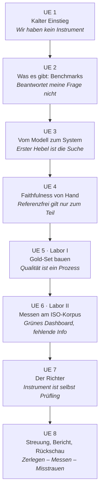
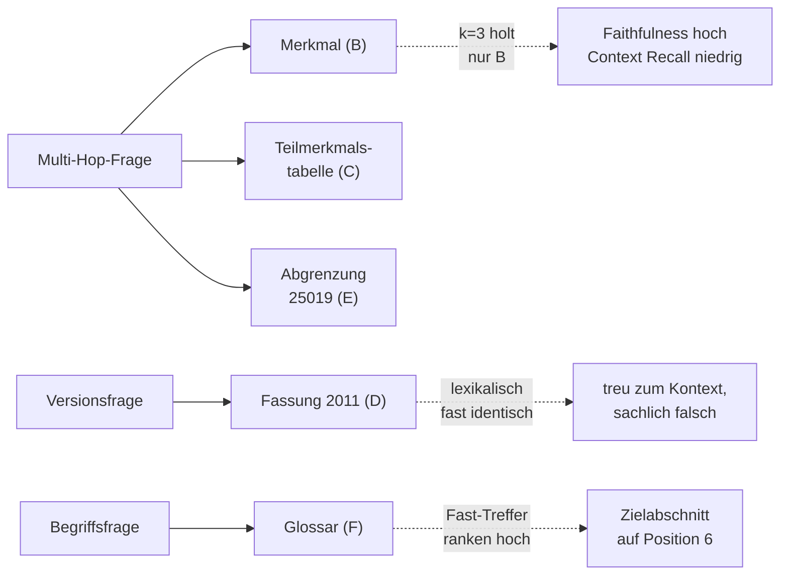

# M4 – Evaluation (8 UE)

**Modulkonzept · Bachelor Professional in KI und ML (DQR 6)**
Version 0.2 · Stand 28.08.2026

---

## 1. Zweck dieses Dokuments

Arbeitsgrundlage für Modul M4. Das Dokument hält die Zielkompetenz, den didaktischen Aufbau, den fachlichen Kanon und die Laborplanung fest. Es ist kein fertiges Skript und kein Handout.

---

## 2. Zielkompetenz

> Die Teilnehmenden können die Qualität von KI-Outputs kompetent beurteilen — auch dort, wo keine Referenzlösung vorliegt.

**Perspektive:** Betreiber. Ein eigenes System bewerten und Fehler darin lokalisieren — nicht Herstellerangaben auditieren.

**Abgrenzungen:**

| Thema | Verortung | Begründung |
|---|---|---|
| Agenten- und Trajektorienbewertung | M5 (Betrieb/Robustheit) | Sprengt 8 UE, setzt Betriebskontext voraus |
| Nachweisführung, Dokumentationspflichten | M6 (Regulatorik) | M4 liefert das Artefakt, M6 den Rahmen |
| Vollständige Bias-Taxonomie | entfällt | Nachschlagewerk, nicht Unterrichtsstoff (Abschnitt 8) |
| Multimodale Evaluation | entfällt | Kein gemeinsamer Nenner in der Gruppe |
| Tool-Landschaft in der Breite | entfällt | Veraltet binnen eines Jahres |

**Leitprinzip aus DQR-5 fortgeführt:** lesen, beurteilen und spezifizieren vor selbst schreiben.

---

## 3. Ausgangszustand und Gestaltungsprinzipien

**Gruppe:** berufsfachlich stark heterogen — Touristik, Informatik, Maschinenbau, Logistik. Gemeinsamer fachlicher Nenner ist der ML-Grundstock aus den Vormodulen: **Accuracy, Precision, Recall, Konfusionsmatrix**. Alles Weitere muss daran andocken.

**Vier Gestaltungsprinzipien:**

1. **Kleinschrittig.** Jede UE bringt genau einen neuen Begriff mit fachlichem Boden. Keine Aufzählungen von Metriknamen ohne Anwendungsfall.
2. **Hands-on, aber nie ohne Boden.** Jede praktische Übung hat einen benannten fachlichen Anker. Umgekehrt: kein fachlicher Inhalt ohne mindestens eine Beobachtung, an der er sich festmacht.
3. **Erst beobachten, dann benennen.** Die Teilnehmenden lösen ein Phänomen zuerst aus und bekommen danach den Fachbegriff dafür.
4. **Nichts behaupten, was nicht gemessen wurde.** Insbesondere: Ein Robustheitsabfall ist kein Kontaminationsbeweis (siehe UE 2).

---

## 4. Der Aufstieg im Überblick

| UE | Schritt | Fachlicher Boden | Ertrag |
|---|---|---|---|
| 1 | Eigene Urteile, Dissens sichtbar machen | Objektivität, Reliabilität, Validität; Konstruktbegriff | „Wir haben kein Instrument" |
| 2 | MMLU und GSM8K im Datensatzblick; Perturbations-Demo | Sättigung; Optionen-Erraten; GSM1k als Beweisform | „Öffentliche Benchmarks beantworten meine Frage nicht" |
| 3 | Precision/Recall → @k → MRR → nDCG | Labelanforderungen je Metrik; Labelkosten | „Der erste Hebel ist die Suche" |
| 4 | Faithfulness von Hand; danach die konzeptuelle Triade | Claim-Zerlegung; Referenz-Ehrlichkeit | „Referenzfrei gilt nur für einen Teil" |
| 5 | Labor I: Gold-Set | Skala vor Annotation; Zufallskorrektur bei κ | „Testmengenqualität ist ein Prozess" |
| 6 | Labor II: Messen am ISO-Korpus | Sammelscore-Negativbeispiel; Faithfulness ≠ Correctness | „Grünes Dashboard, fehlende Information" |
| 7 | Swap mit Menschen, dann mit dem Judge | Drei Fallenklassen; Expertise Gap als Validitätsfrage | „Das Instrument ist selbst ein Prüfling" |
| 8 | Streuung, Bewertungsbericht, Rückschau | Bootstrap, gepaarter Vergleich | Die Triade wird benannt |

**Rampe und Ertragszone:** UE 1–4 sind Aufstieg, ab UE 5 wird gemessen. Das ist bewusst so gewichtet und der Preis für den behutsamen Einstieg.

**Zur Reihenfolge:** Die Triade *Zerlegen – Messen – Misstrauen* ist ein Expertenmodell. Sie steht am Ende, nicht am Anfang — als Rückschau ordnet sie Erlebtes, als Einstieg wäre sie eine Vokabel.

---

## 5. Die Unterrichtseinheiten im Detail

### UE 1 — Kalter Einstieg: Wir haben kein Instrument

**Ablauf**

1. Vier KI-Antworten auf eine Fachfrage werden ausgeteilt (Auswahl aus einer Domäne mit gemeinsamem Nenner, keine Spezialisierung).
2. Jede:r urteilt **allein** und schriftlich: welche ist die beste, welche die schlechteste, mit einer Begründung.
3. Urteile werden eingesammelt und nebeneinandergelegt.

**Der Befund ist der Dissens.** Die Gruppe ist sich nicht einig — und die Begründungen nennen unterschiedliche Kriterien. Genau das ist der Ausgangspunkt.

**Fachlicher Boden**

Rückgriff auf den bekannten ML-Stoff: Bei einem Klassifikator gibt es eine Konfusionsmatrix, weil es ein Label gibt. Leitfrage: *Was wäre hier die Konfusionsmatrix, und woran scheitert der Versuch, eine aufzustellen?*

Daraus die drei Gütekriterien, die den Rest des Moduls tragen:

- **Objektivität** — hängt das Ergebnis vom Bewertenden ab? (Antwort: gerade eben ja.)
- **Reliabilität** — käme bei Wiederholung dasselbe heraus?
- **Validität** — misst das Kriterium, was gemeint ist?

Dazu der **Konstruktbegriff**: Was ist eigentlich „Qualität einer Antwort"? Ein Benchmark ist eine Operationalisierung, keine Wahrheit.

**Ertrag:** Wir haben Meinungen, aber kein Instrument. Der Rest des Moduls baut eines.

---

### UE 2 — Was es gibt, und warum es nicht reicht

**Teil A: Datensatzblick**

Zwei Benchmarks, nicht mehr:

- **MMLU** — akademisches Faktenwissen, Multiple Choice.
- **GSM8K** — Grundschulmathematik mit mehrschrittigem Rechenweg.

Bewusst reduziert: Beide haben eine dokumentierte Kontaminations-Gegengeschichte und liefern damit den fachlichen Boden für Teil B. Weitere Benchmarks ohne diesen Anschluss wären Aufzählungsballast.

Gearbeitet wird am **Rohformat**: Wie sieht ein Item konkret aus? Wie banal oder komplex ist es? Die Ernüchterung darüber, wie einfach die Items gebaut sind, ist Teil des Lernziels.

**Teil B: Sättigung und Kontamination**

- **Sättigung:** Sobald genügend Modelle über 90 % liegen, trennt ein Benchmark nicht mehr zwischen ihnen. MMLU war bis 2023 der Leitbenchmark und ist genau daran gescheitert.
- **Kontaminationsnachweise:** GPT-4 erriet auf MMLU fehlende Antwortoptionen mit rund 57 % Exact Match. Das difficulty-gematchte GSM1k zeigte bei einzelnen Modellfamilien Einbrüche von bis zu 13 Prozentpunkten gegenüber GSM8K.

**Teil C: Live-Demo (der erste Aha-Moment)**

1. Drei bis fünf bekannte Items auswählen, Modell lösen lassen — funktioniert.
2. **Perturbieren**: Zahlen, Namen, Einheiten, Datumsangaben ändern, Aufgabenstruktur erhalten.
3. Erneut lösen lassen. Beobachten, ob und wo es bricht.

> ⚠ **Sprachregelung, verbindlich.** Der Einbruch belegt **keine** Kontamination. Er belegt Nicht-Robustheit.
> **Beobachtung** = Robustheitsabfall.
> **Hypothese** = Memorierung.
> **Beweis** = schwierigkeitsgematchte Kontrollmenge — genau deshalb wurde GSM1k gebaut.
>
> Ohne diese drei Zeilen erzeugt die Demo genau das Halbwissen, das M4 verhindern soll.

**Leitprinzip an die Tafel:**

> Ein kontaminationsresistenter Benchmark verlangt die **Anwendung einer Struktur auf gestörte Eingaben**, nicht das Abrufen einer memorierten Instanz.

**Ertrag:** Öffentliche Benchmarks beantworten meine betriebliche Frage nicht — weder inhaltlich noch methodisch. Ich brauche eigene Testmengen.

---

### UE 3 — Vom Modell zum System

**Der Übergang** wird explizit gemacht: Bisher wurde ein Modell isoliert betrachtet. Ein RAG-System hat zwei Komponenten, die getrennt versagen können. Wer nur das Ende misst, kann den Fehler nicht lokalisieren.

**Metrikaufbau, streng an das Vorwissen angedockt:**

| Schritt | Von | Nach | Was neu ist |
|---|---|---|---|
| 1 | Precision, Recall | Precision@k, Recall@k | Der Cutoff: Es zählt nur die Trefferliste bis Rang k |
| 2 | | MRR | Position statt Menge — aber nur die des ersten Treffers |
| 3 | | nDCG@k | Abgestufte Relevanz und Rangdiskontierung |

**nDCG im Detail:** DCG@k = Σᵢ relᵢ / log₂(i+1), normiert am idealen Ranking (IDCG). Zwei Konsequenzen, die fast immer unterschlagen werden:

1. nDCG-Werte sind zwischen verschiedenen Bewertungsskalen und Kandidatenmengen **nicht** vergleichbar.
2. Ein nDCG ohne dokumentierte Relevanzskala ist keine Zahl, sondern eine Behauptung.

**Der tragende Satz dieser UE** — ohne ihn ziehen die Teilnehmenden aus den folgenden Einheiten den falschen Schluss, IR-Metriken seien überholt:

> Labels für das **Retrieval** sind billig — ob ein Abschnitt relevant ist, entscheidet man in Sekunden. Labels für **Antworten** sind teuer. Deshalb ist die Retrieval-Messung der erste und günstigste Hebel. Und deshalb ist referenzfreie Bewertung kein Fortschritt, sondern ein Notbehelf für die zweite Hälfte.

**Ertrag:** Der erste Hebel ist die Suche, und sie ist mit vertrauten Mitteln messbar.

---

### UE 4 — Faithfulness von Hand

**Teil A: Die Übung**

Eine KI-Antwort und der zugehörige Kontext liegen auf dem Tisch. Die Teilnehmenden:

1. zerlegen die Antwort in einzelne Aussagen (Claims),
2. prüfen jede Aussage gegen den Kontext: belegt / nicht belegt,
3. bilden den Quotienten.

Das Ergebnis **ist** Faithfulness — von Hand gerechnet, bevor je ein Werkzeug auftaucht. Die spätere Toolzahl ist damit keine Blackbox, sondern ein nachgebauter Handgriff.

Beobachtung, die dabei zwangsläufig entsteht: Die Zerlegung in Claims ist selbst strittig. Was ist eine Aussage? Zählt eine Einschränkung als eigener Claim? Dieser Dissens ist der Vorgriff auf UE 7.

**Teil B: Die konzeptuelle Triade**

Drei Fragen an ein RAG-System:

| Frage | Konzept |
|---|---|
| Hat die Suche das Richtige und nur das Richtige geliefert? | **Suche** |
| Stützt sich die Antwort auf das Gelieferte? | **Verankerung** |
| Beantwortet sie die gestellte Frage? | **Zielerfüllung** |

> ⚠ **Versionswarnung.** Diese Triade stammt aus dem Ragas-Paper von 2023. Das heutige Tooling hat sie umbenannt und aufgeteilt — aus „Context Relevance" wurden Context Precision und Context Recall. Die Triade wird als **Konzept** gelehrt, nicht als Werkzeugkunde. Beim Tooling in UE 6 wird gezeigt, dass die Namen andere sind.

**Teil C: Die Referenz-Ehrlichkeit**

- **Faithfulness ist referenzfrei.** Anteil der belegten Aussagen an allen Aussagen — mehr braucht es nicht.
- **Context Recall ist es nicht.** Weil es darum geht, nichts zu übersehen, braucht Context Recall immer eine Referenz. Die LLM-basierte Variante nutzt die Referenzantwort als Stellvertreter für Referenzkontexte, zerlegt sie in Claims und prüft die Zuschreibbarkeit zum abgerufenen Kontext.

> Wer Ragas pauschal als „braucht keine Ground Truth" lehrt, erzeugt genau die Halbwissenslage, die vermieden werden soll.

**Ertrag:** „Referenzfrei" gilt für einen Teil der Metriken, nicht für alle. Und jede referenzfreie Zahl entsteht durch einen Modellaufruf.

---

### UE 5 — Labor I: Das Gold-Set

**Schritt 1 — Musterbeispiel im Plenum.**
Ein vollständig annotiertes Item wird gezeigt: Frage, Referenzantwort, Referenzkontexte als Chunk-IDs, Relevanzstufen, Annotationsrichtlinie auf fünf Regeln eingedampft. Erst das fertige Artefakt sehen, dann selbst bauen.

**Schritt 2 — Synthetische Kandidaten.**
Ein LLM erzeugt rund 40 Fragenkandidaten aus dem Korpus. Der Prompt wird gemeinsam gelesen und beurteilt: Was verlangt er, und was wird er systematisch liefern? Erwartungsbildung vor der Ausführung.

> **Merksatz:** Synthetik skaliert die **Vorarbeit**, nicht das **Urteil**.

**Schritt 3 — Manuelle Filterung.**
Die Teilnehmenden sortieren die Kandidaten: trivial / redundant / unscharf / brauchbar. Die **Ausschussquote wird gemessen** und protokolliert. Sie ist selbst ein Befund über das Generatormodell.

Bewusst nicht vorgesehen: ein zweites LLM als Filter. Begründung in Abschnitt 12.

**Schritt 4 — Doppelannotation.**
Kleingruppen bearbeiten je 6–8 Items, jedes Item unabhängig von **zwei** Personen. Relevanzskala **0/1/2**, weil nDCG abgestufte Labels braucht — Rückbezug auf UE 3. Das macht spürbar, warum die Skalendefinition *vor* der Annotation stehen muss.

**Schritt 5 — Dissens und κ.**
Uneinigkeiten sammeln → **Cohen's κ** im Notebook rechnen → Richtlinie nachschärfen → Streitfälle reannotieren → κ erneut rechnen.

> ⚠ **Cohen's κ, nicht Fleiss.** Fleiss' κ setzt drei oder mehr Bewerter pro Item voraus. Bei Doppelannotation ist Cohen's κ das richtige Maß.

Der Zufallskorrektur-Term wird explizit gerechnet, damit klar wird, warum 85 % Übereinstimmung bei schiefer Klassenverteilung nichts wert sind.

**Ertrag:** Der Anstieg von κ zwischen den beiden Durchgängen ist der eigentliche Lerngegenstand. **Testmengenqualität ist ein Prozess, kein Zustand.**

**Ebenfalls in dieser UE — die vierte Fragenklasse:** nicht beantwortbare Fragen. Ein System ist nur dann gut, wenn es weiß, was es nicht weiß. Erwarteter Output: „Dazu liegen keine Informationen vor." In der Betreiberperspektive ist Verweigerungsfähigkeit oft die wichtigste Einzeleigenschaft.

---

### UE 6 — Labor II: Messen am ISO-Korpus

**Ablauf**

1. Pipeline und Dashboard vorführen — alles grün.
2. Messung mit Ragas: Faithfulness, Context Precision, Context Recall; zusätzlich nDCG@10 gegen das in UE 5 gebaute Gold-Set.
3. Die drei Defekte **lokalisieren und begründen**, nicht beheben.
4. Judge-freie Gegenrechnung: `IDBasedContextRecall` oder eigene Recall@k-Rechnung gegen das Gold-Set. Beide Zahlen vergleichen — wo sie auseinandergehen, liegt der Judge-Fehler.

**Negativbeispiel, das hier gezeigt und verworfen wird:** DeepEvals `RagasMetric` ist der Mittelwert aus vier Einzelmetriken. Ein Mittelwert über Retrieval- **und** Generationsmetriken macht Fehlerlokalisierung rechnerisch unmöglich. Zeigen, benennen, verwerfen.

**Ertrag:** Grünes Dashboard bei fehlender Information. Faithfulness ≠ Correctness ist hier nicht behauptet, sondern gemessen.

Korpusdetails in Abschnitt 9.

---

### UE 7 — Der Richter

**Teil A: Swap mit Menschen (zuerst!)**

Die Gruppe wird geteilt. Gruppe 1 bewertet Antwortpaare in der Reihenfolge A→B, Gruppe 2 dieselben Paare als B→A. Urteile vergleichen, **Flip-Rate** bestimmen.

Der Befund betrifft die eigene Gruppe. Das ist der entscheidende didaktische Zug: Reihenfolgeeffekte sind eine Eigenschaft von Messinstrumenten, Menschen eingeschlossen. Damit ist die anschließende Judge-Kritik keine Häme, sondern Methodik.

**Teil B: Derselbe Aufbau mit dem Judge**

- Swap-Experiment mit dem LLM-Judge, Flip-Rate.
- Verbosity: eine korrekte Antwort um Füllmaterial aufblähen, Score-Delta.

Zwei Zahlen, die die Teilnehmenden selbst erzeugt haben und die dem Judge widersprechen.

**Teil C: Die drei Fallenklassen**

Jetzt erst wird benannt, was ausgelöst wurde. Siehe Abschnitt 8.

**Teil D: Verwandtschaft (vorbereitete Demo)**

| Rolle | Modell |
|---|---|
| Generator | Qwen3.8-27B (lokal) |
| Judge „verwandt" | Qwen3.8-27B (lokal) |
| Judge „fremd" | Gemma4-12B bzw. Phi-4 (OpenRouter/DeepInfra) |

Dasselbe Antwortpaar, zwei Judges, Delta ablesen. Aus Zeitgründen als vorbereitete Demo mit ausgelieferten Rohdaten, nicht als eigene Messung.

**Teil E: Der Expertise Gap — bewusst herausgehoben**

> Verbosity und Position sind **Oberflächenfehler**: per Swap messbar, in einer Stunde nachweisbar.
> Der Domain Expertise Gap ist kategorial anders: Er ist ein **Validitätsproblem**, das man von innerhalb der Evaluation grundsätzlich nicht sehen kann. Ein Judge, der das Fachvokabular nicht tief genug versteht, meldet keinen Fehler — er meldet Zustimmung.

Daraus folgt der Satz, der zu M5 und M6 überleitet: **Eine menschliche Stichprobenkalibrierung ist nicht verhandelbar.** Kein Anteil des Judge-Ergebnisses darf ungeprüft in eine Aussage eingehen.

**Ertrag:** Das Instrument ist selbst ein Prüfling.

---

### UE 8 — Streuung, Bericht, Rückschau

**Teil A: Statistik im Notebook**

Details in Abschnitt 10. Kernaussage:

Bei 30 Testfragen und 27 Treffern liegt das 95-%-Intervall grob bei 75–98 %. Damit ist „0,91 gegen 0,89" erledigt, ohne dass über Signifikanztests geredet werden muss.

Zur Größenordnung aus der Agentenpraxis: Systeme mit 60 % Erfolgsquote im Einzellauf fallen über acht Läufe auf rund 25 %.

> **Modulregel:** Ein Balkendiagramm ohne Intervall wird in M4 nicht akzeptiert.

**Teil B: Der Bewertungsbericht**

Kurzform, eine Seite: Was wurde gemessen, mit welcher Testmenge, mit welchem Instrument, mit welcher Streuung — und **welche Aussage ist damit nicht gedeckt**. Der letzte Punkt ist der eigentliche Prüfstein.

**Teil C: Rückschau — jetzt die Triade**

Der zurückgelegte Weg bekommt seinen Namen:

- **Zerlegen** — UE 3, 4, 6: Welche Komponente ist gemeint?
- **Messen** — UE 3, 5, 8: Mit welchem Instrument, gegen welche Testmenge, mit welcher Streuung?
- **Misstrauen** — UE 2, 7: Wo sitzt die Falle im Messinstrument selbst?

**Teil D: Übergabe**

Nach M5: Agenten- und Trajektorienbewertung, Betriebsmessung über Zeit.
Nach M6: der Bewertungsbericht als regulatorisch verwertbares Artefakt.

---

## 6. Fachlicher Mindestkanon (Referenz)

Zusammenstellung dessen, was sitzen muss. Verteilung über die UEs siehe oben.

### 6.1 Welche Metrik braucht welche Labels

| Metrik | Voraussetzung | Blinder Fleck |
|---|---|---|
| Precision@k | binäre Relevanzlabels | ignoriert Rang innerhalb der Top-k |
| Recall@k | binäre Labels **und** vollständige Relevanzmenge | rechnet große k schön |
| MRR | Position des ersten Treffers | sagt nichts über den Rest der Liste |
| nDCG@k | abgestufte Relevanz + dokumentierte Skala | nicht vergleichbar über Skalen und Kandidatenmengen |
| Faithfulness | Kontext + Antwort (referenzfrei) | sagt nichts über Korrektheit |
| Context Recall | **Referenz** erforderlich | nicht referenzfrei, entgegen verbreiteter Darstellung |

### 6.2 Die Metrik ist selbst ein Modellaufruf

Faithfulness = Claim-Zerlegung (LLM) + Attribuierung (LLM). Zwei Inferenzschritte, zwei Fehlerquellen, beide dem Judge-Bias ausgesetzt.

### 6.3 Judge-freie Alternativen bei vorhandenen Labels

- `NonLLMContextPrecisionWithReference` — Levenshtein-Distanz (rapidfuzz) gegen Referenzkontexte.
- `IDBasedContextRecall` — Vergleich der Kontext-IDs mit Referenz-IDs.

> **Lehrsatz:** Der Judge ist der Preis dafür, dass man sich das Labeln gespart hat.

### 6.4 Streuung und Übereinstimmung

- Bootstrap über Items für Konfidenzintervalle; gepaarter Bootstrap für Vergleiche.
- Cohen's κ mit Zufallskorrektur für Doppelannotation.

---

## 7. Sprachregelungen (verbindlich für Skript und Handreichung)

| Falsch | Richtig |
|---|---|
| „Das Modell ist kontaminiert, weil es nach Perturbation scheitert." | „Das Modell ist nach Perturbation nicht robust. Memorierung ist die naheliegende Hypothese; der Nachweis braucht eine gematchte Kontrollmenge." |
| „RAGAS braucht keine Ground Truth." | „Faithfulness und Answer Relevance sind referenzfrei. Context Recall braucht eine Referenz." |
| „Der nDCG liegt bei 0,82." | „Der nDCG@10 liegt bei 0,82, bei dreistufiger Relevanzskala über 20 Kandidaten." |
| „Konfiguration A ist besser als B (0,91 vs. 0,89)." | „Der gepaarte Bootstrap liefert ein Intervall, das die Null einschließt — kein belegter Unterschied." |
| „Faithfulness ist hoch, also stimmt die Antwort." | „Die Antwort ist treu zum abgerufenen Kontext. Ob der Kontext das Richtige enthielt, misst Context Recall." |

---

## 8. Bias auf Prinzipniveau: drei Fallenklassen

Statt zwölf Bias-Typen drei Fragen vor jeder automatisierten Bewertung:

1. **Bewertet das Instrument die Oberfläche statt den Inhalt?**
   Länge, Position, Reihenfolge der Rubrikstufen, Vorhandensein von Zitaten — unabhängig davon, ob diese echt sind.

2. **Ist das Instrument mit dem Prüfling verwandt?**
   Self-Enhancement, Preference Leakage, Judge aus derselben Modellfamilie wie der Generator.

3. **Kennt das Instrument die Aufgabe schon?**
   Kontamination, Sättigung, Testmenge aus öffentlichen Quellen.

**Merkformel: Oberfläche – Verwandtschaft – Vorwissen.** Übertragbar auf Fälle, die es heute noch nicht gibt. Einzelnamen gehören in die Handreichung, nicht in den Unterricht.

**Nicht in dieser Reihe:** der Domain Expertise Gap. Er ist kein Oberflächenfehler, sondern ein Validitätsproblem, und wird in UE 7 Teil E getrennt behandelt.

---

## 9. Korpus für Labor II: ISO/IEC 25010

**Warum diese Domäne:** Softwarequalität ist der gemeinsame Nenner der heterogenen Gruppe — jede:r hat eine Vorstellung von „zu langsam" oder „unbedienbar". Anschlussfähig an die vorhandenen ISO-25010-Lehrszenarien (DriveCheck-AI, Zählerstands-Audit).

> ⚠ **Urheberrecht:** Der Normtext darf nicht in den Korpus. Der Korpus wird **vollständig in eigenen Worten** verfasst. Merkmalsstruktur und Änderungen zwischen den Fassungen sind Sachinformationen und frei darstellbar; die Formulierungen der Norm sind es nicht.

### 9.1 Aufbau (18–20 Abschnitte)

| Block | Abschnitte | Rolle |
|---|---|---|
| A | Einführung, SQuaRE-Familie, Zweck des Modells | Kontext |
| B | Je ein Abschnitt pro Merkmal der Fassung 2023: Funktionale Eignung, Performanz, Kompatibilität, Interaktionsfähigkeit, Zuverlässigkeit, Sicherheit, Wartbarkeit, Flexibilität, Betriebssicherheit | Kern (9 Abschnitte) |
| C | **Teilmerkmals-Tabelle** als eigener Abschnitt | Multi-Hop-Ziel |
| D | 2–3 Abschnitte aus der **Fassung 2011** (acht Merkmale, „Gebrauchstauglichkeit", „Portabilität") | Versionsfalle |
| E | Abgrenzung Produktqualität ↔ Qualität bei der Nutzung (eigene Norm 25019:2023) | Multi-Hop-Ziel |
| F | Glossar | Rangfalle |
| G | Hinweise zur Messbarkeit von Merkmalen | Ablenkung |

### 9.2 Die drei Defekte

**Defekt 1 — Multi-Hop.** *„Welchem Merkmal ist Skalierbarkeit zugeordnet, und wie hieß dieses Merkmal in der Vorgängerfassung?"* Benötigt B (Flexibilität) + C (Teilmerkmale) + D (2011: Portabilität). Bei k = 3 holt der Retriever nur den ersten Block. Plausible Antwort, Faithfulness hoch, Context Recall im Keller.

**Defekt 2 — Versionsfalle.** *„Wie viele Qualitätsmerkmale umfasst das Produktqualitätsmodell?"* Die 2011er Abschnitte sind lexikalisch fast identisch und ranken hoch. Antwort „acht" ist treu zum Kontext und trotzdem falsch. Die Falle ist nicht konstruiert, sondern real: 2011 acht Merkmale, 2023 neun.

**Defekt 3 — Rangfalle.** Das Glossar liefert Fast-Treffer („Gebrauchstauglichkeit", „Portabilität"); der fachlich richtige Abschnitt landet auf Position 6. Hier greift nDCG, und es wird sichtbar, warum Recall@10 die Sache schönrechnet.

### 9.3 Fragenmenge (25–30 Items)

| Klasse | Anteil | Zweck |
|---|---|---|
| Single-Hop | ~10 | Baseline, muss funktionieren |
| Multi-Hop | ~8 | Defekt 1 |
| Versionsfalle | ~6 | Defekt 2 |
| Nicht beantwortbar | ~5 | Verweigerungsfähigkeit |

Beispiel für die vierte Klasse: *„Welchen Grenzwert schreibt das Modell für die p95-Antwortzeit vor?"* — Das Modell schreibt keine Grenzwerte vor. Die Frage misst zugleich eine echte fachliche Fehlvorstellung ab.

---

## 10. Statistik-Notebook (UE 8, Vorarbeit in UE 5)

- **Item-Level-Scores als DataFrame**, nicht als Mittelwert — Voraussetzung für alles Weitere.
- **Bootstrap über Items** (10.000 Resamples, Perzentil-Intervall) für jede Kennzahl. Sekundenschnell, keine Verteilungsannahme, entspricht der Praxis.
- **Gepaarter Bootstrap** für den Vergleich zweier Konfigurationen. Kritisch: über *dieselben* Items resampeln. Zwei unabhängige Intervalle auf Überlappung zu prüfen ist der Standardfehler und liefert systematisch zu konservative Aussagen.
- **Cohen's κ** aus UE 5, beide Durchgänge, im selben Notebook.
- **Flip-Rate aus UE 7** ebenfalls mit Intervall — auch Judge-Instabilität bekommt eine Streuung.
- Darstellung durchgehend mit Fehlerbalken.

---

## 11. Kompetenznachweis

Passend zu „lesen und spezifizieren statt schreiben": Eine **plausibel aussehende, fertige Eval-Suite** wird vorgelegt. Aufgabe: die Schwächen benennen und begründen.

**Drei bis vier eingebaute Mängel**, Auswahl aus:

- Judge aus derselben Modellfamilie wie der Generator
- Testmenge aus einer öffentlichen Quelle übernommen
- kein Retrieval/Generation-Split, nur ein Sammelscore
- Einzellauf ohne Streuungsangabe
- nDCG ohne dokumentierte Relevanzskala
- Context Recall als „referenzfrei" deklariert

**Empfehlung für die Erstauflage:** Sammelscore, Einzellauf ohne Streuung, Judge-Verwandtschaft. Diese drei decken je eine der drei Bewegungen ab und sind ohne Spezialwissen erkennbar. Die übrigen sind subtiler und eignen sich für spätere Durchläufe oder zur Differenzierung nach oben.

---

## 12. Bewusst verworfene Alternativen

Festgehalten, damit die Entscheidungen nicht versehentlich rückgängig gemacht werden.

**LLM-Kritiker als Filter für das Gold-Set.**
Naheliegender Ablauf wäre: Testfragen vom LLM generieren, von einem zweiten LLM filtern lassen, fertig ist die Testmenge. Das ist zirkulär. Der Generator teilt die blinden Flecken des Prüflings, der LLM-Kritiker teilt sie ebenfalls. Was entsteht, ist eine Testmenge, die genau das nicht findet, was die Modellfamilie systematisch falsch macht. Zudem widerspricht es dem DQR-5-Prinzip: Hier würde produzieren lassen und beurteilen delegiert.
*Stattdessen:* Synthetik als Kandidatenlieferant, Mensch als Filter, Ausschussquote als Befund (UE 5, Schritte 2–3). Der Kritiker-Prompt darf als Werkzeug gezeigt werden.

**Analogie „Benchmark-Kontamination ↔ unreflektierte KI-Nutzung durch Studierende".**
Verlockend, aber schädlich: Sie verwischt genau den Begriff, den UE 2 sauber setzen muss. Prüfungsintegrität ist ein anderes Thema als Evaluationsmethodik.

**Programmierdidaktische Übungsformate** (eigene Lösung vs. KI-Lösung vergleichen, Prompt-statt-Code-Aufgaben, Debugging-Werkstatt).
Falsches Niveau und falsche Zielgruppe für eine Gruppe mit Logistik-Fachwirt:innen und Touristik-Expert:innen.

**Ein dritter Benchmark in UE 2.**
Ohne dokumentierte Kontaminations-Gegengeschichte fehlt der Anschluss an Teil B. Zwei Benchmarks mit Beleg schlagen drei ohne.

**Hochschuldidaktische Literatur zu kritischem Denken als fachliche Grundlage.**
Zielt auf KI-Literacy bei Lernenden — „ich beurteile, was mir die KI ausgibt". M4 zielt auf Betreiberkompetenz — „ich messe ein System, das ich verantworte". Benachbart, aber nicht dasselbe; als fachlicher Boden für Evaluationsmethodik nicht tragfähig.

---

## 13. Entscheidungsprotokoll

| # | Entscheidung |
|---|---|
| 1 | Zielkompetenz „Systeme bewerten können" (Betreiberperspektive) |
| 2 | Didaktischer Aufstieg statt Expertenmodell; Triade als Rückschau in UE 8 |
| 3 | Perturbations-Demo in UE 2 als erster Aha-Moment |
| 4 | Zwei Benchmarks (MMLU, GSM8K), nicht mehr |
| 5 | Faithfulness zuerst von Hand, danach mit Werkzeug |
| 6 | Positions-Bias zuerst am Menschen, dann am Judge |
| 7 | Bias nur auf Prinzipniveau (drei Fallenklassen); Expertise Gap getrennt |
| 8 | Zwei Laborteile: Gold-Set-Bau (UE 5) und Messung (UE 6) |
| 9 | Synthetik als Kandidatenlieferant, kein LLM-Filter |
| 10 | Korpus-Domäne ISO/IEC 25010, vollständig in eigenen Worten |
| 11 | Fertiges Tooling zuerst, danach Eigenkonzeption |
| 12 | Streuungsrechnung im Notebook (Bootstrap) |
| 13 | Fremder Judge über OpenRouter/DeepInfra, als vorbereitete Demo |
| 14 | Kompetenznachweis mit 3–4 eingebauten Mängeln |
| 15 | Agenten-/Trajektorienbewertung nach M5 |

---

## 14. Offene Punkte und nächste Schritte

**Offen:**

- Konkrete Item-Auswahl für die Perturbations-Demo in UE 2 (Quelle, Anzahl, Vorbereitungsaufwand)
- Domäne der vier Antworten für den kalten Einstieg in UE 1 — muss neutral genug sein, damit nicht aus Vorwissen statt aus Kriterien geurteilt wird
- Umfang der Handreichung; Einbindung in die HTML-Markdown-App
- Welches Artefakt genau an M5 und M6 übergeben wird

**Lieferreihenfolge:**

**a)** Korpusentwurf — 18–20 Abschnitte als Markdown, drei Defekte eingebaut und dokumentiert
**b)** Fragenkatalog mit Referenzantworten und Referenzkontext-IDs, plus das annotierte Musterbeispiel für UE 5
**c)** Notebook-Gerüst (Bootstrap, gepaarter Bootstrap, Cohen's κ, Flip-Rate)
**d)** Die fehlerhafte Eval-Suite für den Kompetenznachweis

---

## 15. Fachlicher Hintergrund: Stand der Technik

Kurzfassung der zugrunde liegenden Recherche, Stand August 2026.

### LLM-as-Judge

Ausgangspunkt war der Befund, dass GPT-4 in über 80 % der Fälle mit menschlichen Bewertern übereinstimmt — dieselbe Rate wie zwischen Menschen. Die Folgeforschung ist deutlich nüchterner:

- Dokumentiert sind Verbosity-Bias, Positions-Bias, Self-Enhancement-Bias und Authority-Bias (Bevorzugung von Antworten mit Zitaten, auch wenn diese erfunden sind).
- Hinzu kommen Verzerrungen aus dem Bewertungs-Prompt selbst: Rubric-Order-Bias, Score-ID-Bias, Reference-Answer-Score-Bias.
- Befund 2026: Kein Judge ist über Benchmarks hinweg gleichmäßig zuverlässig; selbst Frontier-Modelle überschreiten auf schwierigen Bias-Benchmarks 50 % Fehlerrate.
- Konzeptionell zentral: *Reliability without Validity* — hohe Konsistenz ist kein Beleg für Gültigkeit.
- **Preference Leakage** (ICLR 2026): Kontamination durch Verwandtschaft von Datengenerator- und Evaluator-Modell; schwerer zu entdecken als die klassischen Judge-Biases.

### Bewertung ohne Ground Truth

Etablierter referenzfreier Kanon: Faithfulness, Answer Relevance, Context Relevance; dazu Selbstkonsistenz-Verfahren (SelfCheck).

Realitätscheck: Eine Untersuchung an 198 Firmenbeispielen behandelt referenzfreie Bewertung als binäre Klassifikation und findet einen **optimistischen Bias** (falsche Antworten werden durchgewinkt) sowie einen **zynischen Bias** (korrekte Antworten werden abgelehnt). Als alleiniges Fundament nicht belastbar.

Trend: weg vom skalaren Score, hin zu diagnostischer Prüfung auf Claim-Ebene.

### Retrieval-Metriken

Klassischer IR-Anker: Precision@k, Recall@k, Hit Rate, MRR, nDCG; Referenzrahmen TREC, MS MARCO, BEIR.

Der didaktisch wertvolle Standardfall: Ein Legal-RAG erreicht offline 0,91 Faithfulness; in Produktion fehlt bei jeder sechsten Antwort ein zentraler Paragraf. Die Faithfulness bleibt bei 0,91, der Context Recall liegt bei 0,62 — der Retriever verfehlt bei Multi-Hop-Fragen die zweite Quelle, der Generator antwortet kohärent aus dem Teilkontext.

### Kontamination

- Sättigung: Sobald genügend Modelle über 90 % liegen, trennt ein Benchmark nicht mehr (MMLU).
- Nachweise: GPT-4 errät auf MMLU fehlende Antwortoptionen mit 57 % Exact Match; das schwierigkeitsgematchte GSM1k zeigt Einbrüche bis 13 Prozentpunkte.
- Erkennung war insgesamt nur begrenzt erfolgreich; der Fokus hat sich auf **Mitigation im Benchmark-Design** verlagert.
- Drei Linien: Aktualität (LiveBench ersetzt monatlich rund ein Sechstel der Fragen, objektive Ground Truth ohne LLM-Judge), prozedurale Erzeugung (DyVal, TreeEval), Perturbation.

### Testmengen und Statistik

Sauberer Workflow: Fähigkeiten definieren → Dev- und Test-Set anlegen, **bevor** Code entsteht → System gegen das Dev-Set bauen → Test-Set zurückhalten. Weil die Evaluation vor dem System existiert, sinkt das Kontaminationsrisiko erheblich.

Zur Streuung: Systeme mit 60 % Erfolgsquote im Einzellauf fallen über acht Läufe auf rund 25 %.

---

## 16. Werkzeuge und Betriebsrisiken

| Risiko | Beschreibung | Umgang |
|---|---|---|
| **NaN-Falle** | Ragas liefert NaN, wenn das Modell ungültiges JSON ausgibt. Mit lokalen Modellen über LM Studio kein Randfall. | JSON-Constraining einplanen — oder bewusst als Beobachtung einbauen: „unsere Messung hat 12 % Ausfälle" ist selbst ein Befund. |
| **Versionsdrift** | Ragas migriert von der Legacy-Metrik-API auf die Collections-API; die Abgrenzung war im Frühjahr 2026 noch unklar. | Versionsnummer neben jedes Codebeispiel in der Handreichung. |
| **Sammelscores** | DeepEvals `RagasMetric` ist der Mittelwert aus vier Einzelmetriken. | Negativbeispiel in UE 6: Zeigen, benennen, verwerfen. |
| **Judge-Verwandtschaft** | Generator und Judge aus derselben Familie = eingebautes Self-Enhancement. | In UE 7 Teil D als Messung aufgelöst statt als Mangel hingenommen. |

**Infrastruktur:** Dual-GPU (40 GB VRAM) lokal für Generator und Labor; OpenRouter oder DeepInfra für den fremden Judge.

---

## 17. Quellen

**Judge-Zuverlässigkeit**
- Adaline: LLM-as-a-Judge Reliability & Bias — https://www.adaline.ai/blog/llm-as-a-judge-reliability-bias
- Reliability without Validity (arXiv 2606.19544) — https://arxiv.org/pdf/2606.19544
- Evaluating Scoring Bias in LLM-as-a-Judge (arXiv 2506.22316) — https://arxiv.org/abs/2506.22316
- Preference Leakage / LLM-as-a-Judge Übersicht — https://llm-as-a-judge.github.io/

**Referenzfreie Bewertung und RAG-Metriken**
- Ragas (arXiv 2309.15217) — https://arxiv.org/pdf/2309.15217
- Ragas-Dokumentation, Context Recall — https://docs.ragas.io/en/latest/concepts/metrics/available_metrics/context_recall/
- Ragas-Dokumentation, Context Precision — https://docs.ragas.io/en/stable/concepts/metrics/available_metrics/context_precision/
- GRAMMAR: Zuverlässigkeit referenzfreier Bewertung (arXiv 2404.19232) — https://arxiv.org/pdf/2404.19232
- RAGVUE: diagnostische RAG-Bewertung (arXiv 2601.04196) — https://arxiv.org/pdf/2601.04196
- RAG-Survey, Metrik-Taxonomie (arXiv 2407.13193) — https://arxiv.org/pdf/2407.13193
- DeepEval, RAGAS-Integration — https://deepeval.com/docs/metrics-ragas

**Kontamination und dynamische Benchmarks**
- Survey zu Datenkontamination (arXiv 2502.14425) — https://arxiv.org/pdf/2502.14425
- LiveBench-Beschreibung (arXiv 2605.17273) — https://arxiv.org/pdf/2605.17273
- Perturbationsstrategien (arXiv 2606.25984) — https://arxiv.org/pdf/2606.25984
- Kontaminationsnachweise, GSM1k (arXiv 2605.18824) — https://arxiv.org/pdf/2605.18824

**Evaluationspraxis**
- Vector Institute: Agentic AI Evaluation Strategies — https://vectorinstitute.ai/agentic-ai-evaluation-strategies/
- Galileo: Agent Evaluation Framework — https://galileo.ai/blog/agent-evaluation-framework-metrics-rubrics-benchmarks
- FutureAGI: RAG Evaluation Metrics 2026 — https://futureagi.com/blog/rag-evaluation-metrics-2025/

**ISO/IEC 25010**
- arc42 Quality Model, Update 2023 — https://quality.arc42.org/articles/iso-25010-update-2023
- ISO/IEC 25010:2023, Vorschau — https://cdn.standards.iteh.ai/samples/78176/13ff8ea97048443f99318920757df124/ISO-IEC-25010-2023.pdf

**Didaktische Formate**
- AI Ready: Student Grading AI Responses, Fordham University — https://itnews.blog.fordham.edu/ai-ready-student-grading-ai-responses/
- Generative AI Critical Analysis Activities, AI for Education — https://www.aiforeducation.io/ai-resources/generative-ai-critical-analysis-activities
- Human-LLM Evaluator Agreement, ACL Anthology — https://aclanthology.org/2024.emnlp-main.451.pdf
