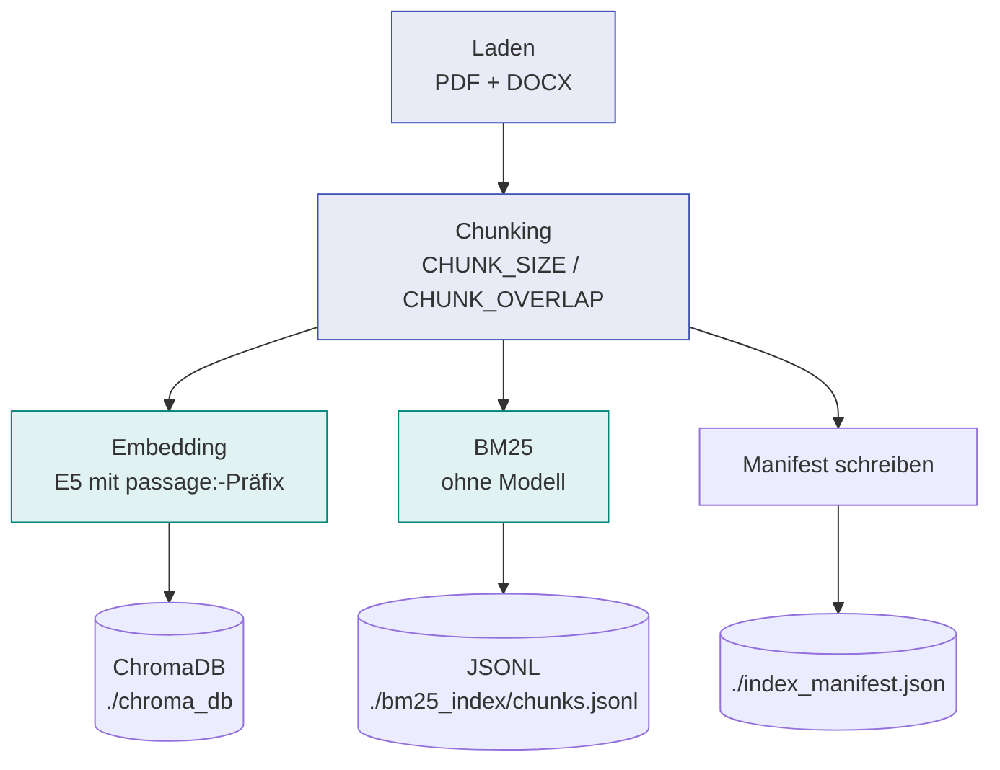
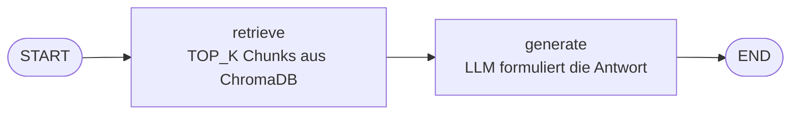
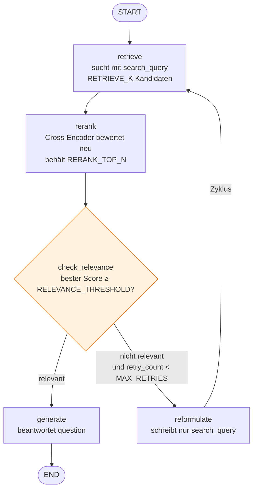
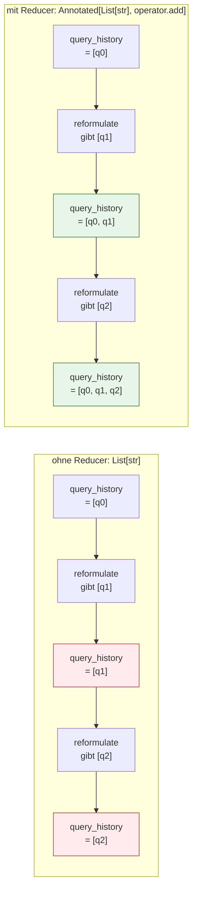
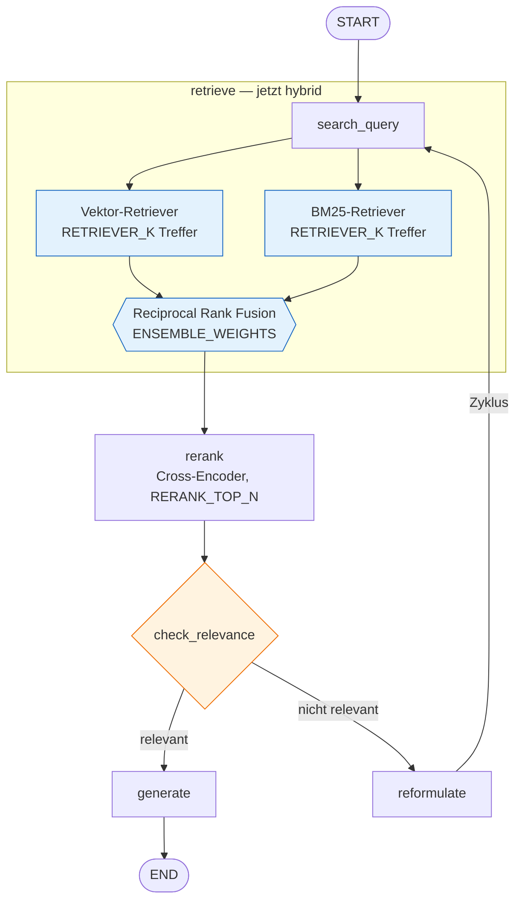

# RAG-Notebookreihe – Übersicht

Fünf Jupyter-Notebooks, die schrittweise ein Retrieval-Augmented-Generation-System aufbauen:
von der Indexierung einer Dokumentensammlung bis zur Hybrid-Suche mit Reranking und
selbstkorrigierendem Graphen.

| Datei | Baustufe | Neu gegenüber der Vorstufe |
|---|---|---|
| `1_indexing.ipynb` | Indexierung | – |
| `2_rag_Simple.ipynb` | Einfaches RAG | linearer LangGraph: retrieve → generate |
| `3a_rag_Reranking.ipynb` | + Reranker | Cross-Encoder, bedingte Kante, Zyklus |
| `3b_rag_Reranking_QuerySammlung.ipynb` | + Query-Sammlung | Reducer im State (`Annotated`) |
| `3c_rag_Reranking_BM25_Hybrid.ipynb` | + Hybrid Search | BM25 + Ensemble mit Rank Fusion |

Die Reihe ist so geschnitten, dass jede Stufe **genau ein neues Konzept** einführt. Alles
Übrige bleibt wortgleich, damit der Unterschied zwischen zwei Notebooks tatsächlich das ist,
worum es didaktisch geht.

---

## Gemeinsame Grundlagen

### Der Konfigurationsblock

In allen fünf Notebooks steht **derselbe** Konfigurationsblock als erste Codezelle. Er ist
die einzige Stelle, an der etwas angepasst wird. Abschnitte, die ein Notebook nicht braucht,
stören dort nicht — der Preis dafür ist, dass in Notebook 1 auch die LLM-Einstellungen
sichtbar sind. Der Gewinn: wer den Provider wechselt, macht das an einer Stelle und in jedem
Notebook gleich.

Zwei unabhängige Schalter:

```python
EMBEDDING_BACKEND = "lmstudio"    # "lmstudio" | "huggingface"
LLM_BACKEND       = "lmstudio"    # "lmstudio" | "deepinfra" | "openrouter"
```

Sie sind bewusst getrennt, weil sie unterschiedlichen Zwängen unterliegen:

- Das **Embedding-Backend** ist an den Index gebunden. Indexierung und Retrieval müssen
  denselben Vektorraum verwenden, sonst sind die Treffer Zufall.
- Das **LLM** ist frei wählbar. Es formuliert nur die Antwort und berührt den Index nicht.
  Ein lokal indexierter Bestand lässt sich also problemlos von einem Cloud-Modell beantworten.

API-Keys stehen als Klartextvariablen im Block — bewusst, nicht aus Nachlässigkeit.
`getpass` blockiert „Run All", und `os.environ` verhält sich zwischen Windows, macOS und
Linux unterschiedlich genug, um im Unterricht Zeit zu kosten. Der Kommentar an der Stelle
weist darauf hin, den Key nicht weiterzugeben und nicht zu committen.

### Das Embedding-Modell

Beide Backends laden dasselbe Modell: **`multilingual-e5-large-instruct`**. LM Studio
verwendet lediglich eine **Q8_0-Quantisierung** — gleiche Gewichte, minimal gerundete Zahlen,
derselbe Vektorraum.

E5 erwartet Präfixe, die LangChain nicht automatisch setzt:

- `passage: …` beim Indexieren
- `query: …` beim Suchen

Ein dünner Wrapper (`build_embeddings()`, ebenfalls in allen Notebooks identisch) übernimmt
das. Ohne diese Präfixe arbeitet das Modell deutlich unter seinem Niveau — ein Fehler, der
keine Fehlermeldung erzeugt, sondern nur schlechtere Treffer.

### Das Index-Manifest

Notebook 1 schreibt `index_manifest.json` mit Backend, Modellname, Chunk-Parametern und
Chunk-Zahl. Notebook 2, 3a, 3b und 3c **geben es beim Start aus, prüfen aber nichts**.

Das ist Absicht. Ein automatischer Abgleich würde die häufigste Fehlerquelle unsichtbar
wegautomatisieren; so sehen die Teilnehmenden schwarz auf weiß, womit der Index gebaut
wurde, und machen den Vergleich selbst.

### Technologiestack

| Baustein | Verwendung |
|---|---|
| **LangChain** | Loader, Text-Splitter, Embedding- und LLM-Abstraktion |
| **LangGraph** | Ablaufsteuerung als Graph — ab 3a mit Zyklen |
| **ChromaDB** | persistente Vektordatenbank |
| **sentence-transformers** | Cross-Encoder für das Reranking |
| **rank-bm25** | lexikalischer Index (nur 3c) |
| **Gradio** | Bedienoberfläche |
| **LM Studio** | lokaler OpenAI-kompatibler Server für Embeddings und LLM |

---

## 1 — Indexierung (`1_indexing.ipynb`)

**Zweck:** PDFs und Word-Dokumente in durchsuchbare Indizes überführen. Läuft einmal, oder
wenn neue Dokumente dazukommen.

**Ablauf:**



Laden und Chunking sind der gemeinsame Stamm, die beiden Indizes zwei unabhängige Senken
daran. Zwei Schalter (`BUILD_VECTOR_INDEX`, `BUILD_BM25_INDEX`) steuern, welche gebaut wird;
das Embedding-Modell wird erst *innerhalb* der Vektor-Senke instanziiert. Wer nur den
BM25-Index neu braucht, wartet damit Sekunden statt Minuten.

**Das leitende Prinzip:** Beide Indizes müssen auf **denselben Chunks** aufsetzen — nicht nur
auf demselben Dokumentenbestand. Bei unterschiedlichem `CHUNK_SIZE` liefern Vektorsuche und
BM25 Treffer verschiedenen Zuschnitts, die die spätere Fusion nicht mehr zusammenführen kann.
Deshalb liegt das Chunking im gemeinsamen Stamm und nicht in den Senken.

**Zwei plattformkritische Details im Loader:**

- Dateiendungen werden **case-insensitiv** geprüft. `glob("*.pdf")` findet unter macOS und
  Linux keine Datei namens `Bericht.PDF`, unter Windows schon — der Index wäre je nach
  Rechner unterschiedlich vollständig, ohne Fehlermeldung.
- Die Dateiliste wird **sortiert**, weil `glob` je nach Dateisystem eine andere Reihenfolge
  liefert. Sortiert ist der Index reproduzierbar.

**Stellschrauben:** `CHUNK_SIZE` (512), `CHUNK_OVERLAP` (128, ca. 25 % — großzügig gewählt
wegen langer deutscher Sätze).

**Ausgabe:** `./chroma_db/`, `./bm25_index/chunks.jsonl`, `./index_manifest.json`

Der BM25-Index liegt als **JSONL** vor, nicht als Pickle: versionsunabhängig,
plattformneutral, im Texteditor lesbar und ohne die Sicherheitsfrage, die ein Pickle aus
fremder Hand aufwirft.

---

## 2 — Einfaches RAG (`2_rag_Simple.ipynb`)

**Zweck:** Die Grundform zeigen — Frage rein, belegte Antwort raus.

**Graph:**



**Was hier gelernt wird:** die drei Bestandteile eines LangGraph — **State** (die
Datenstruktur, die durch den Graphen fließt), **Nodes** (Funktionen, die den State
verändern), **Edges** (die Verbindungen). Der State ist ein `TypedDict`; jede Node gibt ein
Dict mit nur den Feldern zurück, die sie ändert.

**Prinzipien im Prompt:** Antworten ausschließlich aus dem Kontext, Belegpflicht mit
Abschnittsverweisen, ausdrückliche Erlaubnis zu sagen, dass etwas nicht im Kontext steht.
`temperature=0`, weil bei RAG Faktentreue und nicht Kreativität gefragt ist.

**Der didaktische Haken:** Am Ende wird der Graph als Mermaid-Diagramm gerendert. Es ist eine
gerade Linie — und damit die Frage aufgeworfen, wozu man dafür LangGraph braucht. Diese Frage
beantwortet Notebook 3a.

**Stellschraube:** `TOP_K` (10 Chunks pro Frage).

---

## 3a — RAG mit Reranking und Relevanz-Gate (`3a_rag_Reranking.ipynb`)

**Zweck:** Zeigen, wozu ein Graph gut ist, den eine lineare Chain nicht ersetzen kann.

**Graph:**



Die Raute ist keine Node, sondern die Routing-Funktion an der bedingten Kante — sie
verändert den State nicht.

**Drei neue Konzepte:**

*Reranking.* Ein **Bi-Encoder** (das E5-Modell) bettet Frage und Dokument getrennt ein — das
ist schnell und skaliert, aber ungenau. Ein **Cross-Encoder** verarbeitet beide gemeinsam und
urteilt deutlich besser, ist dafür aber zu langsam für die ganze Datenbank. Daraus folgt das
Muster **breit suchen → intelligent filtern → antworten**: `RETRIEVE_K = 15` Kandidaten holen,
davon die `RERANK_TOP_N = 5` besten behalten.

*Bedingte Kante.* `check_relevance` ist keine Node, sondern eine **Routing-Funktion**: sie
verändert den State nicht, sondern gibt einen String zurück, der die nächste Kante bestimmt.
Genau das kann eine Chain nicht.

*Zyklus.* Reicht der beste Score nicht an `RELEVANCE_THRESHOLD` heran, wird die Suchanfrage
umformuliert und erneut gesucht. `retry_count` begrenzt das auf `MAX_RETRIES` Durchläufe.

**Zwei Fragen im State — das zentrale Detail dieser Stufe:**

| Feld | Bedeutung | Wer schreibt es |
|---|---|---|
| `question` | die Frage des Menschen — bleibt unverändert | niemand |
| `search_query` | die Anfrage an die Suche | `reformulate` |

Steckte beides in einem Feld, würde `generate` nach einer Reformulierung die *Suchanfrage*
beantworten statt die Frage. Der Mensch fragt „Wann greift Artikel 6?", das Modell antwortet
auf „Einstufungsvorschriften Hochrisiko-KI-Systeme" — inhaltlich plausibel, aber an der Frage
vorbei, und in der Oberfläche nicht zu erkennen.

**Zur Score-Skala:** Der Cross-Encoder wird mit `activation_fn=torch.nn.Sigmoid()` geladen.
Ohne das liefern MS-MARCO-Modelle rohe Logits im Bereich etwa −10 bis +10, auf die eine
Schwelle von 0.3 nicht sinnvoll anwendbar ist. Mit Sigmoid liegen die Scores in [0, 1] und
lassen sich als Relevanz-Wahrscheinlichkeit lesen — erst dadurch wird die Übung „setz den
Threshold auf 0.8, dann auf 0.01" auf verschiedenen Rechnern reproduzierbar.

**Das Modell muss multilingual sein.** `cross-encoder/mmarco-mMiniLMv2-L12-H384-v1`. Ein rein
englischer Reranker vergibt bei deutschen Texten systematisch zu niedrige Scores und lässt
das Gate dauerhaft anschlagen.

**Stellschrauben:** `RETRIEVE_K`, `RERANK_TOP_N`, `RELEVANCE_THRESHOLD`, `MAX_RETRIES`.

**Bekannte Grenze, absichtlich stehengelassen:** Die Reformulierung sieht nur die letzte
Suchanfrage. Bei mehr als zwei Versuchen führt das zu Wiederholungen und Drift — die
Aufgabenstellung am Notebook-Ende zeigt darauf und leitet zu 3b über.

---

## 3b — Query-Sammlung mit Reducer (`3b_rag_Reranking_QuerySammlung.ipynb`)

**Zweck:** Den **Reducer** einführen — an einem Problem, das ihn wirklich erfordert.

Der Graph ist unverändert. Neu ist ein Feld:

```python
query_history: Annotated[List[str], operator.add]
```

**Warum das nötig ist:** In LangGraph **ersetzt** eine Node den Wert eines Feldes, wenn sie
ihn zurückgibt. Der Zyklus würde die Historie also bei jedem Durchlauf überschreiben statt sie
zu verlängern. Der Reducer `operator.add` verkettet den Rückgabewert stattdessen mit dem
Bestehenden: Die Node gibt `{"query_history": [neue_query]}` zurück — eine Liste mit einem
Element — und LangGraph hängt sie an. Kein `append()`, kein Lesen des alten Zustands, keine
Race Conditions bei parallelen Knoten.

Der Graph sieht aus wie in 3a. Was sich unterscheidet, ist der Umgang mit dem State:



Die Node gibt in beiden Fällen dasselbe zurück. Nur die Typannotation entscheidet, ob
LangGraph ersetzt oder anhängt.

**Was der Reducer praktisch ermöglicht:** `reformulate` bekommt jetzt alle bisherigen
Fehlversuche in den Prompt und kann sich davon absetzen. Bei `temperature=0` ist das nicht
optional — ohne Historie erzeugt dieselbe Eingabe zuverlässig dieselbe Umformulierung, und
der zweite Versuch ist wirkungslos.

Zusätzlich zeigt die Oberfläche den Suchweg: Originalfrage → Versuch 1 → Versuch 2. Für die
Fehlersuche und für das Verständnis, was der Graph eigentlich tut, ist das der nützlichste
Teil der Ausgabe.

---

## 3c — Hybrid Search (`3c_rag_Reranking_BM25_Hybrid.ipynb`)

**Zweck:** Die volle Ausbaustufe. Der Graph bleibt identisch zu 3b — geändert wird nur,
**womit** gesucht wird. Der Unterschied steckt vollständig in der `retrieve`-Node:



`rerank`, `generate`, `reformulate` und die bedingte Kante sind wortgleich aus 3b übernommen —
Retrieval und Graph-Logik lassen sich sauber voneinander trennen.

**Zwei Suchverfahren:**

| | Vektorsuche (E5) | Lexikalische Suche (BM25) |
|---|---|---|
| **Stärke** | Paraphrasen, sinngemäße Fragen | exakte Begriffe, Fachtermini, Abkürzungen |
| **Schwäche** | exakte Schlüsselwörter gehen unter | versteht keine Synonyme |
| **Braucht** | Embedding-Modell, Minuten | nichts, Sekunden |

**Reciprocal Rank Fusion.** Der `EnsembleRetriever` verschmilzt beide Ergebnislisten:

```
RRF(d) = Σ  w_r / (k + rank_r(d))
```

Entscheidend ist, dass RRF mit **Rängen statt mit Scores** rechnet. Kosinus-Ähnlichkeit und
BM25-Gewicht liegen auf völlig unterschiedlichen Skalen und wären nicht direkt vergleichbar —
die Platzierung in der jeweiligen Trefferliste dagegen schon. `k` (Standard 60) glättet, damit
die vorderen Plätze nicht übermäßig dominieren.

**Stellschraube `ENSEMBLE_WEIGHTS`:** `[0.5, 0.5]` als Startpunkt, `[0.3, 0.7]` bei viel
Fachvokabular, `[0.7, 0.3]` bei umgangssprachlichen Fragen.

**Rechenaufwand im Blick behalten:** Der Ensemble liefert die *Vereinigung* beider Listen,
also bis zu 2 × `RETRIEVER_K` Kandidaten, die anschließend alle durch den Cross-Encoder gehen.
Bei mehreren Reformulierungsrunden summiert sich das auf der CPU spürbar — deshalb steht
`RETRIEVER_K` hier auf 10 und nicht auf 15.

**Voraussetzung:** Notebook 1 muss mit `BUILD_BM25_INDEX = True` gelaufen sein, und beide
Indizes müssen aus **demselben Lauf** stammen.

**Zusätzlich in der Oberfläche:** klickbare Quellenangaben, die per `#page=` direkt auf die
Seite im PDF springen (`allowed_paths` gibt Gradio Zugriff auf den Dokumentenordner). Da nur
der Dateiname gespeichert wird, fällt der Eintrag auf reinen Text zurück, wenn ein Dokument in
einem Unterordner liegt.

---

## Installation

```bash
# Grundausstattung für alle Notebooks
pip install -U langchain-core langchain-community langchain-text-splitters \
               langchain-openai langchain-chroma langgraph gradio \
               pymupdf docx2txt

# ab Notebook 3a
pip install -U sentence-transformers torch

# nur Notebook 3c
pip install -U rank-bm25

# nur bei EMBEDDING_BACKEND = "huggingface"
pip install -U "langchain-huggingface[full]"
```

Das Extra `[full]` ist nötig, weil die Basis-Installation von `langchain-huggingface`
`sentence-transformers` nicht mehr mitbringt.

**Bei `EMBEDDING_BACKEND = "lmstudio"`** muss LM Studio laufen und das Embedding-Modell
geladen haben; für `LLM_BACKEND = "lmstudio"` zusätzlich ein Chat-Modell im zweiten Slot.

---

## Typische Fehlerbilder

| Symptom | Ursache |
|---|---|
| Treffer wirken zufällig | Index mit anderem Embedding-Backend gebaut → Manifest vergleichen |
| Weniger Dokumente als erwartet | Dateiendung in Großschreibung, alte Notebookversion ohne den Fix |
| Reranker-Scores alle nahe 1.0 oder alle nahe 0.0 | englischer statt multilingualer Cross-Encoder |
| Gate feuert nie | `activation_fn` fehlt → Scores sind Logits, nicht Wahrscheinlichkeiten |
| `FileNotFoundError` in 3c | Notebook 1 lief mit `BUILD_BM25_INDEX = False` |
| Reformulierung wiederholt sich | 3a-Verhalten bei `MAX_RETRIES > 2` → 3b verwenden |
| Zweiter Versuch bringt nichts | dito |

---

## Offener Punkt

Ist `MAX_RETRIES` ausgeschöpft, antwortet der Graph mit dem Kontext des **letzten** Versuchs.
Der kann schlechter sein als der des ersten — der beste Kontext über alle Versuche hinweg wird
derzeit nicht mitgeführt. Das ist bewusst so belassen und steht als Übungsaufgabe am Ende von
3b: Es ließe sich mit einem zusätzlichen State-Feld und einem passenden Reducer lösen und
passt damit thematisch genau dorthin.
