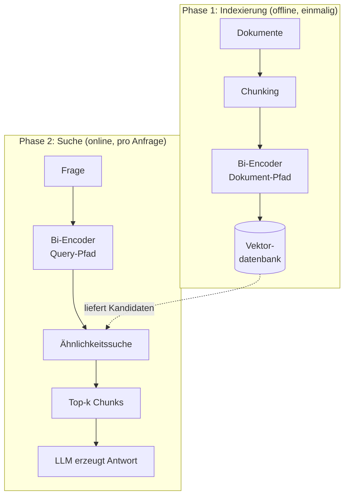
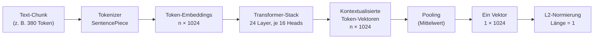
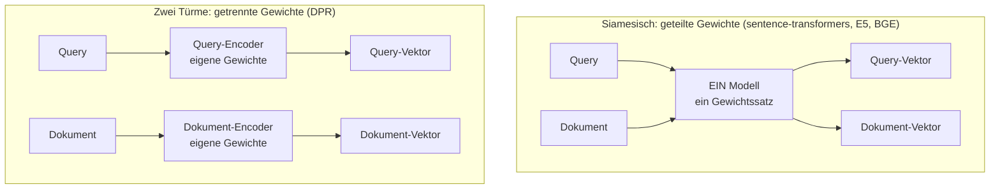

# Bi-Encoder und Cross-Encoder im RAG-System

**Handreichung — Teil A: Der Bi-Encoder (Embedding-Modell)**

Bachelor Professional in KI und ML (DQR 6) · iludis.de

---

## A.1 Die Rolle im RAG-System

Ein RAG-System beantwortet Fragen nicht aus dem Gedächtnis des Sprachmodells, sondern aus einem Dokumentenbestand. Damit zerfällt es in zwei Phasen, die zu völlig verschiedenen Zeitpunkten laufen.

Die **Indexierung** findet einmalig statt, lange vor der ersten Frage. Alle Dokumente werden in Abschnitte zerlegt, jeder Abschnitt wird in einen Vektor umgerechnet, und diese Vektoren wandern in eine Vektordatenbank. Das kann Stunden dauern und ist deshalb Offline-Arbeit.

Die **Suche** findet live statt, während die Nutzerin wartet. Nur die Frage wird in einen Vektor umgerechnet, dann sucht die Datenbank die nächstgelegenen Dokumentvektoren.



Das Modell, das beide Umrechnungen vornimmt, heißt **Bi-Encoder**. Der Name beschreibt genau diese Zweiteilung: zwei Verarbeitungspfade, die niemals gleichzeitig aktiv sind und die nichts voneinander wissen. Beim Indexieren kennt das Modell die späteren Fragen nicht, bei der Suche hat es die Dokumente längst vergessen. Genau daraus folgen sowohl die enorme Geschwindigkeit als auch die Grenzen, die in Teil B den Cross-Encoder notwendig machen.

---

## A.2 Von Text zu Vektor: der Weg durch das Modell

Ein Embedding-Modell ist kein Nachschlagewerk, das Wörtern feste Vektoren zuordnet. Es ist ein Transformer, der einen ganzen Textabschnitt liest und daraus **einen einzigen** Vektor fester Länge erzeugt. Der Weg dorthin hat vier Stationen.



**Tokenisierung.** Der Text wird in Subword-Einheiten zerlegt. Multilinguale Modelle nutzen dafür ein SentencePiece-Vokabular von rund 250.000 Einträgen, das alle unterstützten Sprachen teilen muss. Für das Deutsche ist das folgenreich: Komposita wie „Haftpflichtversicherung" stehen nicht im Vokabular und zerfallen in mehrere Fragmente. Ein deutscher Text braucht daher spürbar mehr Token als ein englischer gleicher Aussage.

**Der Transformer-Stack.** Jedes Token wird zunächst auf einen Vektor abgebildet, dann durchlaufen diese Vektoren nacheinander die Schichten des Modells. In jeder Schicht sorgt Self-Attention dafür, dass jedes Token Information von allen anderen Token derselben Eingabe aufnimmt. Nach der letzten Schicht steht für jedes Token ein Vektor bereit, der nicht mehr nur das Wort repräsentiert, sondern das Wort **in diesem Kontext**. Der Mechanismus selbst wird in Modul M2 behandelt und hier vorausgesetzt.

**Pooling.** Nun liegen so viele Vektoren vor, wie der Chunk Token hatte. Gebraucht wird aber genau einer. Diesen Schritt nennt man Pooling, und es gibt zwei gängige Verfahren:

- **Mean Pooling** mittelt über alle Token-Vektoren, gewichtet mit der Attention-Maske, damit Padding nicht mitzählt. Die E5-Familie arbeitet so.
- **CLS-Pooling** nimmt stattdessen den Vektor des vorangestellten Sonderzeichens `[CLS]` bzw. `<s>`, in dem das Modell während des Trainings gelernt hat, die Gesamtbedeutung zu sammeln.

Welches Verfahren gilt, legt das Modell fest, nicht die Anwendung. Wer es falsch implementiert, bekommt keine Fehlermeldung, sondern nur schlechtere Treffer.

**Normierung.** Zuletzt wird der Vektor auf die Länge 1 gebracht. Das ist kein Schönheitsschritt: bei normierten Vektoren ist das Skalarprodukt mit der Kosinus-Ähnlichkeit identisch, was jede Vektordatenbank ausnutzt.

> **Merksatz**
> Der Bi-Encoder komprimiert. Ein Absatz mit 380 Token wird auf 1024 Zahlen eingedampft. Was in dieser Kompression verloren geht, ist mit keinem noch so guten Ähnlichkeitsmaß zurückzuholen.

---

## A.3 Was bei gegebener Chunk-Größe passiert

Jedes Embedding-Modell hat eine maximale Eingabelänge, `max_seq_length`. Beim Referenzmodell dieser Handreichung sind das 512 Token. Entscheidend ist, was passiert, wenn ein Chunk länger ist: der Text wird **abgeschnitten**. Nicht gemittelt, nicht in Teile zerlegt, nicht gemeldet. Der Überhang existiert für das Modell schlicht nicht.

Ein Chunk von 900 Token wird also zu einem Vektor, der die zweite Hälfte des Absatzes nicht enthält, obwohl der volle Text später an das LLM geht. Solche Chunks sind über die Vektorsuche praktisch unauffindbar, wenn die gesuchte Aussage hinten steht.

Umgekehrt gilt: Je länger der Chunk, desto mehr verschiedene Aussagen werden in **einen** Vektor gemittelt. Der Vektor rückt damit in Richtung eines thematischen Durchschnitts und wird für spezifische Fragen unschärfer. Kürzere Chunks liefern präzisere Vektoren, verlieren aber Kontext, weil Bezüge über die Chunk-Grenze hinweg abreißen.

> **Faustwert für die Praxis**
> 512 Token entsprechen bei deutschem Fließtext grob 280 bis 350 Wörtern. Der Wert schwankt stark mit dem Fachvokabular, weil Komposita überproportional viele Token verbrauchen. Er ist eine Schätzung für die Planung, kein Ersatz für das Nachmessen mit dem tatsächlichen Tokenizer.

Eine zweite Stolperfalle liegt in der Einheit selbst. Chunking-Werkzeuge messen je nach Voreinstellung in **Zeichen** oder in **Token**. Der Unterschied ist im Deutschen ungefähr ein Faktor 4. Ein Wert von 512 kann also je nach Splitter ein voll ausgereizter Chunk oder ein Viertelchunk sein, und beides läuft ohne Fehlermeldung durch.

---

## A.4 Die Bi-Encoder-Topologie

Die Bezeichnung „zwei Encoder" wird oft als „zwei Modelle" missverstanden. Tatsächlich gibt es zwei Bauformen, und die verbreitete ist die einfachere.



Im **siamesischen** Fall existiert physisch nur ein Modell mit einem Gewichtssatz. Es wird lediglich zweimal aufgerufen, einmal für die Frage und einmal für das Dokument. Der Begriff „Bi-Encoder" beschreibt hier die getrennte Verarbeitung, nicht getrennte Modelle.

Bei den **zwei Türmen** (Dense Passage Retrieval, DPR) sind es zwei tatsächlich verschiedene Netze, die gemeinsam so trainiert wurden, dass ihre Ausgaben im selben Vektorraum landen. Der Ansatz ist mächtiger, aber unhandlicher, und in der heutigen Praxis seltener.

Die aktuell gängige Zwischenform ist das **asymmetrische** Modell: ein einziger Gewichtssatz, aber unterschiedliche Aufbereitung der Eingabe je nach Rolle. Fragen bekommen ein Präfix oder eine Aufgabenbeschreibung vorangestellt, Dokumente nicht oder ein anderes. Das Modell weiß dadurch, ob es gerade eine Frage oder eine Antwortpassage kodiert, und stellt sich intern darauf ein. Wird das Präfix vergessen, arbeitet das Modell außerhalb der Bedingungen, unter denen es trainiert wurde. Auch das erzeugt keine Fehlermeldung, sondern nur messbar schlechtere Ergebnisse.

---

## A.5 Die Ähnlichkeitssuche

Sind Frage und Dokumente Vektoren, wird der Bedeutungsvergleich zu Geometrie. Das übliche Maß ist die Kosinus-Ähnlichkeit:

```
                 A · B
cos(θ) = ─────────────────────
              ‖A‖ · ‖B‖
```

Sie misst den Winkel zwischen zwei Vektoren und ignoriert deren Länge. Der Wert liegt zwischen -1 und 1, wobei 1 gleiche Richtung bedeutet. Sind beide Vektoren bereits normiert, entfällt der Nenner und übrig bleibt das Skalarprodukt: eine Multiplikation und eine Summe über 1024 Zahlen, für eine GPU eine Trivialität.

Zwei Präzisierungen, die häufig untergehen:

**Die Datenbank vergleicht nicht mit allen Vektoren.** Bei Millionen Einträgen wäre der vollständige Vergleich zu teuer. Vektordatenbanken nutzen daher Näherungsverfahren (Approximate Nearest Neighbor, meist HNSW), die einen Graphen über den Vektorraum legen und nur einen Bruchteil der Kandidaten prüfen. Die Suche ist damit nicht exakt: es ist möglich, dass ein passendes Dokument nicht gefunden wird, obwohl sein Vektor nahe liegt. Ein Recall-Verlust, der bereits vor jedem Reranking entsteht.

**Der Absolutwert sagt wenig.** Bei kontrastiv trainierten Modellen liegen die Ähnlichkeitswerte typischerweise gedrängt in einem schmalen oberen Band, bei der E5-Familie etwa zwischen 0,7 und 1,0. Das ist eine bekannte Folge der niedrigen Temperatur in der Trainings-Verlustfunktion und kein Fehler. Aussagekräftig ist ausschließlich die **relative Ordnung** der Treffer. Ein fester Schwellwert wie „alles über 0,8 ist relevant" ist deshalb nicht übertragbar und muss, wenn überhaupt, am eigenen Korpus empirisch bestimmt werden.

---

## A.6 Die harte Kopplung an den Index

Embedding-Modell und Vektordatenbank bilden eine Einheit, die man nicht halb austauschen kann. Drei Gründe, in aufsteigender Tücke:

**Die Dimension.** Erzeugt Modell A 1024 Zahlen und Modell B 768, lassen sich die Vektoren nicht einmal formal vergleichen. Das fällt sofort auf.

**Der Vektorraum.** Selbst bei gleicher Dimension legt jedes Modell seine Bedeutungen an anderen Koordinaten ab. Zwei Modelle mit je 1024 Dimensionen liefern Zahlenreihen, die nichts miteinander zu tun haben. Der Vergleich läuft technisch durch und liefert Zufallsergebnisse. Das fällt nicht sofort auf.

**Die Aufbereitung.** Präfixe, Instruktionen und Pooling-Verfahren müssen bei Indexierung und Suche derselben Konvention folgen. Diese Konvention gehört zum Modell und steht in dessen Modellkarte, nicht im verwendeten Framework. Das fällt am wenigsten auf.

Ein Modellwechsel bedeutet deshalb immer eine **vollständige Neuindexierung** des gesamten Bestands. Bei großen Korpora ist das eine Kosten- und Zeitfrage, und genau hier liegt später das ökonomische Argument für den Reranker aus Teil B.

Eine begrenzte Ausnahme bilden Modelle mit **Matryoshka-Repräsentation**. Sie sind so trainiert, dass die vorderen Dimensionen eines Vektors bereits für sich genommen brauchbar sind. Man darf einen 1024er-Vektor also auf 512 oder 256 Stellen kürzen und spart Speicher bei geringem Qualitätsverlust. Erlaubt ist das aber nur konsistent: Index und Anfrage müssen auf derselben Länge arbeiten.

---

## A.7 Das Referenzmodell im Überblick

Alle Zahlen dieser Handreichung beziehen sich auf `intfloat/multilingual-e5-large-instruct`, ein multilinguales Modell, das für deutschsprachige Bestände geeignet ist.

| Merkmal | Wert |
|---|---|
| Basis | XLM-RoBERTa-large |
| Layer | 24 |
| Hidden Size (= Vektordimension) | 1024 |
| Attention-Heads je Layer | 16 |
| Parameter | ca. 0,6 Mrd. |
| Vokabular | ca. 250.000 Subword-Einheiten |
| Maximale Eingabe | 512 Token, längerer Text wird abgeschnitten |
| Pooling | Mittelwert über alle Token |
| Sprachen | 94 |
| Aufbereitung | Frage mit Aufgabeninstruktion, Dokument ohne Präfix |

Die 24 Layer sind kein Zufallswert, sondern das Erbe der Basisarchitektur XLM-RoBERTa-large. Embedding-Modelle werden fast nie von Grund auf gebaut, sondern aus einem vortrainierten Sprachmodell durch kontrastives Nachtraining gewonnen. Layerzahl, Hidden Size und Vokabular sind damit bereits festgelegt, bevor das Modell überhaupt zum Embedder wird.

> **Vorgriff auf Teil B**
> Merken Sie sich diese Größenordnung: 24 Layer, 1024 Dimensionen, 0,6 Mrd. Parameter. Der Reranker, der die Ergebnisse dieses Modells anschließend korrigiert, ist deutlich **kleiner**. Warum er trotzdem präziser urteilt, ist die Leitfrage von Teil B.

---

## A.8 Kurzkontrolle

1. Warum kann ein Bi-Encoder Millionen Dokumente durchsuchen, ein Cross-Encoder aber nicht? Begründen Sie über den Zeitpunkt der Berechnung, nicht über die Modellgröße.
2. Ein Chunk umfasst 900 Token, das Modell verarbeitet 512. Was steht am Ende im Vektor, und welche Fragen bleiben unbeantwortbar?
3. Ein Kollege will das Embedding-Modell gegen ein besseres tauschen, ohne neu zu indexieren, „weil beide 1024 Dimensionen haben". Was entgegnen Sie ihm?
4. Warum ist die Aussage „Treffer ab Kosinus 0,85 sind relevant" ohne Angabe des Modells wertlos?
5. Ein Chunking-Parameter steht auf 512. Welche Rückfrage müssen Sie stellen, bevor Sie beurteilen können, ob der Wert passt?

---

*Teil B behandelt den Cross-Encoder (Reranker), Teil C die Gegenüberstellung beider Architekturen und ihre Rolle im agentischen RAG.*
