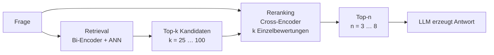
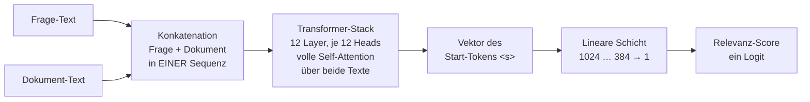

# Bi-Encoder und Cross-Encoder im RAG-System

**Handreichung — Teil B: Der Cross-Encoder (Reranker)**

Bachelor Professional in KI und ML (DQR 6) · iludis.de

---

## B.1 Die Rolle im RAG-System

Die Vektorsuche aus Teil A ist schnell und großzügig. Sie liefert Kandidaten, die thematisch in die Nähe der Frage gehören. Ob einer davon die Frage tatsächlich **beantwortet**, hat sie nicht geprüft, denn dafür hätte sie Frage und Dokument gemeinsam betrachten müssen, und genau das tut ein Bi-Encoder konstruktionsbedingt nie.

Der Reranker schiebt sich als zweite Stufe dazwischen. Er bekommt eine überschaubare Kandidatenliste, bewertet jeden Kandidaten einzeln gegen die Frage und sortiert neu. Erst danach geht eine kurze Auswahl an das Sprachmodell.



Die beiden Stufen verfolgen verschiedene Ziele. Das Retrieval optimiert auf **Recall**: möglichst nichts Wichtiges übersehen, notfalls auf Kosten der Genauigkeit. Das Reranking optimiert auf **Precision**: aus dem Gefundenen das Richtige nach oben holen. Diese Arbeitsteilung ist der Grund, warum k deutlich größer gewählt wird als n.

---

## B.2 Ein Beispiel, an dem der Unterschied sichtbar wird

Der Bestand ist die Hausordnung einer Wohnanlage. Die Frage lautet:

> **Frage:** Darf ich meine Waschmaschine sonntags laufen lassen?

Aus dem Index kommen unter anderem diese beiden Abschnitte zurück:

> **Chunk A:** Die Nutzung der Gemeinschaftswaschküche ist von Montag bis Samstag zwischen 7 und 20 Uhr gestattet. An Sonn- und Feiertagen ruht der Betrieb.

> **Chunk B:** Zur Waschküche gehören zwei Waschmaschinen und ein Trockner. Die Bedienungsanleitungen für beide Geräte hängen neben der Tür aus.

Ein Bi-Encoder bewertet Chunk B häufig höher. Dort steht das Fragewort „Waschmaschine" wörtlich, sogar doppelt, und der Abschnitt handelt von nichts anderem. Chunk A dagegen enthält den Begriff überhaupt nicht. Er spricht von der Waschküche, von Sonn- und Feiertagen und vom ruhenden Betrieb. Alle drei Ausdrücke muss man mit der Frage **in Beziehung setzen**, um zu erkennen, dass hier die Antwort steht. Ein einzelner, im Voraus berechneter Vektor kann diese Beziehung nicht enthalten, weil er entstand, als es die Frage noch nicht gab.

Der Cross-Encoder sieht beide Texte gleichzeitig. Er kann „sonntags" mit „Sonn- und Feiertagen" verknüpfen und „laufen lassen" mit „ruht der Betrieb", und dreht die Reihenfolge um.

> **Wichtige Abgrenzung**
> Chunk A beantwortet die Frage mit „nein". Er ist trotzdem der relevanteste Treffer. Ein Reranker misst, ob ein Text die Frage **beantwortet**, nicht ob er ihr zustimmt. Die Verwechslung von Relevanz und Zustimmung ist ein verbreiteter Denkfehler, der in Testfällen regelmäßig zu falschen Erwartungen führt.

---

## B.3 Von zwei Texten zu einer Zahl

Der Reranker bekommt keine Vektoren, sondern die Rohtexte, und zwar beide zusammen. Sie werden zu einer einzigen Sequenz verkettet, durch Sonderzeichen getrennt:

```
<s> Darf ich meine Waschmaschine sonntags laufen lassen? </s></s> Die Nutzung der Gemeinschaftswaschküche ist von Montag bis Samstag … </s>
```

Diese Sequenz durchläuft den Transformer-Stack. Weil Frage und Dokument in **derselben** Sequenz liegen, bezieht die Self-Attention jedes Token der Frage auf jedes Token des Dokuments und umgekehrt. Genau das ist der ganze Unterschied zum Bi-Encoder, und er kostet nichts weiter als eine andere Anordnung der Eingabe.



Am Ende wird nicht der ganze Sequenzausgang verwendet, sondern nur der Vektor des Start-Tokens. Er geht durch **eine einzige lineare Schicht**, die 384 Zahlen auf eine einzige abbildet. Diese Zahl ist der Score. Ein Klassifikationskopf mit einem Ausgang, mehr ist der Reranker architektonisch nicht.

> **Begriffsklärung: keine Cross-Attention**
> Ein Cross-Encoder enthält keine Cross-Attention-Module. Cross-Attention ist ein eigener Baustein aus dem Encoder-Decoder-Transformer, bei dem eine Sequenz auf eine getrennt kodierte zweite zugreift. Der Cross-Encoder arbeitet stattdessen mit gewöhnlicher Self-Attention über eine einzige, zusammengesetzte Sequenz. Das „Cross" im Namen meint die Kreuzung der beiden Texte in der Eingabe, nicht einen Attention-Typ.

### Der Score ist kein Prozentwert

Der Ausgang der linearen Schicht ist ein **Logit**: eine reelle Zahl ohne Ober- und Untergrenze, typischerweise irgendwo zwischen etwa -10 und +10. Wer Werte zwischen 0 und 1 sehen will, muss selbst eine Sigmoid-Funktion anwenden. Das ändert nur die Skala, nicht die Aussage.

Und die Aussage ist begrenzt: Die Scores sind **nicht kalibriert**. Ein Wert von 6,2 bedeutet nicht „62 Prozent Trefferwahrscheinlichkeit", und er ist auch nicht zwischen verschiedenen Fragen vergleichbar. Belastbar ist ausschließlich die Rangfolge innerhalb einer Kandidatenliste. Feste Schwellwerte („alles unter 0,5 verwerfen") sind daher am eigenen Korpus zu bestimmen und gehören zu den Dingen, die bei einem Modellwechsel neu erhoben werden müssen.

---

## B.4 Warum es keinen Index gibt

Beim Bi-Encoder war die Vorberechnung der entscheidende Trick. Beim Cross-Encoder ist sie unmöglich, und zwar prinzipiell: Der Score entsteht aus dem **Paar**. Solange die Frage nicht bekannt ist, gibt es nichts zu berechnen, was sich speichern ließe. Es gibt keinen Dokument-Score, den man ablegen könnte, so wie es keinen halben Vergleich gibt.

Daraus folgen zwei Dinge, die auf den ersten Blick nichts miteinander zu tun haben.

**Erstens die Kostenstruktur.** Für k Kandidaten braucht es k vollständige Durchläufe durch das neuronale Netz, jeder mit einer Sequenz aus Frage plus Dokument. Der Aufwand der Self-Attention wächst dabei quadratisch mit der Sequenzlänge. Bei 50 Kandidaten sind das 50 Modellaufrufe für eine einzige Nutzerfrage. Bei einer Million Dokumente wären es eine Million. Deshalb steht der Reranker immer hinter einem Retrieval, das die Menge zuvor auf eine Handvoll eindampft, und deshalb ist er das Nadelöhr der Latenz im RAG-System.

**Zweitens die Unabhängigkeit.** Weil der Reranker die Vektordatenbank nie berührt, sondern nur Text sieht, ist er frei austauschbar. Ein anderes Reranker-Modell erfordert keine Neuindexierung, keine Dimensionsprüfung, keine Migration. Genau hier liegt sein wirtschaftlicher Reiz: Er verbessert die Ergebnisqualität einer bestehenden Pipeline, ohne die teuerste Komponente anzufassen.

> **Grenze dieser Rettungsaktion**
> Der Reranker kann nur sortieren, was ihm vorgelegt wird. Was das Retrieval nicht in die Top-k geholt hat, existiert für ihn nicht. Er verbessert die Precision, niemals den Recall. Ein zu schwaches Embedding-Modell lässt sich mit einem Reranker abfedern, aber nicht ersetzen.

---

## B.5 Drei Bauarten von Rerankern

Die klassische Bauart aus B.3 ist nicht die einzige. Seit etwa 2024 haben sich drei Ansätze etabliert, die sich in der Frage unterscheiden, was gleichzeitig in der Eingabe liegt.

| Bauart | Eingabe | Ausgabe | Beispielmodelle |
|---|---|---|---|
| **Pointwise** (klassisch) | ein Paar aus Frage und Dokument | ein Logit je Paar | `mmarco-mMiniLMv2`, `bge-reranker-v2-m3` |
| **Listwise** | Frage und mehrere Kandidaten in einem Kontext | direkte Rangfolge | `jina-reranker-v3` |
| **Generativ** | Frage, Dokument und eine Instruktion als Prompt | Wahrscheinlichkeit eines Ja-Tokens | `Qwen3-Reranker` (0,6B / 4B / 8B) |

**Pointwise** bewertet jedes Paar für sich. Die Kandidaten wissen nichts voneinander, die Rangfolge entsteht erst durch Sortieren der Einzelscores.

**Listwise** legt mehrere Kandidaten gemeinsam in den Kontext und lässt das Modell die relative Ordnung bestimmen. Das ist näher an der eigentlichen Aufgabe, weil Relevanz immer ein Vergleich ist, kostet aber mehr Kontextlänge und erschwert das Parallelisieren.

**Generativ** verwendet ein Decoder-Sprachmodell und formuliert die Bewertung als Frage: „Beantwortet dieses Dokument die Anfrage?" Als Score dient die Wahrscheinlichkeit, mit der das Modell mit „ja" antworten würde. Der Vorteil ist die Instruierbarkeit, also die Möglichkeit, die Relevanzdefinition in natürlicher Sprache anzupassen. Der Preis ist Rechenzeit.

> **Damit fällt eine verbreitete Faustregel**
> „Reranker sind kleine Encoder-Modelle" stimmt nur noch für die erste Zeile der Tabelle. Aktuelle Reranker reichen von rund 0,1 bis über 8 Milliarden Parameter und sind teilweise gar keine Encoder mehr. Was alle Bauarten verbindet, ist nicht die Größe und nicht die Architektur, sondern das Prinzip: Frage und Dokument werden **gemeinsam** verarbeitet, und das Ergebnis lässt sich nicht vorberechnen.

---

## B.6 Das Referenzmodell im Überblick

Für den Kurs arbeiten wir mit `cross-encoder/mmarco-mMiniLMv2-L12-H384-v1`, einem bewusst kleinen Modell, das auch ohne GPU brauchbare Antwortzeiten liefert.

| Merkmal | Wert |
|---|---|
| Basis | mMiniLMv2, destilliert aus XLM-RoBERTa-large |
| Layer | 12 |
| Hidden Size | 384 |
| Attention-Heads je Layer | 12 (Head-Dimension 32) |
| Parameter gesamt | ca. 118 Mio. |
| davon Vokabular-Matrix | ca. 96 Mio. |
| davon Transformer-Stack | ca. 21 Mio. |
| Maximale Eingabe | 512 Token **für Frage und Dokument zusammen** |
| Trainingsdaten | mMARCO, maschinell übersetztes MS MARCO, 14 Sprachen inkl. Deutsch |
| Ausgabe | ein Logit, unkalibriert |

Drei Beobachtungen lohnen den zweiten Blick.

**Der Reranker ist kleiner als der Embedder.** 12 Layer gegen 24, 118 Millionen Parameter gegen 600 Millionen. Er urteilt trotzdem präziser über die Relevanz eines Treffers. Der Vorteil kommt nicht aus der Kapazität, sondern aus der Anordnung der Eingabe. Wer das verstanden hat, hat den Kern beider Teile verstanden.

**Vier Fünftel des Modells sind Wörterbuch.** Von den 118 Millionen Parametern entfallen rund 96 Millionen auf die Abbildung des 250.000 Einträge großen Vokabulars auf 384 Dimensionen. Im eigentlichen rechnenden Teil arbeiten nur etwa 21 Millionen Parameter. Bei kleinen multilingualen Modellen ist die Dateigröße also ein schlechter Indikator für die Rechenleistung.

**Die Destillation hat die Heads entkoppelt.** Das Lehrermodell XLM-RoBERTa-large hat 16 Heads bei 1024 Dimensionen, der Schüler 12 Heads bei 384. Frühere Destillationsverfahren verlangten übereinstimmende Head-Zahlen; MiniLMv2 hebt diese Einschränkung auf, indem es die Beziehungen zwischen den Attention-Werten überträgt statt der Werte selbst. Deshalb sind Layerzahl und Head-Zahl eines destillierten Modells frei wählbar und nicht aus dem Lehrermodell ableitbar.

### Das Kontextfenster, und warum die 512 hier etwas anderes bedeuten

Die 512 Token dieses Modells müssen **Frage und Dokument gemeinsam** aufnehmen, zuzüglich der drei bis vier Sonderzeichen der Konkatenation. Das Embedding-Modell aus Teil A hat ebenfalls eine Grenze von 512 Token, dort gilt sie aber allein für den Chunk.

Gleiche Zahl, andere Bemessungsgrundlage. Wer Chunks so bemisst, dass sie die Kapazität des Embedders voll ausnutzen, überschreitet damit zwangsläufig die Kapazität des Rerankers, sobald die Frage dazukommt. Abgeschnitten wird dann das Ende des Dokuments, ohne Meldung. Der Reranker bewertet einen Text, dessen Schluss er nie gesehen hat.

Neuere Reranker haben deutlich größere Fenster, `bge-reranker-v2-m3` etwa 8192 Token. Das entschärft das Problem, hebt es aber nicht auf: Die Frage bleibt immer Teil der Rechnung, und die Kosten der Self-Attention wachsen quadratisch mit der Gesamtlänge.

---

## B.7 Kurzkontrolle

1. Warum lässt sich für ein Dokument kein Reranker-Score im Voraus berechnen und speichern, für ein Embedding aber sehr wohl?
2. Chunk A aus B.2 sagt „nein" auf die gestellte Frage und ist trotzdem der beste Treffer. Erklären Sie den Unterschied zwischen Relevanz und Zustimmung.
3. Ein Reranker gibt für Frage 1 den Bestwert 8,1 aus und für Frage 2 den Bestwert 2,3. Was folgt daraus über die Qualität der beiden Ergebnislisten?
4. Der Reranker im Kurs hat 118 Millionen Parameter, das Embedding-Modell 600 Millionen. Warum ist der Kleinere im Relevanzurteil überlegen?
5. Ein Team erhöht k von 50 auf 500, um die Antwortqualität zu steigern. Welche zwei Größen verschlechtern sich dadurch, und welche verbessert sich möglicherweise gar nicht?

---

*Teil C stellt beide Architekturen gegenüber, ordnet Late-Interaction-Verfahren als Zwischenform ein, grenzt Reranking von Hybridsuche und Rangfusion ab und behandelt die Besonderheiten im agentischen RAG.*
