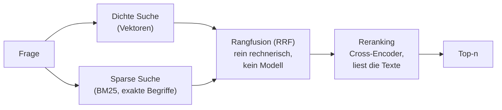
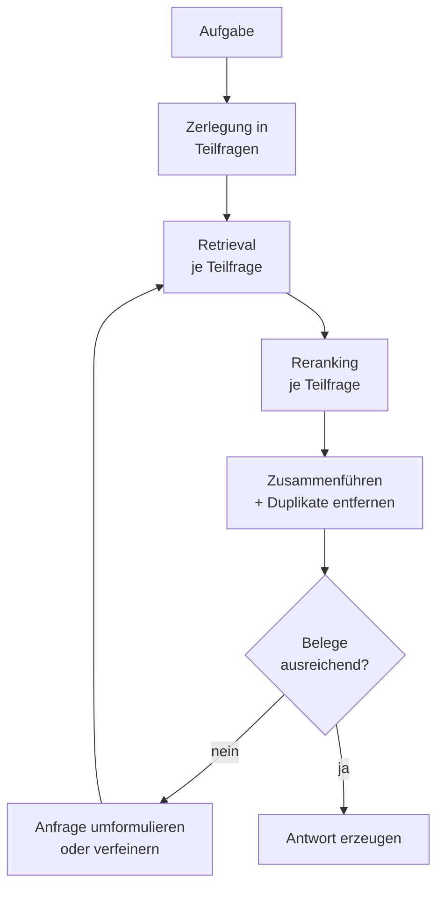

# Bi-Encoder und Cross-Encoder im RAG-System

**Handreichung — Teil C: Gegenüberstellung und Einordnung**

Bachelor Professional in KI und ML (DQR 6) · iludis.de

---

## C.1 Der eine Unterschied, aus dem alle anderen folgen

Beide Modelle aus den Teilen A und B sind Transformer. Beide verstehen Sprache. Beide bewerten Ähnlichkeit. Sie unterscheiden sich in einem einzigen Punkt: **zu welchem Zeitpunkt Frage und Dokument einander begegnen.**

Beim Bi-Encoder begegnen sie einander nie. Jeder Text wird für sich zu einem Vektor verdichtet, und erst diese beiden Verdichtungen werden verglichen. Beim Cross-Encoder begegnen sie einander sofort, in derselben Eingabesequenz, und werden gemeinsam verarbeitet.

Alles Weitere ist Konsequenz. Weil der Bi-Encoder die Dokumente allein verarbeitet, kann er sie vorberechnen, also skalieren. Weil der Cross-Encoder das Paar braucht, kann er nichts vorberechnen, also nicht skalieren. Weil der Bi-Encoder verdichten muss, verliert er Nuancen. Weil der Cross-Encoder nicht verdichtet, behält er sie.

| Merkmal | Bi-Encoder (Retrieval) | Cross-Encoder (Reranking) |
|---|---|---|
| Eingabe | ein Text | zwei Texte, verkettet |
| Interaktion Frage ↔ Dokument | keine | volle Self-Attention über beide |
| Ausgabe | ein Vektor fester Länge | ein Logit |
| Vorberechnung | Dokumente vollständig, offline | unmöglich |
| Aufwand je Anfrage | 1 Modelldurchlauf + Indexsuche | k Modelldurchläufe |
| Sinnvolle Mengengrüße | Millionen bis Milliarden | typischerweise 25 bis 100 |
| Optimiert auf | Recall | Precision |
| Bindung an den Index | hart, Wechsel erzwingt Neuindexierung | keine, frei austauschbar |
| Referenzmodell im Kurs | 24 Layer, 1024 Dim., ca. 0,6 Mrd. Par. | 12 Layer, 384 Dim., ca. 118 Mio. Par. |

Die letzte Zeile ist die lehrreichste. Das größere Modell macht die gröbere Arbeit. Wer Modellgröße mit Urteilsfähigkeit gleichsetzt, kann diese Konstellation nicht erklären.

---

## C.2 Kein Zweikampf, sondern ein Spektrum

Zwischen „gar keine Interaktion" und „volle Interaktion" liegt eine dritte Bauform, die in der Diskussion oft fehlt: **Late Interaction**, prominent vertreten durch ColBERT.

```mermaid
flowchart TB
    subgraph BI["Bi-Encoder — Interaktion: nie"]
        direction LR
        B1[Frage → 1 Vektor] --- B2[Dokument → 1 Vektor]
        B2 --- B3["Vergleich zweier<br/>Verdichtungen"]
    end
    subgraph LI["Late Interaction — Interaktion: spät, aber flach"]
        direction LR
        L1["Frage → n Vektoren<br/>(einer je Token)"] --- L2["Dokument → m Vektoren<br/>(vorberechenbar)"]
        L2 --- L3["MaxSim:<br/>Token gegen Token"]
    end
    subgraph CE["Cross-Encoder — Interaktion: sofort und tief"]
        direction LR
        C1[Frage + Dokument] --- C2["gemeinsame<br/>Sequenz"]
        C2 --- C3["Self-Attention<br/>über alle Token"]
    end
```



Ein Late-Interaction-Modell speichert nicht einen Vektor je Chunk, sondern **einen Vektor je Token**. Zur Anfragezeit wird jedes Fragetoken mit jedem Dokumenttoken verglichen und für jedes Fragetoken der beste Treffer behalten; die Summe dieser Bestwerte ergibt den Score. Die teure Sprachverarbeitung bleibt damit vorberechenbar, die Interaktion findet erst am Ende statt und besteht nur aus billigen Skalarprodukten.

Der Preis ist der Speicher: Ein Index mit einem Vektor je Token ist um ein bis zwei Größenordnungen größer als einer mit einem Vektor je Chunk. Neuere Verfahren komprimieren diese Vektoren stark, und Modelle wie BGE-M3 liefern dichte, sparse und Multi-Vektor-Repräsentationen aus einem Durchlauf.

Für den Unterricht ist Late Interaction vor allem deshalb wichtig, weil es die falsche Dichotomie auflöst. Die eigentliche Entwurfsfrage lautet nicht „Vektoren oder Texte", sondern: **Wie viel Interaktion kann ich mir zur Anfragezeit leisten, und wie viel kann ich vorziehen?**

---

## C.3 Was der Reranker leistet und was nicht

Die Aussage „ein Reranker repariert ein schwaches Embedding-Modell" ist verbreitet und zur Hälfte falsch. Die Trennlinie verläuft entlang der beiden Gütemaße.

**Recall** ist der Anteil der relevanten Dokumente, der überhaupt in die Kandidatenliste gelangt. Er wird allein vom Retrieval bestimmt, also vom Embedding-Modell, vom Chunking und von der Näherungssuche des Index. Der Reranker sieht die Kandidatenliste und sonst nichts. Was dort fehlt, kann er nicht ergänzen.

**Precision** ist der Anteil des Relevanten unter dem, was am Ende an das Sprachmodell geht. Hier wirkt der Reranker, und zwar deutlich.

> **Merksatz**
> Das Embedding-Modell entscheidet, *was gefunden wird*. Der Reranker entscheidet, *was davon nach oben kommt*. Ein Fehler in der ersten Stufe ist in der zweiten nicht mehr korrigierbar.

Daraus folgt eine Diagnoseregel für die Praxis: Bevor man einen Reranker einführt, misst man den Recall der ersten Stufe bei der gewählten Kandidatenzahl k. Liegt er niedrig, ist der Reranker die falsche Baustelle; dann helfen besseres Chunking, ein anderes Embedding-Modell oder Hybridsuche. Liegt der Recall hoch und die Antwortqualität trotzdem niedrig, ist der Reranker genau das richtige Werkzeug.

Die Wahl von k ist dabei ein Kompromiss zwischen Recall und Latenz. Größenordnungen aus der Praxis: rund 50 Kandidaten für dialogorientierte Anwendungen, 100 bis 200 für Rechercheszenarien, mit spürbar abnehmendem Nutzen jenseits von etwa 100. Verlässlich sind diese Werte nur am eigenen Korpus.

---

## C.4 Abgrenzung: Hybridsuche und Rangfusion sind kein Reranking

Drei Verfahren werden regelmäßig unter dem Wort „Reranking" vermischt, obwohl sie an verschiedenen Stellen ansetzen.



**Hybridsuche** kombiniert zwei Retrieval-Verfahren: die dichte Vektorsuche und eine klassische Stichwortsuche wie BM25. Sie ergänzen sich, weil Vektoren bei exakten Kennungen schwach sind, also bei Artikelnummern, Paragrafen, Eigennamen und Abkürzungen. Hybridsuche verbessert den **Recall**.

**Rangfusion**, meist Reciprocal Rank Fusion, führt die beiden Trefferlisten zusammen. Sie rechnet dabei ausschließlich mit Rangplätzen:

```
RRF(d) = Σ  1 / (k + rang_i(d))          k üblicherweise 60
         i
```

Ein Dokument, das in beiden Listen weit vorn steht, sammelt den höchsten Wert. Entscheidend ist: Rangfusion **liest keine Texte** und benutzt kein Modell. Sie löst das Problem, dass Kosinuswerte und BM25-Werte auf unvergleichbaren Skalen liegen, indem sie beide Skalen wegwirft.

**Reranking** ist die einzige der drei Stufen, die die Texte tatsächlich noch einmal ansieht. Sie verbessert die **Precision**.

Die drei schließen einander nicht aus, sondern werden in dieser Reihenfolge hintereinandergeschaltet. Wer sie verwechselt, sucht Fehler an der falschen Stelle.

---

## C.5 Was sich im agentischen RAG ändert

Im klassischen RAG durchläuft eine Frage die Pipeline genau einmal. Ein Agent tut das nicht. Er zerlegt die Aufgabe, sucht mehrfach, bewertet Zwischenergebnisse und entscheidet, ob er weitersucht.



Vier Punkte, die dabei anders zu bewerten sind als in der einstufigen Pipeline.

**Der Reranker wird zum Kostentreiber.** Seine Kosten fallen nicht einmal an, sondern einmal je Teilfrage und je Schleifendurchlauf. Drei Teilfragen mit je zwei Durchläufen und k = 50 ergeben 300 Modelldurchläufe für eine einzige Nutzeranfrage. Die Wahl von k ist im agentischen Betrieb deshalb eine ungleich schärfere Entscheidung.

**Der Reranker wird zum Konsolidierungspunkt.** Mehrere Teilfragen liefern überlappende Trefferlisten, und durch die Überlappung beim Chunking sind ohnehin benachbarte Chunks fast identisch. Der Reranker bewertet solche Beinahe-Duplikate erwartungsgemäß **beide** hoch, weil er jedes Paar isoliert betrachtet und von der Existenz des anderen nichts weiß. Ohne eine anschließende Duplikatentfernung füllt sich das Kontextfenster des Sprachmodells mit derselben Aussage in leichter Variation.

**Der Score verführt zur Abbruchbedingung.** Es liegt nahe, den Reranker-Score als Entscheidungsgrundlage zu nutzen: „Wenn der beste Kandidat unter einem Schwellwert liegt, suche erneut." Das ist grundsätzlich sinnvoll, kollidiert aber mit der Erkenntnis aus B.3: Die Scores sind unkalibriert und zwischen verschiedenen Fragen nicht vergleichbar. Ein am Beispiel A gefundener Schwellwert gilt für Beispiel B nicht. Wer so eine Schleife baut, muss den Schwellwert an einem repräsentativen Fragenkatalog empirisch bestimmen und bei jedem Modellwechsel neu erheben.

**Die Auswahl n zählt doppelt.** In der einstufigen Pipeline füllt der Kontext des Sprachmodells sich einmal. Im Agenten konkurrieren die Belege mit Zwischenergebnissen, Werkzeugausgaben und dem Verlauf. Ein knapp gewähltes n ist hier kein Sparzwang, sondern eine Qualitätsentscheidung.

---

## C.6 Typische Fallen

Alle vier Fehler haben eine Gemeinsamkeit: Sie erzeugen keine Fehlermeldung. Das System läuft, liefert Ergebnisse und ist trotzdem schlechter, als es sein müsste.

> **Falle 1: Dieselbe Zahl, verschiedene Bemessungsgrundlagen**
> Beim Embedding-Modell gilt die Längengrenze für den Chunk allein. Beim Reranker gilt sie für Frage und Chunk **zusammen**. Chunks, die den Embedder gerade noch ausreizen, sprengen den Reranker zwangsläufig. Wer beide Grenzen mit demselben Zahlenwert vorfindet, hält sie leicht für dieselbe Bedingung. (Ausführlich in B.6.)

> **Falle 2: Zeichen sind keine Token**
> Chunking-Werkzeuge messen je nach Voreinstellung in Zeichen oder in Token. Im Deutschen liegt dazwischen ungefähr der Faktor vier, bei komposita-reichen Fachtexten mehr. Derselbe Parameterwert bedeutet also einmal einen vollen und einmal einen Viertel-Chunk. Der einzige verlässliche Weg ist, mit dem Tokenizer des eingesetzten Modells nachzumessen.

> **Falle 3: Stille Truncation**
> Weder Embedder noch Reranker melden, wenn sie Text abschneiden. Der Überhang verschwindet lautlos. Beim Embedder wird dadurch das Chunk-Ende unauffindbar, beim Reranker urteilt das Modell über einen Text, dessen Schluss es nie gesehen hat. Der Effekt zeigt sich ausschließlich als leicht schlechtere Trefferqualität, also genau dort, wo niemand einen Konfigurationsfehler vermutet.

> **Falle 4: Asymmetrische Modelle brauchen ihr Präfix**
> Viele Embedding-Modelle bereiten Fragen und Dokumente unterschiedlich auf, durch Präfixe oder eine Aufgabeninstruktion. Diese Konvention gehört zum **Modell** und steht in dessen Modellkarte, nicht im Framework, das es lädt. Wird sie ausgelassen oder aus der Dokumentation eines verwandten Modells übernommen, arbeitet das Modell außerhalb seiner Trainingsbedingungen. Die Einbußen sind messbar, aber unsichtbar.

Diese vier Punkte sind kein Konfigurationsanhang, sondern die praktische Kehrseite der Architektur. Jede Falle folgt direkt aus einer Eigenschaft, die in Teil A oder B beschrieben wurde.

---

## C.7 Anhang: Modelllandschaft

> **Verfallsdatum**
> Stand dieser Übersicht ist September 2026. Modellnamen und Rangfolgen in diesem Feld veralten innerhalb von Monaten. Die **Architekturprinzipien** aus den Teilen A bis C sind langlebig, die folgende Tabelle ist es nicht. Vor jeder Modellentscheidung gehört ein Blick auf die aktuellen Bestenlisten und, wichtiger, eine Messung am eigenen Korpus.

**Embedding-Modelle für deutschsprachige Bestände**

| Modell | Lizenz / Zugang | Bemerkung |
|---|---|---|
| `multilingual-e5-large-instruct` | MIT, lokal | Referenzmodell dieses Kurses, 512 Token, instruktionsgesteuerte Query-Seite |
| `BGE-M3` | MIT, lokal | 8192 Token, liefert dichte, sparse und Multi-Vektor-Ausgabe zugleich; verbreitete Empfehlung für deutsche Fachtexte |
| `Qwen3-Embedding` (0,6B / 4B / 8B) | Apache 2.0, lokal | führt die offenen multilingualen Bestenlisten an, Matryoshka-Dimensionen |
| Cohere Embed, Voyage, OpenAI | API | starke Qualität, dafür Datenabfluss und Abhängigkeit |

**Reranker**

| Modell | Bauart | Bemerkung |
|---|---|---|
| `mmarco-mMiniLMv2-L12-H384-v1` | pointwise | Referenzmodell dieses Kurses, CPU-tauglich, aus 2022 |
| `bge-reranker-v2-m3` | pointwise | ca. 0,6 Mrd. Parameter, 8192 Token, 100+ Sprachen |
| `jina-reranker-v3` | listwise | ca. 0,6 Mrd. Parameter, bewertet Kandidaten im Vergleich |
| `Qwen3-Reranker` (0,6B / 4B / 8B) | generativ | instruierbar, deutlich rechenintensiver |
| Cohere Rerank | API, pointwise | über 100 Sprachen, geschwindigkeitsoptimierte Variante verfügbar |

Zwei Hinweise zur Auswahl. Erstens: Eine gute Platzierung auf englischen Bestenlisten sagt über deutsche Bestände wenig aus. Aussagekräftig sind mehrsprachige Benchmarks und deutschsprachige Testmengen. Zweitens: Der im Kurs verwendete Reranker ist bewusst klein gewählt, damit er ohne GPU vorführbar bleibt. Als Produktionsempfehlung ist er nicht gemeint.

---

## C.8 Glossar

**ANN (Approximate Nearest Neighbor)** — Näherungsverfahren zur Vektorsuche, das nicht alle gespeicherten Vektoren prüft. Schnell, aber nicht exakt.

**Bi-Encoder** — Modell, das Frage und Dokument getrennt zu je einem Vektor kodiert.

**BM25** — klassisches, statistisches Rankingverfahren auf Basis von Wortvorkommen. Stark bei exakten Begriffen, blind für Bedeutung.

**Chunk** — Textabschnitt, in den ein Dokument vor der Indexierung zerlegt wird.

**Cross-Encoder** — Modell, das Frage und Dokument als eine gemeinsame Sequenz verarbeitet und einen Relevanzwert ausgibt.

**Late Interaction** — Verfahren mit einem Vektor je Token; die Interaktion findet erst beim Vergleich statt (ColBERT).

**Logit** — unbeschränkter Ausgabewert eines Modells vor Anwendung einer Sigmoid- oder Softmax-Funktion.

**Matryoshka-Repräsentation** — Trainingsverfahren, das die vorderen Dimensionen eines Vektors eigenständig nutzbar macht und damit Kürzung erlaubt.

**Pooling** — Zusammenfassung vieler Token-Vektoren zu einem einzigen Vektor, meist als Mittelwert oder über das Start-Token.

**Precision** — Anteil des Relevanten am Ausgegebenen.

**Recall** — Anteil des Relevanten, der überhaupt gefunden wurde.

**RRF (Reciprocal Rank Fusion)** — rechnerische Zusammenführung mehrerer Trefferlisten allein über Rangplätze.

**Truncation** — Abschneiden von Eingabetext oberhalb der Modellgrenze, in der Regel ohne Meldung.

---

## C.9 Kurzkontrolle

1. Formulieren Sie den Unterschied zwischen Bi- und Cross-Encoder in einem Satz, ohne die Begriffe „schnell" und „genau" zu verwenden.
2. Warum ist Late Interaction schneller als ein Cross-Encoder, obwohl es ebenfalls Token gegen Token vergleicht?
3. Ein System liefert schlechte Antworten. Der gemessene Recall der ersten Stufe bei k = 50 liegt bei 0,45. Ist ein Reranker die richtige Maßnahme? Begründen Sie.
4. Worin unterscheidet sich Rangfusion von Reranking, obwohl beide Trefferlisten umsortieren?
5. Ein Agent bricht die Suche ab, sobald der beste Reranker-Score über 0,8 liegt. Nennen Sie zwei Gründe, warum diese Regel unzuverlässig ist.
6. Warum wachsen die Reranking-Kosten im agentischen RAG überproportional, und welche Stellschraube greift am direktesten?

---

*Ende der Handreichung. Teil A behandelt den Bi-Encoder, Teil B den Cross-Encoder.*
