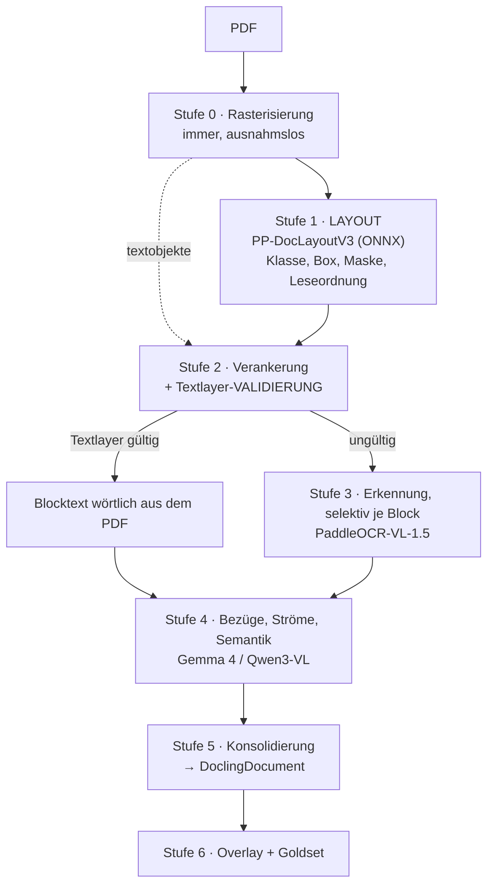

# Vom freien Layout zum Schema

**Arbeitsprotokoll: wie aus einer gestaltungstheoretischen These eine Implementierungsentscheidung wurde**

Projekt: KI-gestützte Dokumentenaufbereitung · Stufe 1 (Layout-Erkennung) · Stand: 04.09.2026

---

## Inhalt

1. [Ausgangslage](#1-ausgangslage)
2. [Die empirischen Befunde](#2-die-empirischen-befunde)
3. [Die These vom freien Layout](#3-die-these-vom-freien-layout)
4. [Prüfung der These](#4-prüfung-der-these)
5. [Der Reframe: Form ist nicht Verpackung](#5-der-reframe-form-ist-nicht-verpackung)
6. [Die Kostenfrage und ihre Auflösung](#6-die-kostenfrage-und-ihre-auflösung)
7. [Der Architekturwandel](#7-der-architekturwandel)
8. [Der Werkzeugweg](#8-der-werkzeugweg)
9. [Die Entwurfsentscheidungen im Schema](#9-die-entwurfsentscheidungen-im-schema)
10. [Korrekturprotokoll](#10-korrekturprotokoll)
11. [Stand und offene Punkte](#11-stand-und-offene-punkte)

---

## 1. Ausgangslage

Grundlage war der Leitfaden *KI-gestützte Dokumentenaufbereitung und Datenextraktion*
mit seinem Neun-Phasen-Modell 00–08. Aufgabe: das skizzierte Konstrukt an drei
realen Dokumenten implementieren, die ausdrücklich **keine** sauberen Beispielseiten
sind, sondern typische Layout-Problemfälle.

Der erste Ausbauschritt wurde eingegrenzt auf: **vollständige, plausible und robuste
Layout-Erkennung plus ein Schema, das die detektierten Einzelteile so ablegt, dass
darauf aufgebaut werden kann.** Formeln werden in dieser Stufe nicht transkribiert,
sondern ausgeschnitten, als Bild abgelegt, mit `formula` klassifiziert und mit der
Abbildungsbeschreibung des Originals verknüpft.

---

## 2. Die empirischen Befunde

Vor jeder Architekturdiskussion standen Messungen an den drei Seiten. Sie haben den
weiteren Verlauf stärker bestimmt als jede Vorüberlegung.

### Zimbardo, *Psychologie*, S. 118 — 595 × 793 pt

| Befund | Warum es weh tut |
|---|---|
| Spaltenraster wechselt **innerhalb** der Seite: oben Vollbreite, ab y≈500 zweispaltig | Ein seitenweit ermitteltes Raster ist immer falsch |
| Bildunterschrift spannt beide Spalten, sitzt zwischen Grafik und Fließtext | Naive Leserichtung klebt sie mitten in einen Satz: `…die Er` + `Abbildung 4.8: …` |
| **Grafikbeschriftungen sind Vektor-Outlines** — 313 Vektorobjekte, im Textlayer nur 18 Blöcke mit Inhalt `,` | Born-digital, aber die Grafik ist textlos. OCR wäre hier **besser** als der Textlayer |
| Tabelle 4.2 ohne Linien, nur Farbstreifen; Zellinhalte umbrechen | Lattice-Erkennung greift nicht; naives Verketten ergibt `Geruchskonzentration0,07` |
| Fußzeile mit Personalisierungsstempel | Boilerplate **und** personenbezogenes Datum |

### Wahrnehmungspsychologie, S. 112 — 547 × 737 pt

| Befund | Warum es weh tut |
|---|---|
| Grün hinterlegte **Marginalspalte** (x 43–170) mit Randnotizen | Gehören nicht in den Lesefluss, sind aber Text |
| Haupttext **umfließt das Bild** (x 325 → x 184 ab y 234) | L-Form: der Fall, an dem rekursiver XY-Cut scheitert |
| **Verschachtelte Zweispaltigkeit** im Kasten „Für die Praxis" | Eine flache Blockliste kann das nicht abbilden |
| **Icon-Fonts**: Aufzählungszeichen = Font `BlikButtons`, Zeichen `4` | Im Extrakt erscheint `4 4 4` als Inhalt |
| **Doppelt gezeichnete Blöcke**: [22]≡[23], [24]≡[25] | Jede Marginalie erscheint zweimal |

### Tietze/Schenk, *Halbleiter-Schaltungstechnik*, S. 460 — 405 × 627 pt

Der lehrreichste Fall. 1-Bit-Bilevel-PNG, 1683 × 2603 px, also rund 299 dpi.

Und: **Die Seite hat einen Textlayer.** Acht Textblöcke, Schriften Helvetica und
Times-Roman — Substitutionsschriften, also ein nachträglich eingelegter OCR-Layer.

> ⚠️ **Damit scheitert die Triage-Regel des Leitfadens.** Die Heuristik
> „`page.get_text()` leer ⇒ Scan" stuft genau diese Seite als born-digital ein.
> Der Textlayer liefert `10 !2` statt 10 Ω, `I00` statt 100, `IcXA-Rg-Ebene` —
> und die Lücken sind aussagekräftiger als die Fehler: zwischen y 301 und 342 sowie
> zwischen y 402 und 469 steht **nichts**. Dort stehen die abgesetzten Formeln.
> Der alte OCR-Lauf hat sämtliche Display-Gleichungen stillschweigend verworfen.

**Erste harte Regel des Projekts:** Ein vorhandener Textlayer ist keine
Qualitätsaussage. Er muss selbst validiert werden, sonst verankert man Ergebnisse an
einer Lüge — und eine Lüge, die in jedem Log völlig gesund aussieht.

---

## 3. Die These vom freien Layout

Die inhaltlich zentrale Frage der Session lautete sinngemäß:

> Wenn man das Layout der nächsten Seite nicht kennt, muss jede Seite als
> Überraschung geplant werden. Der einzig passende Prozess wäre der eines Menschen:
> die Seite als Ganzes betrachten, in Einzelteile auftrennen, diese getrennt
> entschlüsseln, die Bezüge wieder konstruieren. Bücher sind aufwändig gestaltet;
> Gestaltung arbeitet bewusst mit Überraschung, weil Ästhetik das Interesse hält.
> Gestaltungsregeln — Hell-Dunkel, Groß-Klein, Formkontraste, Weißraum — entstammen
> der Ästhetiktheorie und lassen sich nicht in mathematische Strukturen pressen.
> Das ist die Grundwahrheit, der sich Dokumentenanalyse stellen muss: sie muss den
> Inhalt von der ästhetischen Form trennen.

Diese These ist der Angelpunkt des gesamten Protokolls. Alles Weitere ist ihre
Prüfung und die Konsequenzen daraus.

---

## 4. Prüfung der These

### 4.1 Was trägt

**Der beschriebene Prozess ist der Stand der Technik, nicht eine Wunschvorstellung.**
Ganzes → Teile → Teile entschlüsseln → Bezüge rekonstruieren ist exakt die
Dreiteilung Detection → Recognition → Relation Extraction, wie sie jedes ernsthafte
System für Document Layout Analysis fährt.

**Die Bezugsrekonstruktion ist tatsächlich weich.** „Bildunterschriften stehen
meistens in der Nähe" — genauer geht es nicht, und die Zahlen bestätigen es: Auf dem
mehrspaltigen Subset von OmniDocBench erreicht rekursiver XY-Cut 75,3 % Kanten-
genauigkeit, LayoutReader 24,6 %, ein Verfahren von Juli 2026 kommt auf 88,0 %. Auf
umfließenden Layouts fällt XY-Cut auf rund 50 %.

### 4.2 Einwand 1 — Überraschung wirkt zwischen Dokumenten, nicht innerhalb

Ein Buch ist keine Folge unabhängiger Überraschungen. Die Alternation der Raster ist
gestalterische Absicht, aber sie ist **endlich**: gewechselt wird innerhalb eines
Stilkatalogs, sonst zerfällt das Buch optisch.

Das ist messbar belegt: Unüberwachtes Clustering von Dokumenten auf Template-Ebene
mit eingefrorenen multimodalen Encodern trennt Templates bei sauberen, ausgerichteten
Bildern nahezu perfekt — Adjusted-Rand-Werte deutlich über 0,95. Dokumentstil ist ein
lernbarer Prior, kein Rauschen.

Folge: Die teure Einzelanalyse ist nicht für *jede* Seite nötig, sondern für die
Seiten, die vom Profil des Dokuments **abweichen**.

### 4.3 Einwand 2 — die Ästhetik-Signale sind formalisiert

Die *Absicht* der Gestalterin ist nicht formalisierbar. Die *Signale*, mit denen sie
arbeitet, sind aber genau die Merkmale, die Layout-Algorithmen konsumieren:

| Gestaltungsprinzip | algorithmisches Gegenstück |
|---|---|
| Weißraum als Trenner | die **Prämisse** des XY-Cut — er schneidet entlang der Weißraumtäler |
| Hell-Dunkel | Füll- und Luminanzkontrast; auf unseren Seiten der Träger der Semantik |
| Groß-Klein | Schriftgrößenverhältnis, Grundlage jeder Überschriftenerkennung |
| Nähe, Symmetrie | probabilistisch modelliert als Texthomogenität via bayessche Cue-Integration |

Wo es tatsächlich bricht, ist präziser als „Ästhetik": bei **nicht-rechtwinkligem
Weißraum**. Dem L-förmigen Textumfluss um das Rubin-Kippbild. Dort halbiert sich die
Genauigkeit der geometrischen Verfahren. **Rechtwinklig ist gelöst, umfließend nicht.**

### 4.4 Einwand 3 — der Ort der Überraschung ist auch der Ort der Vektorgrafik

Auf den drei Seiten ist die stärkste Layout-Evidenz die, die im Leitfaden nirgends
vorkommt: **Vektorobjekte**. Die Marginalspalte ist ein einzelnes gefülltes Rechteck
(x 43–170, y 62–698, RGB 0.89/0.94/0.90). Der Kasten „Für die Praxis" ist Rahmen plus
Kopfbalken in exakt der Verlagsgrünstufe. Exakte Regionsgrenzen, kostenlos, ohne
Modell.

Das ist die Verallgemeinerung eines etablierten Prinzips — Lattice-Verfahren nutzen
sichtbare Linien zur Tabellenerkennung. Der Schritt von „Linien → Zellen" zu
„Füllflächen → Regionen" ist naheliegend, aber unbelegt: das gehört ans Goldset,
nicht in eine Annahme.

---

## 5. Der Reframe: Form ist nicht Verpackung

Der folgenreichste Punkt der Session, und der einzige, an dem der These
grundsätzlich widersprochen wurde.

**„Inhalt von der ästhetischen Form trennen" ist das falsche Ziel.**

Der grüne Kasten ist keine Verzierung, die man abzieht, um an den Text zu kommen —
er **ist** die Typangabe „Für die Praxis". Die Marginalie ist kein Ornament, sondern
ein didaktisches Element mit eigener Funktion. Wer die Form abstreift, um „den
eigentlichen Inhalt freizulegen", vernichtet Information, die ausschließlich in der
Form steht.

> 💡 Die Aufgabe ist nicht Trennung, sondern **Übersetzung: Form → Typ**.
> Nicht CSS abtrennen, sondern CSS in Semantik überführen.

Genau deshalb hat das Vokabular von `docling-core` 30 Labels statt „Text/kein Text",
und genau deshalb hat PP-DocLayoutV3 25 Klassen statt fünf.

**Und die Grundwahrheit ist nicht die Ästhetik.** Sie ist die **Struktur, die vor dem
Layout existierte** — Kapitelgliederung, Zuordnung von Bildunterschrift zu Bild, wie
sie im Redaktionssystem des Verlags standen. Das Layout ist eine verlustbehaftete,
ästhetisch motivierte **Kodierung** dieser Struktur. Dokumentenanalyse ist Dekodierung.

Das hat zwei harte Konsequenzen: Es sagt, **was im Goldset annotiert wird** (die
Autorenstruktur, nicht die Gestaltung), und **wogegen gemessen wird**
(Strukturwiederherstellung, nicht Beschreibungsgüte).

---

## 6. Die Kostenfrage und ihre Auflösung

Ausgangsfrage: Ist es praktikabel, den „teuren, aber besten Weg" tatsächlich zu
gehen — VLM auf jeder Seite, on-premise, für einen Bestand von 20.000 Dokumenten?

Gemessene Durchsätze, einzelne A100 mit vLLM, OmniDocBench v1.5:

| Modell | Seiten/s |
|---|---|
| PaddleOCR-VL | 1,224 |
| MinerU 2.5 | 1,057 (eigenoptimiert 2,12) |
| MonkeyOCR-pro-1.2B | 0,673 |
| dots.ocr | 0,352 |

Hochgerechnet auf 1 Mio. Seiten (20.000 Dokumente à 50 Seiten):

| Weg | Zeit | Kosten |
|---|---|---|
| PaddleOCR-VL, eine A100 | **≈ 9,5 GPU-Tage** | ~70 kWh ≈ 25 € |
| vier Karten parallel | 2–3 Tage | < 100 € |
| Cloud, offenes Modell | — | ≈ 500 $ |
| seitenbasierte Extraktionsplattform | — | ≈ 15.000 $ |

**Schlussfolgerung: Rechenzeit ist bei dieser Größenordnung nicht der Engpass.**
Damit entwertet sich das eigene Sparargument. Wo das Geld tatsächlich liegt:

1. **Menschliche Prüfung.** 1 Mio. Seiten bei 2 % Review-Quote sind 20.000 Seiten,
   bei 30 s je Seite rund 165 Personentage. Dominant um Größenordnungen.
2. **Betrieb und Einrichtung.** Aktuelle OCR-VLMs lokal ans Laufen zu bringen ist
   ein Abhängigkeits- und Runtime-Projekt, kein Modellproblem.
3. **Das Goldset.** Ohne das weiß man beim Modellwechsel nicht, ob die Neuverarbeitung
   besser war — und Neuverarbeitung selbst ist fast gratis.

**Und die Profilbildung wechselt dadurch Funktion:** vom Sparinstrument zum
Stichproben- und QA-Instrument. Sie liefert die Verteilung der Layouts im Bestand —
gebraucht für eine repräsentative Goldset-Stichprobe und für die Erkennung von
Ausreißerseiten. Nicht mehr fürs Routing.

### Der Realitätsabgleich mit der vorhandenen Hardware

RTX 3090 Ti, Gemma 4 12B bei 40–50 tok/s. Ein Layout-Dump ohne Textinhalt liegt bei
700–1.000 Ausgabetoken, also **16–22 Sekunden pro Seite**. Für 1 Mio. Seiten wären
das rund 231 Tage — Faktor 25 gegenüber der A100 mit einem 0,9-B-Spezialmodell.

> ⚠️ **Korrektur am Leitfaden:** Die dort genannten „3–6 Sekunden pro Seite" passen
> zu 150–400 Ausgabetoken, also zur **Feldextraktion** — nicht zur Layout- oder
> Volltextausgabe. Das ist ein Faktor 4 und gehört in die Kostenformel.

---

## 7. Der Architekturwandel

Der Fund, der die Architektur umgebaut hat: **Layout-Analyse gehört nicht ins große
VLM.**

Die Entwickler:innen von PaddleOCR-VL begründen die Trennung ausdrücklich damit,
dass End-to-End-VLM-Ansätze mit langen autoregressiven Sequenzen arbeiten, was hohe
Latenz und Speicherverbrauch bedeutet und **das Risiko instabiler Layout-Analyse und
von Halluzinationen erhöht — besonders ausgeprägt bei mehrspaltigen oder gemischt
text-grafischen Layouts.**

Das beschreibt exakt beide Buchseiten. Deshalb steht ein eigenes, kleines
Detektionsmodell davor: **PP-DocLayoutV3**, RT-DETR mit HGNetV2-Backbone, sechs
Decoder-Layern, 300 Queries und vier Ausgabeköpfen, rund 142 MB.

```
logits        (1, 300, 25)        Klassenscores
pred_boxes    (1, 300,  4)        DETR cxcywh
out_masks     (1, 300, 200, 200)  Instanzmasken
order_logits  (1, 300, 300)       Lesereihenfolge als Kantenmatrix
```

Drei Eigenschaften sind entscheidend:

- Es **erkennt keinen Text**. Es lokalisiert, klassifiziert, ordnet — genau Stufe 1.
- Die Lesereihenfolge kommt als **paarweise Matrix**, nicht als Index. Damit gibt es
  eine Konfidenz *pro Kante* — ein Gütemaß, ohne ein Modell nach seiner Sicherheit zu
  fragen, die ohnehin kaum kalibriert wäre.
- Es ist ein Detektor: Millisekunden statt Sekunden pro Seite.

### Die resultierende Pipeline



**Rollenwechsel des großen VLM.** Gemma 4 und Qwen3-VL verlieren die Layout-Rolle und
bekommen eine bessere: die **Semantik**, die kein Detektor kennt. „Dieser grüne
Kasten ist ein Praxisbeispiel", „diese Abbildung zeigt ein Kippbild nach Rubin".
Genau die geforderte Abbildungsbeschreibung.

**Rollenwechsel des deterministischen Pfads.** Er verschwindet nicht, aber seine
Aufgabe kehrt sich um: nicht mehr Kostensparer, sondern **Verankerungsquelle**. Ein
VLM gibt approximative Boxen aus und *erzeugt* Text neu, mit Halluzinationsrisiko.
Das PDF-Textobjekt hat exakte Koordinaten und ist, wo es gültig ist, wörtlich.

---

## 8. Der Werkzeugweg

Der Weg zur Werkzeugentscheidung verlief über mehrere Stationen, jede mit einer
Klärung:

| Station | Klärung |
|---|---|
| LM Studio als gesetzter Standard | Pädagogisch richtig (Debug-Fenster), aber die aktuellen Genauigkeitsführer laufen dort nicht |
| Zwei GPUs, 40 GB „kombiniert" | Maschinenübergreifendes Pooling ist llama.cpps **RPC-Backend** — Pipeline-Parallelismus, erweitert Kapazität, nicht Geschwindigkeit. Für Dokumente falsch: gebraucht wird ein *schnelleres*, nicht ein *größeres* Modell |
| vLLM zugelassen | Öffnet die spezialisierten OCR-VLMs |
| PP-DocLayoutV3 lädt nicht in LM Studio | Kein Formatproblem, ein **Aufgabentyp**-Problem: `object-detection` statt `image-text-to-text`. LM Studio hat dafür keine Laufzeit und braucht keine |
| „Ist Docker nötig?" | Nein. Der Docker/WSL-Hinweis stammte aus der **PaddlePaddle**-Anleitung, nicht von vLLM. Mit dem ONNX-Pfad entfällt Paddle vollständig |
| PaddleOCR-VL-1.5-GGUF | Offizielles PaddlePaddle-Repo, Apache-2.0, llama.cpp-Unterstützung upstream. Damit läuft Stufe 3 in LM Studio |
| Prototyp braucht keinen Durchsatz | **vLLM wird jetzt gar nicht gebraucht** |

### Der Prototyp-Stack

| Stufe | Werkzeug | Installation |
|---|---|---|
| 0 Rendern | PyMuPDF | `pip install pymupdf` |
| 1 Layout | PP-DocLayoutV3 ONNX + ONNX Runtime | `pip install onnxruntime-gpu` |
| 2 Verankerung | PyMuPDF, pdfplumber | `pip` |
| 3 Erkennung | PaddleOCR-VL-1.5 GGUF in LM Studio | Download |
| 4 Semantik | Gemma 4 12B in LM Studio | Download |

**Kein Docker, kein WSL, kein PaddlePaddle, kein vLLM.** ONNX Runtime ist ein
Tensor-Executor, kein LLM-Serving-Stack — nativ unter Windows mit CUDA- oder
DirectML-Provider, auf macOS mit CoreML/CPU.

### Versionsdisziplin

Gemischte Versionen (Mac 1.5 / Windows 1.6) wären methodisch tödlich: Sobald ein
Goldset existiert, ist jede Messung an eine Modellversion gebunden. Festzunageln sind
**drei** Dinge, nicht eines: Modellversion, Quantisierung und das mmproj samt
`image_max_pixels` (Standard 1003520; für `Spotting:` auf 1605632 zu setzen).

---

## 9. Die Entwurfsentscheidungen im Schema

Die `inference.yml` von PP-DocLayoutV3 war der Schlussstein — sie hat drei offene
Fragen geschlossen und zwei neue Entwurfsentscheidungen erzwungen.

### E1 — Eigenes Zwischenschema, `DoclingDocument` als Zielformat

`DoclingDocument` ist ein Ergebnismodell und kann keine konkurrierenden
Detektionskandidaten mit Quelle und Konfidenz halten. Das Zwischenschema kann es;
konsolidiert wird erst danach.

### E2 — Das native Label wird wörtlich mitgeführt

Von 25 PP-Klassen sind 13 verlustfrei auf `DocItemLabel` abbildbar, **12 nicht**.
Der Verlustgrund steht als zweites Tupelelement im Mapping, nicht in einem Kommentar.

| Verlustbehaftet | was verloren geht |
|---|---|
| `aside_text` → `text` | die Marginalien-Eigenschaft |
| `inline_formula` → `formula` | Inline/Display-Unterscheidung |
| `formula_number`, `number` → `text` | Formel- bzw. Seitennummer |
| `header_image`, `footer_image` → `picture` | Zugehörigkeit zur Kolumne |
| `vision_footnote` → `footnote` | Bezug zur Abbildung |
| `abstract`, `algorithm`, `reference_content`, `vertical_text`, `seal` | Rolle, Schreibrichtung, Siegeleigenschaft |

Würde Stufe 1 sofort mappen, wirft sie weg, was Stufe 4 wieder braucht.

### E3 — `aside_text` beantwortet die Lesefaden-Frage

Die offene Frage, wie Marginalien vom Haupttext zu trennen sind, beantwortet **der
Detektor selbst**. Die grüne Randspalte ist `aside_text`. Keine Geometrie, keine
Heuristik. Daraus abgeleitet vier Ströme: `haupt`, `marginalie`, `boilerplate`,
`apparat`.

> 💡 Nebeneffekt für den Datenschutz: `boilerplate` fängt genau die Elemente, die vor
> der Weiterverarbeitung entfernt gehören — auf der Zimbardo-Seite den
> Personalisierungsstempel, der Boilerplate **und** personenbezogenes Datum ist.

### E4 — Bezugsrahmen als Pflichtfeld

Vier Koordinatensysteme treffen aufeinander: `MODELL_800`, `BILD_PIXEL`,
`SEITE_PUNKT`, `NORMIERT_1000` (Gemma-`box_2d`). Dazu die y-Richtung: PDF zählt
nativ von unten, alle Bildwelten von oben.

Konsequenz: `rahmen` und `ursprung` sind Pflichtfelder der `Bbox`, und eine
IoU-Berechnung über Rahmengrenzen wirft eine Exception, statt eine plausible Zahl
zurückzugeben.

### E5 — `keep_ratio: false` entkoppelt die dpi-Frage

Das Modell sieht immer 800 × 800, anisotrop gestaucht, ohne Padding. Zwei Folgen:

✅ Die Rücktransformation ist eine reine achsenweise Streckung — kein Versatz, aber
**verschiedene Faktoren für x und y**.

✅ Die Rendering-Auflösung ist für Stufe 1 **irrelevant**. Sie zählt erst für die
Ausschnitte in Stufe 3.

Gemessene Verzerrung bei 200 dpi: Zimbardo 1,333 · Wahrnehmung 1,347 ·
Tietze-Schenk 1,546. Faustregel daraus: hoch rendern, Layout auf der verkleinerten
Kopie, Ausschnitte aus dem Original.

### E6 — Lesekanten statt Leseindex

`order_logits` ist eine 300 × 300-Matrix über Blockpaare. Das Schema führt deshalb
`Lesekante(von, nach, konfidenz)` statt eines Sortierindex. Die Lesefolge wird greedy
über die Kantenkonfidenz abgeleitet — und die Kantenkonfidenz ist zugleich das
Konfidenzsignal für die Review-Queue.

### E7 — Ungeklärtes wird nicht geraten

Zwei Parameter sind aus der `inference.yml` nicht ableitbar:

- **`is_scale`** — ob durch 255 geteilt wird. Der Parameter fehlt. Deshalb ein
  Schalter in `vorverarbeiten()`, keine Annahme.
- **Box-Konvention der Ausgabe** — normiertes `cxcywh` oder entpacktes `xyxy`.
  Deshalb `konvention_bestimmen()`, das am Wertebereich **misst** statt festzulegen.

---

## 10. Korrekturprotokoll

Was im Verlauf der Session korrigiert werden musste — festgehalten, weil die
Korrekturen selbst lehrreich sind:

| # | Ursprüngliche Aussage | Korrektur |
|---|---|---|
| 1 | „Ein Raster pro Buch, Musterseiten" | Falsch. Alternierende Raster sind gestalterische Absicht. Haltbar ist nur: die Alternation ist **endlich** |
| 2 | „PP-DocLayoutV3 gibt Mehrpunkt-Polygone statt Rechtecken" | Falsch. Der Box-Kopf gibt achsenparalleles `cxcywh`. Die Schiefe-Robustheit kommt aus dem **Masken**-Kopf |
| 3 | „`BoundingBox` aus docling-core als Schematyp" | Zu früh. Das Zwischenschema muss das Polygon optional führen können |
| 4 | „vLLM braucht WSL oder Docker" | Der Docker/WSL-Hinweis stammte aus der PaddlePaddle-Anleitung. vLLM: `uv pip install vllm` |
| 5 | „Deterministisch, wo das Profil greift — als Kostenhebel" | Entwertet, sobald die Durchsatzrechnung stand. Der deterministische Pfad bleibt, aber als **Verankerung** |
| 6 | Farbtupel im Overlay als BGR kommentiert, als RGB notiert | Behoben: Farben durchgängig RGB, eine Konvertierung an einer Stelle |

---

## 11. Stand und offene Punkte

### Was steht

Ein lauffähiges Notebook, `01_layout_erkennung_und_schema.ipynb`, 31 Zellen, davon
14 Code. Alle Zellen laufen fehlerfrei gegen die drei echten Seiten — außer den
beiden ONNX-Zellen, denen die Modelldatei fehlt.

Inhalt: Seiteninventar (Phase 00), Vorverarbeitung exakt nach `inference.yml`,
Koordinatenumrechnung über vier Systeme mit Rahmenwächter, das Zwischenschema
(`Bbox`, `Block`, `Lesekante`, `SeitenBefund`, `Strom`), das vollständige
Klassenmapping mit Verlustdokumentation, ein ONNX-Selbsttest auf alle vier Köpfe,
ein Dekodierer und die Overlay-Visualisierung. Dazu fünf Übungsaufgaben von
Koordinatenrechnung bis Goldset-Annotation.

### Was offen ist

| # | Punkt | Wie zu klären |
|---|---|---|
| 1 | `is_scale` | beide Varianten laufen lassen, Ausgaben vergleichen |
| 2 | Box-Konvention | `konvention_bestimmen()` misst es am ersten echten Lauf |
| 3 | Semantik von `order_logits` | ob Zeile→Spalte „folgt auf" heißt, ist zu verifizieren |
| 4 | Polygone aus `out_masks` | 200 × 200-Masken hochskalieren, Konturen ziehen |
| 5 | Kästen ohne Klasse | „Für die Praxis", „Definition" haben in den 25 Klassen kein Gegenstück — Aufgabe für Stufe 4, gestützt auf die Vektorrahmen |
| 6 | Parität der MLX-Portierung | selbstberichtet; gegen den ONNX-Referenzlauf zu prüfen |
| 7 | **Goldset** | ohne Handannotation ist „robust" Geschmackssache |
| 8 | Vierte Testseite | Formular oder seitenübergreifende Tabelle fehlt — `checkbox_*` und Stitching bleiben sonst ungetestet |

### Nächster Schritt

`koepfe_pruefen()` auf die ONNX-Datei, dann `layout_erkennen()` auf eine der drei
Seiten. Aus dem Ergebnis klären sich die Punkte 1 bis 3, und es wird sichtbar,
welche der 25 Klassen der Detektor auf Lehrbuchseiten tatsächlich vergibt.

---

## Quellen

- PaddleOCR-VL Technical Report, arXiv 2510.14528 — Zweistufenarchitektur, Begründung der Trennung
- PaddleOCR-VL-1.5, arXiv 2601.21957 — 94,5 % auf OmniDocBench v1.5, Real5-OmniDocBench
- `PaddlePaddle/PP-DocLayoutV3` — `inference.yml`, 25 Klassen, Preprocess-Kette
- `agentable/pp-doclayoutv3-mlx` — Architekturbeschreibung, vier Köpfe, Paritätsangaben
- `PaddlePaddle/PaddleOCR-VL-1.5-GGUF` — llama.cpp-Unterstützung, sechs Element-Prompts
- Qianfan-OCR Technical Report, arXiv 2603.13398 — Durchsatzvergleich in Seiten/s auf A100
- *Reading Order Inference for Complex Document Layouts*, arXiv 2607.01018 — Kantengenauigkeit XY-Cut vs. LayoutReader
- *Unsupervised Document and Template Clustering using Multimodal Embeddings*, arXiv 2506.12116
- `docling-core` 2.94.1 — `DocItemLabel`, `BoundingBox`, `CoordOrigin`
- vLLM-Dokumentation, Installation und Plattformmatrix
