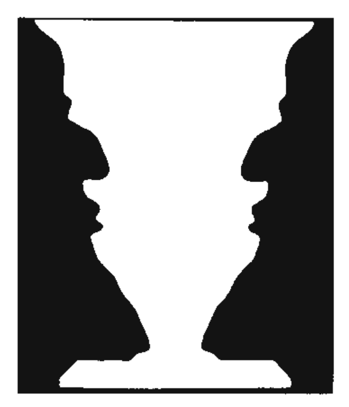

Die Trennung einer Figur vom Hintergrund erfolgt über Symmetrie-eigenschaften, über die Geschlosenheit als Merkmal einer Figur oder die Größe von Elementen.

Abb. 9.3 Kippbild nach Rubin: Gesehen werden entweder zwei Gesichter oder eine weiße Vase. (Aus Ditzinger, 2006)

Einige grundlegende Eigenschaften von Reizen, die eine Figur-Grund-Differenzierung begünstigen, sind folgende (ausführlicher in Palmer, 1999):

■ Geschlossenheit: Geschlossene Elemente wie Kreise werden als Figuren gesehen.

Größe: Sind mehrere Flächenelemente in einem Bild, so wird das kleinere in der Regel als Figur gesehen.

Symmetrie: Symmetrische Elemente bilden Figuren im Gegensatz zu unsymmetrischen Elementen, die den Hintergrund bilden. In  
Abb. 9.2 wird diese Symmetriewirkung ver-anschaulicht: Im linken Teil des Abbildungs-

teils zur Symmetrie sind infolge der Symmetrie weiße Figuren zu sehen, im rechten Teil dagegen schwarze Figuren.

Parallelität: Parallele Konturen gehören zur gleichen Figur.

Bekanntheit oder Erfahrung: Die Bekanntheit von Objekten in einer Szene hilft uns bei der Figur-Grund-Trennung. Welche Rolle die Erfahrung hat, zeigt sich bei dem Versuch, Schrift zu lesen, die um 180° gedreht ist.

## Für die Praxis

Benutzerfreundliche Bildschirmmasken

Bildschirmmasken dienen der Strukturierung des Dialogs zwischen Benutzer und Computer. Sie sollten die verschiedenen Informationen so darstellen, dass eine schnelle Orientierung auf dem Bildschirm ohne lange visuelle Suche möglich ist. Dazu werden beispielsweise auch häufig die Gestaltgesetze ausgenutzt. Experimentell ist gezeigt worden, dass nach Gestaltgesetzen strukturierte Masken bessere Suchleistungen auf dem Bildschirm erbrachten als weniger strukturiert Masken.

Bekanntheit hilft nicht immer bei der Erkennung.

Figuren befinden sich räumlich immer vor dem Hintergrund. Die Figur wird schneller verarbeitet als der Hintergrund.

Nach der Gestaltpsychologie ordnen sich die Elemente nach einem über- geordneten Prinzip, dem Prägnanz- prinzip. Danach strebt das System nach einer einfachen und stabilen Strukturierung der Gesamtsituation.

Aber nicht immer setzt sich Bekanntheit durch. Gottschaldt (1929) hat Experimente durchgeführt, bei denen Probanden eine Teilfigur in einer komplexen Figur suchen musste. Er machte die Probanden unterschiedlich intensiv mit den Teilfiguren bekannt. Im Ergebnis stellt er fest, dass die Erkennungszeit in keiner Beziehung zum Grad der Bekanntheit steht. In ☑ Abb. 9.4 sind Figuren zu sehen, an denen demonstriert werden kann, dass ein Wissen der Strukturierung nicht immer hilft. In ☑ Abb. 9.4 ist oben links eine Teilfigur zu sehen. Es fällt dennoch schwer, diese Teilfigur in der komplexen Figur rechts zu finden.

Definition Prägnanz

Figuren haben bestimmte allgemeine Eigenschaften: Figuren sind leichter zu behalten als der Hintergrund. Die Figur befindet sich räumlich immer vor dem Hinter-grund. Der Hintergrund erstreckt sich hinter der Figur. Die Figur wird schneller verarbeitet als der Hintergrund. Die Konturen, die zur Figur-Grund-Trennung führen, gehören zur Figur (☑ Abb. 9.5).

## Prägnanz

Das übergeordnete Prinzip der Gestaltpsychologie ist das der Prägnanz: Jedes Reizmuster wird so interpretiert, dass die sich ergebende Struktur so einfach und so stabil wie möglich ist.

Das übergeordnete Prinzip der Prägnanz besagt, dass Reizmuster so gesehen werden, dass sich eine möglichst einfache Struktur ergibt.